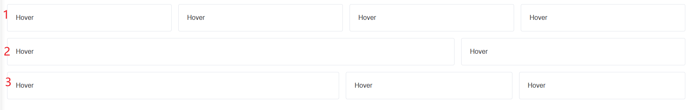

```html
<div class="cards mb-4">
    <el-card shadow="hover">Hover</el-card>
    <el-card shadow="hover">Hover</el-card>
    <el-card shadow="hover">Hover</el-card>
    <el-card shadow="hover">Hover</el-card>
</div>

<div class="middle mb-4">
    <el-card shadow="hover">Hover</el-card>
    <el-card shadow="hover">Hover</el-card>
</div>

<div class="footer mb-4">
    <el-card shadow="hover">Hover</el-card>
    <el-card shadow="hover">Hover</el-card>
    <el-card shadow="hover">Hover</el-card>
</div>
```





使用`Flex+@media`实现响应式布局

实现效果如下：


默认效果：盒子按行排列，盒子之间有一定的间距，盒子的宽度不固定，是按比例分配的

#### 中屏`（max-width: 992px）`：

第一行的四个盒子，一行显示两个，分成两行

第二行和第三行的盒子，一个盒子占据一行，纵向排列

#### 小屏`（max-width: 768px）`：

每一个盒子都是占据一行，纵向排列


```css
/* 1. 容器通用设置 */
.cards {
    display: flex;
    flex-wrap: wrap; /* 允许换行 */
    gap: 20px; /* 设置卡片之间的固定间距 */
}

/* 2. PC端 (默认样式) - 一行四个 */
.cards .el-card {
    /* 
    计算逻辑：
    总宽 100%
    一行4个，中间有3个缝隙 (3 * 20px = 60px)
    单个宽度 = (100% - 60px) / 4
    */
    width: calc((100% - 60px) / 4);
    box-sizing: border-box; /* 确保内边距不撑大盒子 */
}

/* 3. 中屏 (平板/小笔记本) - 当屏幕宽度小于 1200px 时，变为一行两个 */
@media (max-width: 1200px) {
    .cards .el-card {
        /* 
        计算逻辑：
        一行2个，中间有1个缝隙 (20px)
        单个宽度 = (100% - 20px) / 2 
        */
        width: calc((100% - 20px) / 2);
    }
}

/* 4. 小屏 (手机) - 当屏幕宽度小于 768px 时，变为纵向排列 */
@media (max-width: 768px) {
    .cards .el-card {
        /* 强行占满一行 */
        width: 100%;
    }
}
```


```html
<template>
  <div class="middle mb-4">
    <el-card shadow="hover">Hover (宽)</el-card>
    <el-card shadow="hover">Hover (窄)</el-card>
  </div>
</template>

<style>
/* --- PC端优先 (默认样式) --- */
.middle {
  display: flex;
  gap: 20px; /* 两个盒子之间的间距 */
}

/* 第一个盒子：占据 2 份 */
.middle .el-card:nth-child(1) {
  flex: 2;
  min-width: 0; /* 防止内容过长导致 flex 比例失效 */
}

/* 第二个盒子：占据 1 份 */
.middle .el-card:nth-child(2) {
  flex: 1;
  min-width: 0;
}

/* --- 响应式：屏幕 <= 992px 时 --- */
@media (max-width: 992px) {
  .middle {
    /* 改变 Flex 方向为纵向 */
    flex-direction: column;
  }

  /* 恢复宽度为 100%，取消之前的比例分配 */
  .middle .el-card:nth-child(1),
  .middle .el-card:nth-child(2) {
    flex: none;  /* 取消 flex: 2/1 的设定 */
    width: 100%; /* 占满整行 */
  }
}
</style>
```


```html
<template>
  <div class="footer mb-4">
    <el-card shadow="hover">Hover (2倍宽)</el-card>
    <el-card shadow="hover">Hover (1倍宽)</el-card>
    <el-card shadow="hover">Hover (1倍宽)</el-card>
  </div>
</template>

<style>
/* --- PC端优先 (默认样式) --- */
.footer {
  display: flex;
  gap: 20px; /* 统一间距，flex会自动扣除这部分后再计算比例 */
}

/* 第1个盒子：占据 2 份 */
.footer .el-card:nth-child(1) {
  flex: 2;       /* 核心：权重为2 */
  min-width: 0;  /* 最佳实践：防止内部内容过宽撑破比例 */
}

/* 第2个 和 第3个 盒子：各占据 1 份 */
/* 使用 n+2 选择器选中第2个及之后的元素 */
.footer .el-card:nth-child(n+2) {
  flex: 1;       /* 核心：权重为1 */
  min-width: 0;
}

/* --- 响应式：中屏及小屏 (<= 992px) --- */
/* 这里选择了 992px 作为分界点，涵盖了平板(中屏)和手机(小屏) */
@media (max-width: 992px) {
  .footer {
    /* 切换为纵向排列 */
    flex-direction: column;
  }

  /* 恢复盒子状态 */
  .footer .el-card {
    flex: none;  /* 取消之前的 flex: 2 / flex: 1 比例限制 */
    width: 100%; /* 强制占满一行 */
  }
}
</style>
```

