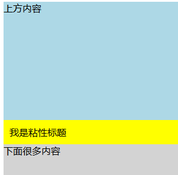

### position: sticky

是一种 **相对定位（relative）** 和 **固定定位（fixed）** 的混合体。

在元素 **没有到达指定阈值（top、left、right、bottom）** 之前，它跟 `relative` 一样，正常随文档流滚动。

一旦到达阈值，它会像 `fixed` 一样，**粘在那个位置**，直到它的父容器范围结束。


```css
position: sticky;
top: x;
```

**在滚动过程中**，元素的 **外边框 top 边** 和 **包含块（通常是最近一个可滚动祖先）的 content box 顶部** 之间的距离 **不会小于 x**。

在没到这个位置之前，它跟 `relative` 一样，照常滚动。

一旦即将小于 `x`，浏览器就让它“卡住”，保持这个最小距离 `x` 不变。


需要指出的是，通常设置了`sticky`定位的元素，会随着页面一起滚动的。但是我们希望该元素，滚动到某一个特定位置是，就像`fixed`一样固定在那里，这就是`sticky`定位的意义。


### 相对的元素

`top:x`相对的元素是 相对于最近的`可滚动祖先`的内容区域 


### 常见应用

- 页面内导航栏随滚动保持可见：

  

  让这个标题栏/导航栏随着滚动，到达`top:0`时，固定在顶部。


对于类似官网的`顶部导航栏`可以直接使用：

```css
position: sticky;
top: 0;
```

这表示导航栏 **距离包含块的顶部 0 像素时就开始“粘住”**。

默认情况下，导航栏就是放在最上面的，这样下面可能会有很长的内容，一旦滚动时，导航栏就粘在了页面顶部。


#### 注意

- `sticky` 元素的父容器不能有 `overflow: hidden/scroll/auto`，否则粘不住。
- 必须指定一个偏移量（`top`、`left` 等），否则它不会生效。