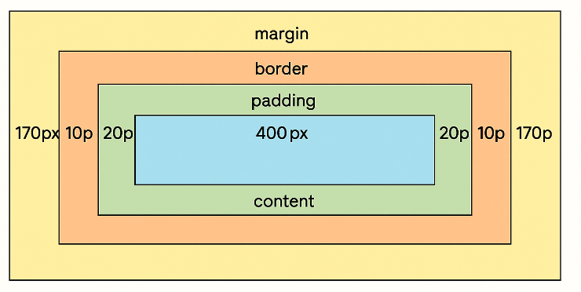
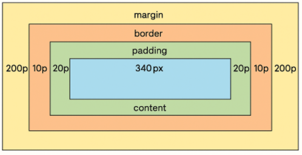
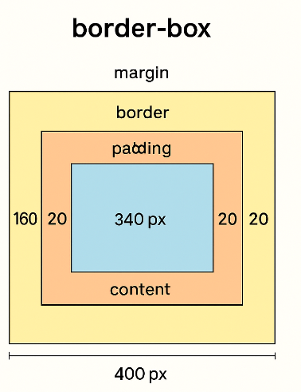

### 1. 布局模型的前提条件

在标准文档流中（非浮动、非绝对定位）：

- 一个**块级元素**在父元素中会独占一行。

- 它的**总宽度**由以下公式决定：

  ```sql
  子元素总宽度 = margin-left + border-left + padding-left
              + content-width
              + padding-right + border-right + margin-right
          = 父元素的内容宽度
  ```

这个宽度必须等于**父元素的内容宽度**（即 `content box` 的宽度）。

对于父元素来说，`box-size = content-box / border-box`，不论是哪一种盒模型，内容宽度都是指内容区得宽宽度。

#### a. content-box 模式

`width` 只算 内容，不包含 padding 和 border。

父元素宽度：800px
子元素：width 400px，padding 20px，border 10px

```rust
父元素 content 区：
|<------------------------ 800px ------------------------>|

剩余空间：
400 (width) + 20+20 (padding) + 10+10 (border) = 460px 已占用  
800 - 460 = 340px 剩余空间  
左右 margin: auto → 每边 170px

父子元素布局示意：
|<--170-->|[border(10)|padding(20)|   content(400)   |padding(20)|border(10)]|<--170-->|
```





#### b. border-box 模式

`width` 包含 内容 + padding + border。

父元素宽度：800px
子元素：width 400px（包含 padding 和 border），padding 20px，border 10px

```rust
父元素 content 区：
|<------------------------ 800px ------------------------>|

width 已含 padding + border：  
内容区宽度 = 400 - (20+20) - (10+10) = 340px  
总宽度仍是 400px  
剩余空间 = 800 - 400 = 400px  
左右 margin: auto → 每边 200px

父子元素布局示意：
|<--200-->|[border(10)|padding(20)|  content(340)  |padding(20)|border(10)]|<--200-->|
```





#### c. border-box 模式

`width` 包含 内容 + padding + border。

```scss
父元素：
width: 800px (border-box)
padding: 20px
border: 20px

```

```scss
子元素：
width: 400px (border-box)
padding: 20px
border: 10px
margin: 0 aut0
```


```markdown
父元素 content 宽度 = 800 - (padding 左右总和) - (border 左右总和)
                   = 800 - 40 - 40
                   = 720px
```

```
子元素 content 宽度 = 400 - (padding 左右总和) - (border 左右总和)
                   = 400 - 40 - 20
                   = 340px
```


```rust
							父元素 content 区：
[B20px][P20px]|<------------------------ 720px ------------------------>|[B20px][P20px]

子元素：
width 已含 padding + border：  
内容区宽度 = 400 - (20+20) - (10+10) = 340px  
子元素总宽度仍是 400px  
父元素内容区剩余空间 = 720 - 400 = 320px  
左右 margin: auto → 每边 160px

父子元素布局示意：
[B20px][P20px]|<--160-->|[B10|P20| content(340) |P20|B10]|<--160-->|[P20px][B20px]
```




#### 总结

**居中原理没变**，都是剩余空间平分。

**差别在于 width 的定义**，它影响“剩余空间”计算前的已占用宽度。


### 2. `margin: auto` 的特殊含义

当你设置 `margin-left` 和 `margin-right` 为 `auto` 时：

- 浏览器会在计算布局时，把 **剩余的空间** 均分给左右的 margin。
- 如果左右都是 `auto`，就会平均分配，从而实现**水平居中**。


### 3. 为什么一定要有宽度

如果没有指定宽度（`width: auto`），块级元素会默认 **占满父元素宽度**，剩余空间为 0，`margin: auto` 就没有“多余空间”可以分配，所以看起来不会居中。


