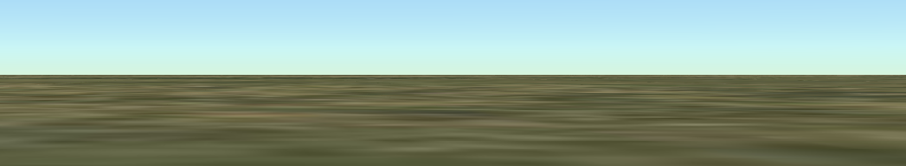
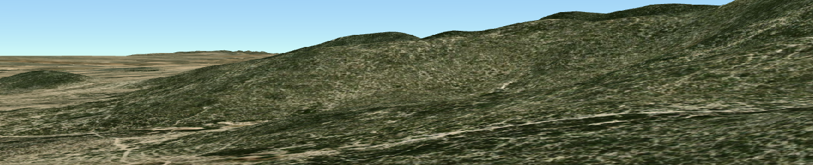

### 初始化项目

使用vue3+vite开发

#### 安装依赖：

```ini
npm install cesium
```


#### `public` 文件夹的作用：

在 Vite 项目中，`public` 文件夹的作用是：**存放不会被 Vite 打包处理的静态资源**，这些资源会在开发服务器和构建时**原样拷贝到最终构建输出目录的根目录下**，并可以直接通过根路径`/`访问。

假设你项目结构如下：

```cpp
my-vite-project/
├── public/
│   └── static/
│       └── Cesium/
│           ├── Assets/
│           ├── Widgets/
│           └── ...
└── src/
    └── main.ts
```

你可以在代码中直接访问这些资源：

```js
window.CESIUM_BASE_URL = '/static/Cesium/';
```

```html

```

##### 🚫 不要做的事

- 不要在 `public` 中放 `.js` 或 `.ts` 模块代码，因为这些不会被处理、也无法通过 `import` 使用。
- 不要在 `public` 中使用 Vue 组件或模块语法（如 `.vue` 文件），Vite 不会识别它们。

##### 总结一句话：

> **`public` 是用来放“原样交付”的资源，适合用来配置基础静态文件、第三方库资源等，不参与构建过程。**

如果你想要让某些文件走模块系统（比如 `import`），应该放在 `src/` 或通过插件处理。


#### 配置**CESIUM_BASE_URL**

Vite 会将 `public` 目录中的文件作为静态资源，直接映射到开发服务器的根路径 `/`


 CesiumJS 在哪里可以找到它运行所需的静态资源文件

在导入 CesiumJS 之前设置全局变量 `window.CESIUM_BASE_URL`，指向这些资源所在的 URL 路径。

拷贝下面四个文件夹：

- `node_modules/cesium/Build/Cesium/Workers`
- `node_modules/cesium/Build/Cesium/ThirdParty`
- `node_modules/cesium/Build/Cesium/Assets`
- `node_modules/cesium/Build/Cesium/Widgets`

### 创建cesium容器

模板中需要一个容器：`cesiumContainer`

```html
<div class="main-content" id="cesiumContainer"></div>
```

Viewer参数

| 参数名                 | 类型              | 说明                                  |
| ---------------------- | ----------------- | ------------------------------------- |
| `animation`            | `boolean`         | 是否显示左下角动画控件（默认 `true`） |
| `timeline`             | `boolean`         | 是否显示时间线（默认 `true`）         |
| `baseLayerPicker`      | `boolean`         | 是否显示图层选择器（默认 `true`）     |
| `geocoder`             | `boolean`         | 是否显示地名搜索框（默认 `true`）     |
| `homeButton`           | `boolean`         | 是否显示主页按钮                      |
| `fullscreenButton`     | `boolean`         | 是否显示全屏按钮                      |
| `infoBox`              | `boolean`         | 是否显示实体信息框                    |
| `sceneModePicker`      | `boolean`         | 是否显示 2D/3D/Columbus View 切换     |
| `selectionIndicator`   | `boolean`         | 是否显示实体选中圆圈                  |
| `navigationHelpButton` | `boolean`         | 是否显示导航帮助按钮                  |
| `terrainProvider`      | `TerrainProvider` | 自定义地形图层（默认是扁平地球）      |
| `imageryProvider`      | `ImageryProvider` | 自定义影像图层（默认是 Bing Map）     |
| `sceneMode`            | `SceneMode`       | 初始视角类型（2D/3D/Columbus）        |
| `useDefaultRenderLoop` | `boolean`         | 是否开启默认渲染循环（用于控制性能）  |

### 隐藏 **商标版权信息** 和 **数据源版权**

#### 方法一：

在 `Viewer` 初始化时传入 `creditContainer` 为一个隐藏的 DOM 元素：

```vue
<template>
  <div>
    <div id="cesiumContainer" style="width: 100%; height: 100vh;"></div>
    <!-- 隐藏 Cesium 的版权信息容器 -->
    <div id="hiddenCredit" style="display: none;"></div>
  </div>
</template>

<script setup>
import { onMounted } from 'vue';
import * as Cesium from 'cesium';
import 'cesium/Build/Cesium/Widgets/widgets.css';

window.CESIUM_BASE_URL = '/static/Cesium/';

onMounted(() => {
  const viewer = new Cesium.Viewer('cesiumContainer', {
      // 关键代码
    creditContainer: document.getElementById('hiddenCredit')
  });
});
</script>
```

这样会让 Cesium 创建 `creditDisplay`，但不再插入页面上，官方推荐且无副作用。

#### 方法二：

```js
 viewer.cesiumWidget.creditContainer.style.display = "none";
```


### 地形数据：terrain

```js
const viewer = new Viewer('cesiumContainer', {
  terrain: Terrain.fromWorldTerrain(),
});
```

告诉 `Cesium` 使用由 `Cesium Ion` 提供的 **真实地形数据服务**，包括高程（Elevation）信息，这样地表不再是平的。

默认情况下，如果你不配置 `terrain`，Cesium 使用的是一个**平地地球**，也就是说所有经纬度位置的高程都是 **0**。

#### 高程信息

**高程**就是地球上某个点的**海拔高度**。

- 是指某个地点**相对于海平面**的高度（单位通常是 **米**）。
- 地球不是平的，有山、有谷、有平原，每个地方的高程不一样。

举个例子：

| 地点           | 经度  | 纬度 | 高程（海拔）              |
| -------------- | ----- | ---- | ------------------------- |
| 喜马拉雅山顶   | 86°E  | 27°N | **8848 米**               |
| 北京市中心     | 116°E | 39°N | **43 米**                 |
| 死海沿岸       | 35°E  | 31°N | **-430 米**（低于海平面） |
| 太平洋中央海域 | -150° | 0°   | **0 米**（海平面）        |


如果你在 Cesium 中**没有配置地形数据**，那么：

- Cesium 默认把整个地球当作一个**完全平坦的球体**
- 每一个经纬度点的高程都是 **0 米**
- 这叫做“扁平地球”（Flat Ellipsoid）




设置了 `fromWorldTerrain()` 之后，Cesium 会：

- 加载全球高程数据（山区、峡谷、建筑区域更真实）
- 支持**贴地**绘制（如模型或实体贴合地表）
- 支持**地形阴影和遮挡**
- 部分地形包含**摄影测量模型（3D Tiles）**



##### ✅ 结论

> **高程 = 海拔高度**
>
> Cesium 默认地球是平的，高程为 0，设置地形后才有真实起伏。

如果你想做的效果涉及：贴地飞行、模型落在山上、模拟建筑地形高度，**必须开启地形数据**（也就是 `Terrain.fromWorldTerrain()`）。


### Cesium图层

**从功能维度分类：**

| 类型              | Cesium 类                                    | 用途                                       |
| ----------------- | -------------------------------------------- | ------------------------------------------ |
| **影像图层**      | `ImageryLayer`                               | 显示地图图像，如卫星图、街道图等           |
| **地形图层**      | `TerrainProvider`                            | 显示地球表面的高低起伏（高程）             |
| **实体图层**      | `EntityCollection`（属于 `viewer.entities`） | 显示点、线、面、标签、模型等“实体”         |
| **3D Tiles 图层** | `Cesium3DTileset`                            | 加载三维城市、建筑、模型等大规模三维数据集 |

####  一、影像图层（Imagery Layers）

用于显示地图图像（瓦片地图），如天地图、OpenStreetMap、ArcGIS 等。

📦 加载方式：`viewer.imageryLayers.addImageryProvider(...)`

**常用图层提供器（ImageryProvider 类）：**

| 类名                                 | 描述                        | 示例服务                   |
| ------------------------------------ | --------------------------- | -------------------------- |
| ✅ `WebMapTileServiceImageryProvider` | 标准 WMTS 协议图层          | 天地图、国测局服务         |
| ✅ `TileMapServiceImageryProvider`    | TMS 图层                    | 离线瓦片、Cesium 自带示例  |
| ✅ `UrlTemplateImageryProvider`       | URL 模板图层（灵活）        | 高德、腾讯、OSM 非标准接口 |
| ✅ `ArcGisMapServerImageryProvider`   | Esri ArcGIS 地图服务        | ArcGIS 在线地图            |
| ✅ `IonImageryProvider`               | Cesium Ion 的图层（需登录） | Bing Maps、Sentinel-2      |
| `OpenStreetMapImageryProvider`       | 加载 OSM 瓦片地图           | OpenStreetMap 标准图       |
| `BingMapsImageryProvider`            | Bing 地图图层               | 已被 Ion 替代为默认方式    |

#### 二、地形图层（Terrain Layers）

用于加载地形高程信息，显示真实山脉、丘陵等地形。

📦 加载方式：在 `Viewer` 中传入 `terrain` 参数，例如：

```js
terrain: Cesium.Terrain.fromWorldTerrain()
```

**常见地形提供器：**

| 类名                         | 描述                             | 用法                                |
| ---------------------------- | -------------------------------- | ----------------------------------- |
| ✅ `CesiumTerrainProvider`    | 标准 Cesium 地形格式（.terrain） | 加载自定义地形数据                  |
| ✅ `Cesium.WorldTerrain`      | Cesium 官方提供的全球地形        | `Cesium.Terrain.fromWorldTerrain()` |
| ✅ `EllipsoidTerrainProvider` | 默认地形：纯椭球体（无起伏）     | 用于不需要真实高程的项目            |

#### 三、数据图层（Data Layers / Entities / Primitives）

用于加载可交互的地理对象，如点、线、面、3D 模型等。

📦 加载方式：`viewer.entities.add(...)`、`viewer.scene.primitives.add(...)` 等

**常见格式或加载器：**

| 类型                    | 用法                       | 说明                            |
| ----------------------- | -------------------------- | ------------------------------- |
| ✅ `EntityCollection`    | `viewer.entities`          | 高层封装，支持动态属性          |
| ✅ `PrimitiveCollection` | `viewer.scene.primitives`  | 低层 API，性能高但复杂          |
| ✅ CZML                  | `Cesium.CzmlDataSource`    | 动态时间数据格式，官方推荐      |
| ✅ GeoJSON               | `Cesium.GeoJsonDataSource` | 标准地理数据格式，易与 GIS 结合 |
| ✅ KML/KMZ               | `Cesium.KmlDataSource`     | Google Earth 格式               |
| ✅ glTF / 3D Tiles       | `Cesium3DTileset`          | 高性能大规模 3D 模型展示        |
| ✅ Custom Primitive      | 手写 Shader 和几何体       | 高级用法，自定义渲染逻辑        |

#### 四、3D 瓦片图层（3D Tiles Layers）

Cesium 独有的 3D Tiles 格式，用于高性能渲染大规模建筑模型、BIM、城市数据。

📦 加载方式：

```js
const tileset = new Cesium.Cesium3DTileset({ url: 'xxx/tileset.json' });
viewer.scene.primitives.add(tileset);
```

####  总结分类表

| 类型            | 加载入口                  | 推荐方式                                    | 典型服务                |
| --------------- | ------------------------- | ------------------------------------------- | ----------------------- |
| 🗺️ 影像图层      | `imageryLayers`           | `WebMapTileServiceImageryProvider`          | 天地图、OSM、ArcGIS     |
| 🏔️ 地形图层      | `terrain`                 | `Cesium.Terrain.fromWorldTerrain()`         | 全球高程                |
| 🧱 实体图层      | `entities` / `primitives` | `viewer.entities.add` / `GeoJsonDataSource` | 点线面、地标            |
| 🧩 3D Tiles 图层 | `scene.primitives`        | `Cesium3DTileset`                           | 城市模型、BIM、倾斜摄影 |

#### 天地图

**天地图**是中国官方提供的免费地图服务，网址是 https://www.tianditu.gov.cn。

它就像中国版的 Google Maps 或高德地图，不过：

- 更加适用于政府、国企、涉密项目
- 数据覆盖全国、准确性高
- 支持标准的地图服务协议（WMTS）

所以，我们在 Cesium 里加载天地图，是为了**让地图背景数据更加真实和权威**。


##### 天地图提供的图层种类 —— 是“影像图层”下的不同风格

| 天地图图层名      | 内容                   | 属于 Cesium 哪类图层？                       |
| ----------------- | ---------------------- | -------------------------------------------- |
| `vec`（矢量图）   | 道路、边界、基础底图   | ✅ **影像图层**                               |
| `cva`（矢量注记） | 地名、文字标签         | ✅ **影像图层**（作为叠加图层）               |
| `img`（影像图）   | 卫星照片               | ✅ **影像图层**                               |
| `cia`（影像注记） | 影像上的地名           | ✅ **影像图层**                               |
| `ter`（地形渲染） | 地形着色图，视觉效果用 | ✅ 也作为 **影像图层** 用途（但不是真实地形） |

##### 📌 注意：

天地图**不会提供 Cesium 的地形图层（如 .terrain 文件）**，所以：

- 如果你想看到真实山脉地形 → 用 `Cesium.Terrain.fromWorldTerrain()`
- 天地图的 “ter” 图层只是“像看起来有起伏的颜色图”，**它本质上还是影像图层**


```mathematica
Cesium 图层体系
├── 🗺️ 影像图层（Imagery Layer）
│   ├── 天地图 vec（矢量）
│   ├── 天地图 cva（注记）
│   ├── 天地图 img（影像）
│   └── 天地图 cia（影像注记）
├── 🏔️ 地形图层（Terrain Layer）
│   └── Cesium World Terrain（真实高程数据）
├── 🧱 实体图层（Entity Layer）
│   └── GeoJSON、CZML、Entity API 添加的点线面等
└── 🧩 3D Tiles 图层（Tileset Layer）
    └── 倾斜摄影 / BIM / 城市建筑模型等
```

##### ✅ 总结一句话：

> **天地图的各种图层（矢量、注记、影像）都是“影像图层”，它们是用来给地图铺背景的，不包含地形或三维模型。**


#### 图层添加与移除

1. ##### 明确图层的类型分类

```
viewer.imageryLayers.addImageryProvider()

viewer.imageryLayers.add(imageryLayer);
```


### 坐标：

在 Cesium 中，**几乎所有空间位置的表达最终都必须转换为三维空间中的笛卡尔坐标（`Cartesian3`）**，这是 Cesium 的核心坐标体系。

#### 为什么使用笛卡尔坐标（`Cartesian3`）？

Cesium 是一个基于 WebGL 的 3D 地球引擎，内部构建的是一个**椭球体模型（WGS84）**。为了在三维场景中进行渲染和数学运算，它统一采用了以地心为原点的笛卡尔三维坐标系（右手系）：

- **X 轴**：指向经度 0°、纬度 0° 的方向（赤道和本初子午线交点）
- **Y 轴**：指向经度 90°E 的赤道方向
- **Z 轴**：指向北极

所以在 Cesium 中，所有**相机、实体、标签、模型等位置**，最终都要用 `Cartesian3` 表达。

#### 常用的经纬度转换方式

| 方法                                                        | 用途                                | 示例               |
| ----------------------------------------------------------- | ----------------------------------- | ------------------ |
| `Cesium.Cartesian3.fromDegrees(lon, lat, height)`           | 将 WGS84 经纬度+高度 转换为三维位置 | ✅ 最常用           |
| `Cesium.Cartesian3.fromRadians(lonRad, latRad, height)`     | 弧度转位置                          | 用得较少           |
| `Cesium.Ellipsoid.WGS84.cartesianToCartographic(cartesian)` | 反向转换为经纬度（`Cartographic`）  | 需要读取坐标时使用 |

**你可以理解为：**

- 地理信息（`经纬度`）是用户使用的输入/输出接口。
- 渲染引擎（Cesium）使用的是**三维空间坐标（`Cartesian3`）**。
- 所以任何你要“放在地图上的东西”，都要经过**转换**后才能显示出来。

#### 举个例子：

添加一个标签或模型时：

```js
const position = Cesium.Cartesian3.fromDegrees(116.39, 39.91, 1000); // 北京 1000 米高空
// 添加模板 必须使用三维坐标系
viewer.entities.add({
  name: "北京",
  position,
  point: {
    pixelSize: 10,
    color: Cesium.Color.RED
  }
});
```

如果你直接使用 `lon`、`lat` 是无法添加实体的，因为 Cesium 的底层渲染只能理解 `Cartesian3`。


### 测量距离：

`handler：`**创建一个用于监听用户输入事件（如鼠标点击、移动、滚轮、触摸等）的事件处理器对象**。

```js
const handler = new Cesium.ScreenSpaceEventHandler(viewer.scene.canvas);
```

参数 `canvas` 是 DOM 元素，通常你传入的是 `viewer.scene.canvas`，即 Cesium 渲染的那个 `WebGL` 画布。

**应该在需要监听用户交互时再创建**，而不是全局提前创建。

 `ScreenSpaceEventHandler` 的作用总结：

| 功能                 | 说明                                                   |
| -------------------- | ------------------------------------------------------ |
| 🎯 **监听用户输入**   | 监听鼠标、触控、滚轮等事件（如点击、双击、拖动）       |
| 📍 **获取点击位置**   | 可用于获取地球上的坐标位置（配合 `pickPosition()`）    |
| 🧩 **绑定自定义回调** | 使用 `.setInputAction()` 绑定事件回调                  |
| 🔄 **移除监听器**     | 用 `.removeInputAction()` 或 `.destroy()` 停止监听事件 |


点击测量距离的按钮，进入到测量功能，鼠标移入地图变为十字。

点击地图，获取当前点击位置，在此位置生成一个点标记，接着移动鼠标，再次点击一个坐标，生成标记，同时生成两点之间的连线，计算距离，显示在地图上，

如此往复，直接双击左键，结束测量。


### 添加实体：

#### 方法：

在 Cesium 中，**添加实体是通过 `viewer.entities.add(options)` 方法**完成的，添加进去的实体是 `Cesium.Entity` 类型的对象。

#### 参数：

`options`是一个普通的配置对象，类型是 `Entity.ConstructorOptions`吗，用来描述这个实体要显示的内容，如位置、图标、线、面等。

#### 返回值：

返回的是一个 `Entity` 对象（`Cesium.Entity` 类型），你可以后续操作它，比如更新位置、隐藏、删除等。

#### 实体类型：

| 实体类型       | 属性名           | 说明                                     |
| -------------- | ---------------- | ---------------------------------------- |
| 📍 点标记       | `point`          | 显示一个小圆点（通常用作定位、打点）     |
| 🖼 图标标注     | `billboard`      | 显示一个图片（图标、头像、图钉）         |
| 📝 文本标签     | `label`          | 显示文字（位置名称、编号等）             |
| 🧭 描述面板     | `description`    | 鼠标点击弹出的 HTML 描述（可包含富文本） |
| 🟰 线段         | `polyline`       | 多段折线，常用于路径、连线等             |
| 🟨 多边形       | `polygon`        | 平面区域，例如绘制区域、围栏等           |
| 🧊 多面体       | `polylineVolume` | 带高度的拉伸面（如管道、立体墙）         |
| 📦 盒子         | `box`            | 三维立方体                               |
| 🥛 圆柱体       | `cylinder`       | 柱状几何体                               |
| 🧈 椭球体       | `ellipsoid`      | 类似球体                                 |
| 🧿 球体区域     | `ellipse`        | 椭圆形状（在地表投影）                   |
| 🪄 圆锥体       | `cone`           | 用于可视域分析等（Cesium 1.113+）        |
| 🚶 路径         | `path`           | 显示实体的运动轨迹                       |
| 🛫 模型         | `model`          | 加载 3D 模型（如 GLTF、GLB 格式）        |
| 🧩 动态姿态模型 | `orientation`    | 设置朝向（如飞机朝前飞）                 |
| 🗺 路径位置     | `position`       | 实体的地理坐标位置                       |

#### 添加图标实体：

在地图上添加图标通常是通过 `Billboards（广告牌）`来实现的。`Billboards` 是世界空间中的二维图像，始终朝向观看者。

**使用 viewer.entities.add() (推荐用于大多数情况):** 这是更现代且功能更强大的方法，它将图标作为实体（`Entity`）的一部分进行管理。

```js
viewer.entities.add({
    //实体本身的核心属性
    // 三维笛卡尔坐标
    position: Cesium.Cartesian3.fromDegrees(-75.59777, 40.03883),
    name: '这是一个图标实体',
    description: '鼠标点击后显示在信息框中的内容。',
    
    // --- 图标相关的详细参数 ---
    billboard: {
        image: "../images/Cesium_Logo_overlay.png", // default: undefined
        show: true, // default
        pixelOffset: new Cesium.Cartesian2(0, -50), // default: (0, 0)
        eyeOffset: new Cesium.Cartesian3(0.0, 0.0, 0.0), // default
        horizontalOrigin: Cesium.HorizontalOrigin.CENTER, // default
        verticalOrigin: Cesium.VerticalOrigin.BOTTOM, // default: CENTER
        scale: 2.0, // default: 1.0
        color: Cesium.Color.LIME, // default: WHITE
        rotation: Cesium.Math.PI_OVER_FOUR, // default: 0.0
        alignedAxis: Cesium.Cartesian3.ZERO, // default
        width: 100, // default: undefined
        height: 25, // default: undefined
    },
});
```

##### billboard 对象内的关键参数详解

**1. 基础与图像 (Basic & Image)**

| 参数名         | 数据类型                                        | 默认值 | 含义                                                         |
| -------------- | ----------------------------------------------- | ------ | ------------------------------------------------------------ |
| **image**      | String 或 HTMLCanvasElement 或 HTMLImageElement |        | **（必需）** 指定图标的图像来源。这可以是一个 URL 字符串，也可以是一个 Canvas 或 Image 元素。 |
| show           | Boolean                                         | true   | 控制图标是否可见。默认为 true。                              |
| imageSubRegion | BoundingRectangle                               |        | 从一个更大的图像（雪碧图/精灵图）中裁剪出特定区域作为图标。例如 new Cesium.BoundingRectangle(x, y, width, height)。 |

**2. 定位与偏移 (Positioning & Offset)**

| 参数名           | 数据类型         | 默认值                  | 含义                                                         |
| ---------------- | ---------------- | ----------------------- | ------------------------------------------------------------ |
| pixelOffset      | Cartesian2       | Cartesian2.ZERO         | 在屏幕空间中，相对于图标原点（position 属性）的像素偏移量。例如 new Cesium.Cartesian2(0, -20) 会使图标向上偏移20像素。 |
| eyeOffset        | Cartesian3       | Cartesian3.ZERO         | 在相机空间中的3D偏移量。这对于将图标从其附着的3D模型或地球表面“推”向相机非常有用，可以防止Z-fighting（深度冲突/闪烁）。例如 new Cesium.Cartesian3(0, 0, -10)。 |
| horizontalOrigin | HorizontalOrigin | HorizontalOrigin.CENTER | 设置图标的水平对齐点。可选值：Cesium.HorizontalOrigin.LEFT (左对齐), Cesium.HorizontalOrigin.CENTER (居中), Cesium.HorizontalOrigin.RIGHT (右对齐)。默认为 CENTER。 |
| verticalOrigin   | VerticalOrigin   | VerticalOrigin.CENTER   | 设置图标的垂直对齐点。可选值：Cesium.VerticalOrigin.TOP (顶部对齐), Cesium.VerticalOrigin.CENTER (居中), Cesium.VerticalOrigin.BASELINE (基线), Cesium.VerticalOrigin.BOTTOM (底部对齐)。默认为 CENTER。 |

**3. 尺寸与缩放 (Sizing & Scaling)**

| 参数名       | 数据类型 | 默认值 | 含义                                                         |
| ------------ | -------- | ------ | ------------------------------------------------------------ |
| scale        | Number   | 1.0    | 图像的缩放比例。1.0 代表原始尺寸，0.5 代表缩小一半，2.0 代表放大一倍。 |
| width        | Number   |        | 图标的宽度（单位：像素）。如果设置了此项，scale 将被忽略。   |
| height       | Number   |        | 图标的高度（单位：像素）。如果设置了此项，scale 将被忽略。   |
| sizeInMeters | Boolean  | false  | 如果设为 true，width 和 height 的单位将是米，图标会随相机远近而缩放，看起来像地面上的真实物体。默认为 false。 |

**4. 颜色与旋转 (Color & Rotation)**

| 参数名      | 数据类型   | 默认值          | 含义                                                         |
| ----------- | ---------- | --------------- | ------------------------------------------------------------ |
| color       | Color      | Color.WHITE     | 应用于图像的颜色。该颜色会与原始图像的颜色混合。默认为 Cesium.Color.WHITE (不改变原色)。设置为 Cesium.Color.RED 会给图标染上红色色调。 |
| rotation    | Number     | 0               | 图标围绕其轴线（从 position 指向相机）的旋转角度，单位是弧度。可以使用 Cesium.Math.toRadians(degrees) 将角度转换为弧度。默认为 0.0。 |
| alignedAxis | Cartesian3 | Cartesian3.ZERO | 设置图标的旋转轴，单位是固定的世界坐标。默认情况下，图标始终朝向相机。如果设置此属性（例如 new Cesium.Cartesian3(0, 0, 1)，即Z轴），图标将绕着该轴旋转，而不是始终面向相机。 |

**5. 可见性与距离显示 (Visibility & Distance Display)**

| 参数名                   | 数据类型                 | 含义                                                         |
| ------------------------ | ------------------------ | ------------------------------------------------------------ |
| distanceDisplayCondition | DistanceDisplayCondition | 根据与相机的距离决定图标是否可见。非常适合实现LOD（Level of Detail）效果。例如 new Cesium.DistanceDisplayCondition(1000, 10000) 表示图标仅在相机距离1000米到10000米之间时才可见。 |
| scaleByDistance          | NearFarScalar            | 根据与相机的距离动态调整图标的缩放比例。例如 new Cesium.NearFarScalar(1.5e2, 2.0, 8.0e6, 0.5) 表示在近处（150米）时放大到2倍，在远处（800万米）时缩小到0.5倍。 |
| translucencyByDistance   | NearFarScalar            | 根据与相机的距离动态调整图标的透明度。用法与 scaleByDistance 类似，但控制的是透明度（0.0完全透明，1.0完全不透明）。 |
| disableDepthTestDistance | Number                   | 当图标与相机的距离小于此值（米）时，将禁用深度测试。这会使图标始终显示在其他物体之上，即使它实际上在物体后面。适用于需要始终显示的重要标记。 |


#### 添加点实体：

```js
viewer.entities.add({
  position: cartesian,
  point: {
    pixelSize: 5,
    color: Cesium.Color.RED,
    outlineColor: Cesium.Color.WHITE,
    outlineWidth: 1,
    heightReference: Cesium.HeightReference.CLAMP_TO_GROUND,
  },
});
```


#### 添加线段实体：

`polyline` 是一种 `Entity` 类型，表示一条线段或折线；

```ts
viewer.entities.add({
  polyline: {
    positions: [...], // 点数组
    width: 3,
    material: Cesium.Color.RED,
  },
});
```

##### `polyline.positions` 是什么？

这是 **线段的顶点坐标数组**，也就是线条的路径。

🔹 类型：

```ts
// 三维坐标点Cesium.Cartesian3 构成的数组， 这些点将按顺序连接起来，形成折线。
positions: Cartesian3[] 。
// 或者 
positions: CallbackProperty<Cartesian3[]>
```

###### 1. positions: Cartesian3[]：

三维坐标点`Cesium.Cartesian3` 构成的数组， 这些点将按顺序连接起来，形成折线。

无法直接用 `[lng, lat]`，需要先转换为笛卡尔三维坐标：

```ts
const pos = Cesium.Cartesian3.fromDegrees(lon, lat, height)
```

或者在交互中通过点击获取：

```ts
const pos1 = viewer.scene.pickPosition(click.position); // 已是 Cartesian3
const pos2 = viewer.scene.pickPosition(click.position);
```

```ts
viewer.entities.add({
  polyline: {
    positions: [pos1,pos2], // 点数组
    width: 3,
    material: Cesium.Color.RED,
  },
});
```


###### 2. positions: CallbackProperty<Cartesian3[]>

`Cesium.CallbackProperty`

`Cesium.CallbackProperty` 是 `Cesium` 提供的一个函数封装类，用于让某个属性（如位置、颜色、速度等）**在每一帧实时重新计算和刷新**。

```js
viewer.entities.add({
    polyline: {
      positions: new Cesium.CallbackProperty(() => positions, false),
      width: 3,
      material: Cesium.Color.RED,
      clampToGround: false,
    },
  });
```

```js
positions: new Cesium.CallbackProperty(() => positions, false),
```

这表示：每一帧都调用这个函数，获取最新的 `positions` 数组，自动更新线段的绘制结果。

只要你在每次点击时往 `positions` 数组中 `push` 一个新坐标点，`Cesium` 就会在下一帧自动重绘线段。

第二个参数：`false` 的含义

```
new Cesium.CallbackProperty(fn, isConstant)
```

- 第二个参数 `isConstant` 表示这个回调函数返回的值是否**永远不变**。
- 设置为 `false`，告诉 Cesium：**这个值会变化**，请每一帧都调用这个函数（如果会变化，就设为 `false`）。


###### 扩展：

> 使用 `CallbackProperty(() => positions, false)` 时，Cesium 会在每一帧都调用这个回调函数，从头到尾获取你当前的整个 `positions` 数组，然后从第一个点开始**完整绘制一次整条线段**。
>
> 是否有性能问题？
>
> - 每帧虽然调用 `CallbackProperty`，但只有当你返回的内容**发生结构变化**（如 push 新点），它才会真正重新计算图元（primitive）；
> - 这种「低频数据变动 + 高频刷新」是 Cesium 的常规机制，应用广泛于动画、动态路径、鼠标交互等场景；
> - 数组越长重绘越慢是理论上存在的，但即使上千个点也足够高效，除非你每帧都创建/销毁实体（这才会卡）。
>
> 是否可以只重绘新增的那一段？
>
> Cesium 默认的 `CallbackProperty` 并不支持「部分重绘」。如果你真的需要优化到极致（比如数万点），你需要：
>
> 1. 不使用 `Entity` + `CallbackProperty`；
> 2. 改用 `Primitive`（底层 API）+ `GeometryInstance`，手动控制更新；
> 3. 或者，每次点击只创建新一段 `polyline entity`（就像你之前用 `[p1, p2]` 那样）。


### 测量面积


### 事件

`movement.endPosition`是普通地图上的位置或者实体是，返回的结果有什么区别

```
viewer.scene.pick(movement.endPosition);
```

