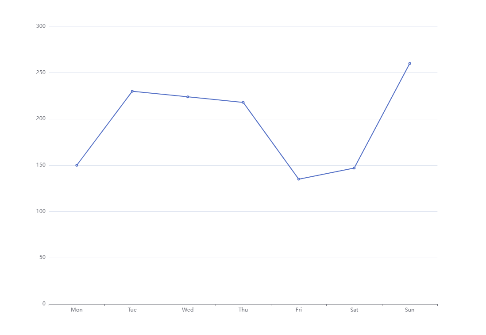

最实用方法是：**找图 + 改配置 + 看变化**

```js
import * as echarts from 'echarts';

var chartDom = document.getElementById('main');
var myChart = echarts.init(chartDom);
var option;

option = {
  xAxis: {
    type: 'category',
    data: ['Mon', 'Tue', 'Wed', 'Thu', 'Fri', 'Sat', 'Sun']
  },
  yAxis: {
    type: 'value'
  },
  series: [
    {
      data: [150, 230, 224, 218, 135, 147, 260],
      type: 'line'
    }
  ]
};

option && myChart.setOption(option);
```

