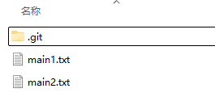
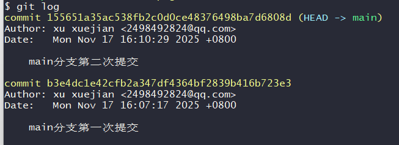
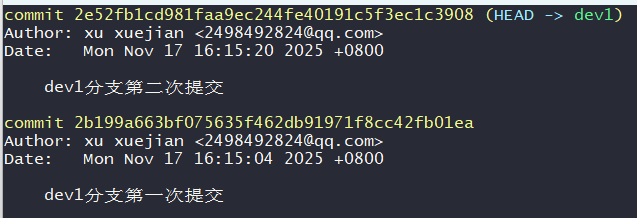

### 🧩 **情况 1：功能分支想同步主分支最新进度（最常见）**

#### 🌱 场景

你在写一个登录功能 `feature/login`。
 写着写着，`main` 分支上别人推了新代码（比如修了一个你依赖的 bug）。

你的提交历史现在长这样：

```mathematica
main:   A --- B --- C
           \
feature:       D --- E
```

但你想在最新的 C 基础上继续开发。

#### 🛠️ 做法

```mathematica
git fetch
git rebase origin/main
```

#### 🎉 结果

Git 会把你的 D、E“拆下来”，重新接到 C 后面：

```mathematica
main:    A --- B --- C
                \
feature (rebased):     D' --- E'
```

**你等于瞬间同步了最新 main，同时没有引入 merge commit。**
 提交历史线性又漂亮，好评如潮。


举例：

创建一个main分支

创建两个文件，分别进行两次提交







创建一个新的分支dev1,

```bash
$ git checkout -b dev1
```

创建两个文件，分别提交两次

这是dev1分支的提交记录




这时候main分支也在更新，也进行了一次提交

```mathematica
main:   A --- B --- C
           \
dev1:         D --- E
```

