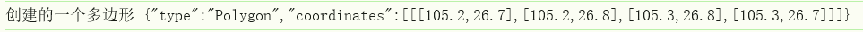

### GeoJSON

GeoJSON 是一种对各种地理数据结构进行编码的格式，基于 Javascript对象表示法（JavaScript Object Notation, 简称 JSON）的地理空间信息数据交换格式。

简而言之，GeoJSON 为你提供了一种简单的格式来表示简单的地理特征以及它们的非空间属性。


JSON 被设计为一种轻量级、基于文本且与语言无关的数据交换格式，人类和机器都易于读写。GeoJSON 基本上使用这种设计策略来表示有关地理特征、它们的属性和它们的空间范围的数据。


###  Geometry（几何对象）

GeoJSON 支持的 `Geometry`（几何对象）类型，包括：`Point`, `LineString`, `Polygon`, `MultiPoint`, `MultiLineString` ，`MultiPolygon`以及`GeometryCollection`

#### **1. Point（点）**

表示一个地理位置（单个点），由一个坐标数组表示。

**GeoJSON 格式：**

```json
{
  "type": "Point",
  "coordinates": [longitude, latitude]
}
```

**示例：**

```json
{
  "type": "Point",
  "coordinates": [102.0, 0.5]
}
```

- `coordinates` 是 `[经度, 纬度]`。
- 可选地包含高程 `[经度, 纬度, 高程]`。

------

#### **2. MultiPoint（多点）**

表示多个点的集合。

**GeoJSON 格式：**

```json
{
  "type": "MultiPoint",
  "coordinates": [
    [lon1, lat1],
    [lon2, lat2],
    ...
  ]
}
```

**示例：**

```json
{
  "type": "MultiPoint",
  "coordinates": [
    [102.0, 0.5],
    [103.0, 1.0]
  ]
}
```

------

#### **3. LineString（线串）**

表示一条由多个点组成的线。

**GeoJSON 格式：**

```json
{
  "type": "LineString",
  "coordinates": [
    [lon1, lat1],
    [lon2, lat2],
    ...
  ]
}
```

**示例：**

```json
{
  "type": "LineString",
  "coordinates": [
    [102.0, 0.0],
    [103.0, 1.0],
    [104.0, 0.0]
  ]
}
```

------

#### **4. MultiLineString（多线串）**

表示多条线，每条线由一组坐标组成。

**GeoJSON 格式：**

```json
{
  "type": "MultiLineString",
  "coordinates": [
    [
      [lon1, lat1], [lon2, lat2]
    ],
    [
      [lon3, lat3], [lon4, lat4]
    ]
  ]
}
```

**示例：**

```json
{
  "type": "MultiLineString",
  "coordinates": [
    [[102.0, 0.0], [103.0, 1.0]],
    [[104.0, 0.0], [105.0, 1.0]]
  ]
}
```

------

#### **5. Polygon（多边形）**

表示一个或多个封闭的区域。

- **外环（必选）**：表示边界。
- **内环（可选）**：表示洞（洞必须在外环内）。

**GeoJSON 格式：**

```json
{
  "type": "Polygon",
  "coordinates": [
    [ [lon1, lat1], [lon2, lat2], ..., [lon1, lat1] ],  // 外环，必须闭合
    [ [lon3, lat3], [lon4, lat4], ..., [lon3, lat3] ]   // 内环（可选）
  ]
}
```

**示例：**

```json
{
  "type": "Polygon",
  "coordinates": [
    [
      [100.0, 0.0],
      [101.0, 0.0],
      [101.0, 1.0],
      [100.0, 1.0],
      [100.0, 0.0]
    ]
  ]
}
```

------

#### **6. MultiPolygon（多多边形）**

表示多个多边形，每个多边形可以有洞。

**GeoJSON 格式：**

```json
{
  "type": "MultiPolygon",
  "coordinates": [
    [   // 第一个多边形
      [ [lon1, lat1], [lon2, lat2], ..., [lon1, lat1] ]  // 外环
    ],
    [   // 第二个多边形
      [ [lon3, lat3], [lon4, lat4], ..., [lon3, lat3] ]  // 外环
    ]
  ]
}
```

**示例：**

```json
{
  "type": "MultiPolygon",
  "coordinates": [
    [
      [[102.0, 2.0], [103.0, 2.0], [103.0, 3.0], [102.0, 3.0], [102.0, 2.0]]
    ],
    [
      [[100.0, 0.0], [101.0, 0.0], [101.0, 1.0], [100.0, 1.0], [100.0, 0.0]],
      [[100.2, 0.2], [100.8, 0.2], [100.8, 0.8], [100.2, 0.8], [100.2, 0.2]]  // 洞
    ]
  ]
}
```

------

#### **7. GeometryCollection（几何集合）**

表示多个不同类型的几何对象的集合。

**GeoJSON 格式：**

```json
{
  "type": "GeometryCollection",
  "geometries": [
    { "type": "Point", "coordinates": [102.0, 0.5] },
    { "type": "LineString", "coordinates": [[102.0, 0.0], [103.0, 1.0]] }
  ]
}
```


#### 补充：

**MultiPolygon**的适合场景

这些多边形是**一个整体对象**，逻辑上它们属于同一类实体。

例子：一个城市行政区，有几块不连续的地块（比如香港有多个离岛），存储时要表达“它们是一回事”。

示例：

```json
{
  "type": "Feature",
  "properties": { "name": "某某区" },
  "geometry": {
    "type": "MultiPolygon",
    "coordinates": [
      [ [ [x1, y1], [x2, y2], ..., [x1, y1] ] ],  // 第一块
      [ [ [a1, b1], [a2, b2], ..., [a1, b1] ] ]   // 第二块
    ]
  }
}
```


多个 **Feature**的适合场景

这些多边形是**不同的对象**，即使它们一起绘制，但彼此独立。

例子：你在地图上随便画了几块区域，每一块都有独立的意义（比如多个地块，每块地都有自己的属性）。

```json
{
  "type": "FeatureCollection",
  "features": [
    {
      "type": "Feature",
      "properties": { "id": 1 },
      "geometry": { "type": "Polygon", "coordinates": [ ... ] }
    },
    {
      "type": "Feature",
      "properties": { "id": 2 },
      "geometry": { "type": "Polygon", "coordinates": [ ... ] }
    }
  ]
}
```


#### openLayers代码示例

将Geometry转为GeoJSON格式

##### point

```js
import Point from "ol/geom/Point";

const geom = new Point([105.2, 26.7]);
const pointJSON = new GeoJSON().writeGeometry(geom);
console.log("创建的一个点", pointJSON);
```


##### Polygon

```js
import { Polygon } from "ol/geom";

const polygon = new Polygon([
  [
    [105.2, 26.7],
    [105.2, 26.8],
    [105.3, 26.8],
    [105.3, 26.7],
  ],
]);
const polygonJSON = new GeoJSON().writeGeometry(polygon);
console.log("创建的一个多边形", polygonJSON);
```




#### 总结

以上看到的几何对象定义了可以在地图上绘制的形状，只描述**空间形状**（也就是位置数据），**不包含属性信息**。

然而，我们在地图上的形状也应该有一些现实世界的意义。此含义由该形状的属性定义。例如，在地图上用多边形标记的建筑物可能有一个名称属性，如“泰姬陵”，可能还有一些其他参数进一步描述了该形状。在 GeoJSON 中，`Feature`类型的对象定义实体的几何形状和属性。


### Feature对象

是对 Geometry 的一层封装，用来给几何对象附加**属性信息**。

每个 Feature 都包含：

- 一个 `geometry` 字段（几何对象）
- 一个 `properties` 字段（描述该几何的各种属性信息，如名称、编号等）
- 一个 `id`（可选的唯一标识）

### 📍 Feature 的结构示例

```json
{
  "type": "Feature",
  "geometry": {
    "type": "Point",
    "coordinates": [102.0, 0.5]
  },
  "properties": {
    "name": "Sample Point",
    "category": "city"
  },
  "id": "point-1"
}
```

- `type: "Feature"`：声明这是一个要素。
- `geometry`：放一个 GeoJSON Geometry 对象（如 Point、Polygon）。
- `properties`：放属性信息（任意 JSON）。
- `id`：可选，用来唯一标识这个 Feature。


### FeatureCollection对象

**FeatureCollection（要素集合）**

- 表示一组 `Feature` 的集合。
- 相当于一个数组，把很多 Feature 放在一起组成一个完整的 GeoJSON 数据集。

#### 📦 FeatureCollection 的结构示例

```json
{
  "type": "FeatureCollection",
  "features": [
    {
      "type": "Feature",
      "geometry": { "type": "Point", "coordinates": [102.0, 0.5] },
      "properties": { "name": "Point A" }
    },
    {
      "type": "Feature",
      "geometry": { 
        "type": "LineString",
        "coordinates": [[102.0, 0.0], [103.0, 1.0]]
      },
      "properties": { "name": "Line B" }
    }
  ]
}
```

- `type: "FeatureCollection"`：声明是要素集合。
- `features`：数组，每个元素都是一个 Feature。


### 🧩 GeoJSON、Geometry、Feature 的关系

可以用一个层次结构来理解：

```ini
GeoJSON
 ├── FeatureCollection (多个 Feature)
 │     ├── Feature 1
 │     │     ├── geometry
 │     │     └── properties
 │     ├── Feature 2
 │     │     ├── geometry
 │     │     └── properties
 │     ...
 └── 或者直接是 Geometry（单个 geometry）
```


#### 🗺 GeoJSON 结构示意图

```matlab
┌────────────────────────────┐
│        GeoJSON 文档        │
│  (整个文件是一个 JSON 对象) │
└─────────────┬──────────────┘
              │
    ┌─────────┼─────────────┐
    │                         │
┌─────────────┐        ┌─────────────────────┐
│ Geometry    │        │ Feature             │
│ (几何对象)  │        │ (要素)               │
└─────┬───────┘        └─────────────┬───────┘
      │                              │
      │                 ┌────────────┴─────────────┐
      │                 │                          │
      ▼                 ▼                          ▼
"Point"               geometry                properties
"LineString"          (几何对象)               (属性信息)
"Polygon"              ↑
"MultiPoint"            └─── 引用任意一种 Geometry 类型
"MultiLineString"
"MultiPolygon"
"GeometryCollection"

       ▲
       │
┌──────┴────────────────────────────────────┐
│ FeatureCollection                         
│ (要素集合)                                
│ type: "FeatureCollection"                
│ features: [ Feature, Feature, ... ]    
└───────────────────────────────────────────┘
```

