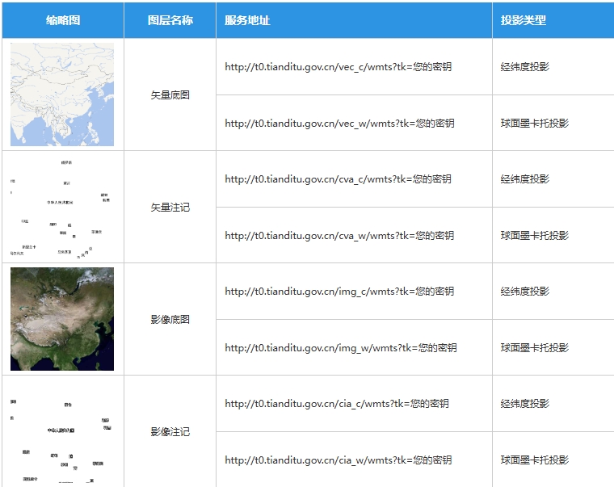

天地图官网给出来下面的表格



到底怎么使用这个`wmts` 瓦片地图，而且可以发现坐标系也要对应。


使用Web 墨卡托投影坐标系时，即不设置投影坐标系，采用openlayer默认的坐标系。

此时所有的


使用XYZ

首先是确定地图的坐标系，看需求了，坐标系不同时，要使用对应的地图资源

`img_c, cia_c` 对应`EPSG:4326`坐标系时的影像底图

`img_w, cia_w`对应`EPSG:3857`坐标系时的影像底图


```ts
"TDT-img": `http://t{0-7}.tianditu.gov.cn/DataServer?T=img_c&x={x}&y={y}&l={z}&tk=${TDT_KEY}`,
"TDT-img-label": `http://t{0-7}.tianditu.gov.cn/DataServer?T=cia_c&x={x}&y={y}&l={z}&tk=${TDT_KEY}`,
// "TDT-img": `http://t{0-7}.tianditu.gov.cn/DataServer?T=img_w&x={x}&y={y}&l={z}&tk=${TDT_KEY}`,
// "TDT-img-label": `http://t{0-7}.tianditu.gov.cn/DataServer?T=cia_w&x={x}&y={y}&l={z}&tk=${TDT_KEY}`,

"TDT-vec": `http://t{0-7}.tianditu.gov.cn/DataServer?T=vec_c&x={x}&y={y}&l={z}&tk=${TDT_KEY}`,
"TDT-vec-label": `http://t{0-7}.tianditu.gov.cn/DataServer?T=cva_c&x={x}&y={y}&l={z}&tk=${TDT_KEY}`,
"TDT-ter": `http://t{0-7}.tianditu.gov.cn/DataServer?T=ter_c&x={x}&y={y}&l={z}&tk=${TDT_KEY}`,
"TDT-roadLabel": `http://t{0-7}.tianditu.gov.cn/DataServer?T=cta_c&x={x}&y={y}&l={z}&tk=${TDT_KEY}`,
```


> 采用`EPSG:4326`坐标系时，要 显式声明 Source 的投影坐标系

```js
    // 底图层
    const baseLayer = new TileLayer({
      source: new XYZ({
        url: mapUrls["TDT-img"],
        crossOrigin: "anonymous", // 解决跨域问题
        projection: "EPSG:4326", // 显式声明 Source 的投影
      }),
      zIndex: 0, // 放在最底层
    });

    // 注记层 (文字标注，叠加在底图之上)
    const annotationLayer = new TileLayer({
      source: new XYZ({
        url: mapUrls["TDT-img-label"],
        crossOrigin: "anonymous",
        projection: "EPSG:4326", // 显式声明 Source 的投影
      }),
      zIndex: 1, // 放在底图上面
    });

    const map = new Map({
      target: domRef.value,
      layers: [
        baseLayer,
        annotationLayer,
      ],
      view: new View({
        center: center,
        zoom: zoom,
        projection: projection,
      }),
    });
```


使用WMTS瓦片地图

```ts
  const createTDT4326Source = (layerType: "vec" | "img" | "cva" | "cia") => {
    // 1. 明确使用 EPSG:4326 投影
    const projection = getProjection("EPSG:4326")!;
    const projectionExtent = projection.getExtent(); // [-180, -90, 180, 90]
    const width = getWidth(projectionExtent); // 宽度是 360 度

    // 天地图 4326 也就是 vec_c/cva_c 类型的矩阵集通常为 'c'
    const matrixSet = "c";

    const resolutions = [];
    const matrixIds = [];

    // 2. 循环生成分辨率和矩阵ID
    // 天地图 EPSG:4326 的层级通常从 1 开始到 18
    for (let z = 0; z < 18; z++) {
      // 映射矩阵ID：数组索引 0 对应 MatrixId "1"
      matrixIds[z] = (z + 1).toString();

      // 分辨率计算公式：
      // 基准计算：360度 / 256像素 = 1.40625
      // 天地图第1级(MatrixId=1)横向有2张瓦片，所以分辨率 = 1.40625 / 2 = 0.703125
      // 后续每一级除以 2
      resolutions[z] = width / 256 / Math.pow(2, z + 1);
    }

    return new WMTS({
      url: `http://t{0-7}.tianditu.gov.cn/${layerType}_${matrixSet}/wmts?tk=${TDT_KEY}`,
      layer: layerType,
      style: "default",
      matrixSet: matrixSet,
      format: "tiles",
      wrapX: true,
      tileGrid: new WMTSTileGrid({
        origin: getTopLeft(projectionExtent), // 原点 [-180, 90]
        resolutions: resolutions,
        matrixIds: matrixIds,
      }),
    });
  };
```


```ts
  // --- 功能：切换到底图 (WMTS版) ---
  const switchToTDTWMTS = (type: "vector" | "satellite" = "vector") => {
    if (!mapInstance.value) return;

    // 1. 移除旧的底图
    currentBaseLayers.value.forEach((layer) => {
      mapInstance.value?.removeLayer(layer);
    });
    currentBaseLayers.value = [];

    // 2. 准备新图层
    let layersToAdd: TileLayer<WMTS>[] = [];

    if (type === "vector") {
      // 矢量底图 + 矢量注记
      const vecLayer = new TileLayer({
        source: createTDT4326Source("vec"),
        zIndex: 0,
      });
      const cvaLayer = new TileLayer({
        source: createTDT4326Source("cva"),
        zIndex: 1,
      });
      layersToAdd = [vecLayer, cvaLayer];
    } else if (type === "satellite") {
      // 影像底图 + 影像注记
      const imgLayer = new TileLayer({
        source: createTDT4326Source("img"),
        zIndex: 0,
      });
      const ciaLayer = new TileLayer({
        source: createTDT4326Source("cia"),
        zIndex: 1,
      });
      layersToAdd = [imgLayer, ciaLayer];
    }

    // 3. 添加新图层到地图
    layersToAdd.forEach((layer) => {
      mapInstance.value?.addLayer(layer);
    });

    // 4. 更新记录
    currentBaseLayers.value = layersToAdd;
  };
```


3857

resolutions和

```ts
  function createTDT3857WMTSSource(layerType: "vec" | "img" | "cva" | "cia") {
    let projection = getProjection("EPSG:3857"); // 获取web墨卡托投影坐标系
    let projectionExtent = projection.getExtent(); // web墨卡托投影坐标系的四至范围
    let width = getWidth(projectionExtent); // web墨卡托投影坐标系的水平宽度，单位米
    const size = width / 256;

    let resolutions = [];
    let matrixIds = [];
    //i=0的怎么办
    for (let i = 1; i < 18; i++) {
      resolutions[i] = size / Math.pow(2, i);
      matrixIds[i] = i;
    }

    // 映射图层名称
    // vec: 矢量底图, img: 影像底图, cva: 矢量注记, cia: 影像注记
    // 注意：WMTS 请求中通常使用 layer 名 (如 vec)，但在 URL 构造中天地图有些特殊
    const layerName = layerType;
    // 对应的矩阵集名称 (w 代表 web mercator, c 代表 经纬度投影)
    const matrixSet = "c";

    return new WMTS({
      url: `http://t{0-7}.tianditu.gov.cn/${layerName}_${matrixSet}/wmts?tk=${TDT_KEY}`,
      layer: layerName,
      version: "1.0.0", // WMTS版本
      style: "default",
      matrixSet: matrixSet,
      format: "tiles",
      projection: projection, // 投影坐标系
      requestEncoding: "KVP", // 请求的编码方式，默认就是'KVP'
      wrapX: true,
      tileGrid: new WMTSTileGrid({
        origin: getTopLeft(projectionExtent),
        resolutions: resolutions,
        matrixIds: matrixIds,
      }),
    });
  }
```

