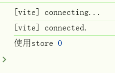

### "getActivePinia()" was called but there was no active Pinia. Are you trying to use a store before calling "app.use(pinia)"?

代码如下：

代码没有什么实际意义，只是为了测试。

`main.js：`

```js
import './assets/main.css'

import { createApp } from 'vue'
import { createPinia } from 'pinia'

import App from './App.vue'
import router from './router'

const app = createApp(App)

app.use(createPinia())
app.use(router)

app.mount('#app')
```


`@/router/index.js:`

```js
import { createRouter, createWebHistory } from 'vue-router'
import HomeView from '../views/HomeView.vue'
import { useCounterStore } from '../stores/counter'

const router = createRouter({
  history: createWebHistory(import.meta.env.BASE_URL),
  routes: [
    {
      path: '/',
      name: 'home',
      component: HomeView,
    },
    {
      path: '/about',
      name: 'about',
      // route level code-splitting
      // this generates a separate chunk (About.[hash].js) for this route
      // which is lazy-loaded when the route is visited.
      component: () => import('../views/AboutView.vue'),
    },
  ],
})

// 测试使用store
const counterStore = useCounterStore()
console.log('使用store', counterStore.count)

export default router
```


`@/stores/counter.js:`

```js
import { ref, computed } from 'vue'
import { defineStore } from 'pinia'

export const useCounterStore = defineStore('counter', () => {
  const count = ref(0)
  const doubleCount = computed(() => count.value * 2)
  function increment() {
    count.value++
  }

  return { count, doubleCount, increment }
})
```


### 执行顺序：

在`main.js：`

```js
import App from './App.vue'
import router from './router'

const app = createApp(App)

app.use(createPinia())
app.use(router)
```

执行到`import router from './router'`，会去执行 `router/index.js` 里的顶层代码。

在 `router/index.js` 中，调用了 `useCounterStore()`，

这会去调用 `getActivePinia()`，但是此时 `app.use(createPinia())` 还没运行。

所以就报错 **"getActivePinia() was called but there was no active Pinia"**。


根本原因：**在模块初始化阶段就访问了 store**，而 store 依赖 Pinia 的安装，但安装是 `app.use(createPinia())` 在后面才做的。


### 解决方法

#### 方法 1：延迟访问 `store`（推荐）

不要在 `router/index.js` 的**文件顶层**直接调用 store，而是等到需要的时候（比如路由守卫、组件里）再调用。

```js
// router/index.js
import { createRouter, createWebHistory } from 'vue-router'
import HomeView from '../views/HomeView.vue'

const router = createRouter({
  history: createWebHistory(import.meta.env.BASE_URL),
  routes: [
    { path: '/', name: 'home', component: HomeView },
    { path: '/about', name: 'about', component: () => import('../views/AboutView.vue') }
  ],
})

// 在路由守卫里用 store
import { useCounterStore } from '../stores/counter'
router.beforeEach((to, from, next) => {
  // 非顶层代码中访问，这时候pinia已经
  const counterStore = useCounterStore()
  console.log('使用 store', counterStore.count)
  next()
})

export default router
```


### 方法2：在组件外使用 `store`

参考：[在组件外使用 store](https://pinia.vuejs.org/zh/core-concepts/outside-component-usage.html)

Pinia store 依靠 `pinia` 实例在所有调用中共享同一个 store 实例。大多数时候，只需调用你定义的 `useStore()` 函数，完全开箱即用。

例如，在 `setup()` 中，你不需要再做任何事情。但在**组件之外**，情况就有点不同了。

 实际上，`useStore()` 给你的 `app` 自动注入了 `pinia` 实例。这意味着，如果 `pinia` 实例不能自动注入，你必须手动提供给 `useStore()` 函数。 你可以根据不同的应用，以不同的方式解决这个问题。


创建一个`pinia`实例

`@/stores/index.js:`

```js
import { createPinia } from 'pinia'
const pinia = createPinia()

export default pinia
```

这个实例需要传递给应用，也可以传递给其它的`useStore()`函数。


`main.js：`

导入创建的pinia实例

```js
import './assets/main.css'
import { createApp } from 'vue'
import pinia from './stores'

import App from './App.vue'
import router from './router'

const app = createApp(App)

app.use(pinia)
app.use(router)

app.mount('#app')
```


`@/stores/counter.js:`

```js
 // 省略
// 导入创建的全局pinia实例
import pinia from './index' // Ensure you import the pinia instance

export const useCounterStore = defineStore('counter', () => {
    // 省略
})

// 在使用store时，把pinia 实例传递给 useCounterStore() 函数：
export function useCounterStoreHook() {
  return useCounterStore(pinia)
}
```


这时候在`@/router/index.js`中使用

```js
import { createRouter, createWebHistory } from 'vue-router'
import HomeView from '../views/HomeView.vue'
import { useCounterStoreHook } from '../stores/counter'

const router = createRouter({
	// 省略
})

// 测试使用store
const counterStore = useCounterStoreHook()
console.log('使用store', counterStore.count)

export default router
```


报错解决，正常输出




#### 错误方法 ：在 `main.js` 里先创建 pinia，再加载 `router`

改加载顺序，让 pinia 提前可用：

```js
const app = createApp(App)
const pinia = createPinia()

app.use(pinia) // 先安装 Pinia

import router from './router' // 现在再加载 router
app.use(router)
```


> 改变加载顺序，并不能解决这个问题。
>
> 因为 **ES 模块的 `import` 是静态的、会在代码运行前就解析并执行**

```js
import router from './router'
```

写在 `app.use(pinia)` 下面，它依然会**在整个文件执行前**先加载并执行 `router/index.js` 里的顶层代码。

换句话说：

- JS 会先加载 `main.js` 里的所有 `import` 模块（包括 `./router`）
- 在加载 `./router` 时，执行了 `useCounterStore()` → 但 Pinia 还没初始化
- 所以无论你把那行 `import` 放到哪，它都会先运行


