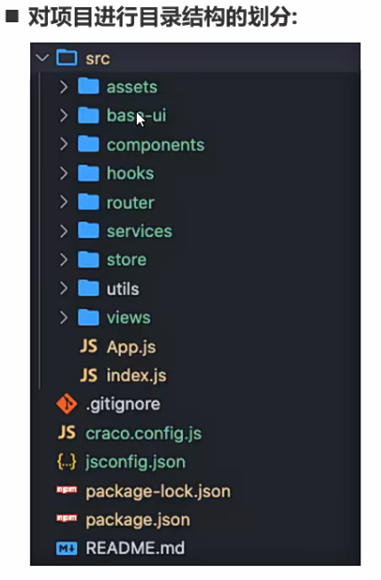
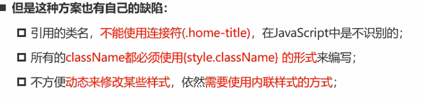

### 一、create-reacte-app

[入门 | 创建 React 应用 - Create React App 中文](https://create-react-app.reactjs.ac.cn/docs/getting-started/)

全局安装`create-reacte-app`

```ini
npm install -g create-react-app
```

创建项目

```ini
npx create-react-app my-app --template [template-name]
```

启动项目

```ini
npm start 或 yarn start
```

目录结构

```ini
my-app
├── README.md
├── node_modules
├── package.json
├── .gitignore
├── public
│   ├── favicon.ico
│   ├── index.html
│   ├── logo192.png
│   ├── logo512.png
│   ├── manifest.json
│   └── robots.txt
└── src
    ├── App.css
    ├── App.js
    ├── App.test.js
    ├── index.css
    ├── index.js
    ├── logo.svg
    ├── serviceWorker.js
    └── setupTests.js
```


推荐的目录结构




使用craco配置webpack

[欢迎 | CRACO 中文](https://craco.reactjs.ac.cn/docs/)

要自定义大多数在使用[Create React App](https://create-react-app.reactjs.ac.cn/)时的情况，可以退出。但是，之后需要自己维护每个配置和脚本，这可能会有点烦人。

**CRACO**意为**C**reate **R**eact **A**pp **C**onfiguration **O**verride，可以在不退出的情况下让你获得[Create React App](https://create-react-app.reactjs.ac.cn/)的所有好处。只使用项目根目录中的一个配置文件自定义配置的 ESLint、Babel、PostCSS，以及更多。


配置路径别名

配置less


css module

xxx.module.css/.less/.scss

以及原理与优缺点



内联与link方式的优缺点


css in js:

styled-components

emotion


配置vscode代码片段