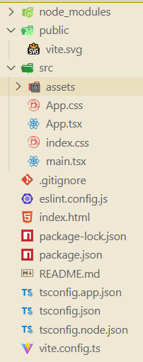

创建项目

```ini
npm create vite@latest my-app -- --template react-ts
```

目录结构：




配置路径别名：

`vite.config.ts：`

```js
import { defineConfig } from 'vite'
import react from '@vitejs/plugin-react'
import path from "path";

export default defineConfig({
  plugins: [react()],
  resolve: {
    alias: {
      "@": path.resolve(__dirname, "src")
    }
  }
});
```

这里配置的目的是让vite打包时可以知道@对应src目录

`tsconfig.app.json：`

这里的配置是为了让vscode的代码提示，~~以及按住ctrl是可以找到路径~~

```ts
"compilerOptions": {
    "baseUrl": ".", // ➕ 新增
    "paths": { "@/*": ["./src/*"] }, // ➕ 新增
     //......
}
```


通常来说，默认生成的tsconfig.json文件，不建议再修改

但是如果我们确实需要修改配置文件

可以在`tsconfig.config.json`（早期版本）或者`tsconfig.app.json` / `tsconfig.node.json`（新版本）中修改配置，他们最终都是会合并到`tsconfig.json`文件中


vite的代码，就是比如vite.xx.*的文件或者是其它的文件

vite对代码的打包或者编译 是基于node环境的，


### 