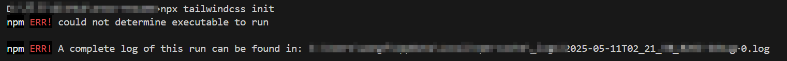

### 🛠 1.安装tailwind css

```ini
npm install -D tailwindcss postcss autoprefixer
npx tailwindcss init -p
```

可能会产生tailwindcss版本与postcss版本兼容问题

执行npx报错



只需要降级tailwindcss即可解决

```ini
npm uninstall tailwindcss
npm install tailwindcss@3.4.17 -D
```

再次执行

```ini
npx tailwindcss init
```

执行完后你会得到两个文件：

```ini
tailwind.config.js
postcss.config.js
```

------

### 🛠 **2. 在 tailwind.config.js 里配置内容路径**

编辑 `tailwind.config.js`：

```js
export default {
  content: [
    "./index.html",
    "./src/**/*.{js,ts,jsx,tsx}",
  ],
  theme: {
    extend: {},
  },
  plugins: [],
}
```

这一步很关键，不然 Tailwind 不会扫描你的代码。

------

### 🎨 **3. 创建全局样式文件（用 SCSS）**

新建：

```ini
src/styles/global.scss
```

在里面写：

```scss
@tailwind base;
@tailwind components;
@tailwind utilities;

/* 下面可以写自己的全局 SCSS */
body {
  font-family: sans-serif;
}
```

Tailwind 的三个指令一定要放在这，别乱删。

------

### 📦 **4. 在入口文件中导入全局 SCSS**

打开你的 `main.tsx`（或 `main.jsx`）：

```tsx
import './styles/global.scss'

import React from 'react'
import ReactDOM from 'react-dom/client'
import App from './App'

ReactDOM.createRoot(document.getElementById('root')!).render(
  <React.StrictMode>
    <App />
  </React.StrictMode>,
)
```

到这里，Tailwind 已经能用了。

------

### 🎀 **5. 安装 SCSS（不装会报错）**

Vite 默认支持 Sass，只需要安装依赖：

```ini
npm install -D sass
```

这一步非常非常关键，不然 `.scss` 文件无法编译。

------

### 🧪 **6. 测试tailwind**

在某个组件写：

```tsx
export default function App() {
  return (
    <div className="p-10 text-2xl text-blue-600">
      Tailwind + SCSS OK 啦！
    </div>
  )
}
```

然后写一个自己的 SCSS 文件：

```scss
/* src/components/Button.module.scss */

.btn {
  padding: 12px 20px;
  background: pink;
  border-radius: 8px;

  &:hover {
    background: hotpink;
  }
}
```

组件里用：

```tsx
import styles from './Button.module.scss'

export default function Button() {
  return <button className={styles.btn}>我是一颗按钮</button>
}
```

如果都没报错 → 你就配置成功啦 🎉