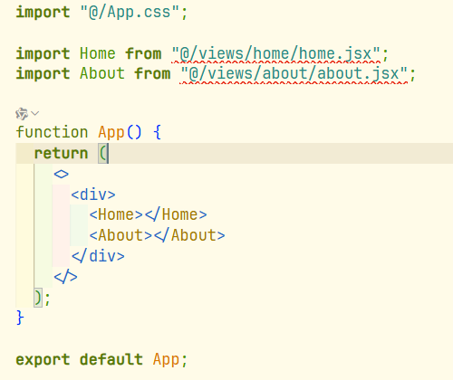

### 问题一：

React + TypeScript项目中

`App.tsx`



错误提示

```ini
无法找到模块“@/views/home/home.jsx”的声明文件。
“c:/Users/admin/Desktop/React/my-app/src/views/home/home.jsx”隐式拥有 "any" 类型。ts(7016
```

原因：

简单讲：
 **TypeScript 天生不认识 .jsx 文件**，除非你明确告诉它：

- “我接受 .jsx 文件作为模块”
- “我允许 `jsx` 文件被 TS 导入”


#### **方案 1（推荐）：给所有 .jsx 声明一个模块类型文件**

在 `src/` 下新建一个 `global.d.ts`（或任意名字，只要是 `.d.ts` 就行）

**global.d.ts**

```ts
declare module "*.jsx";
declare module "*.js";
```

TypeScript 看到这个就知道怎么处理 `.jsx` 了。

⚠️ **注意**：文件必须放在 `src/` 或 tsconfig 能包含到的位置。

------

#### **方案 2：把 .jsx 文件改成 .tsx（最佳）**

你既然是 TS 项目，直接用 TS 就更香：

把：

```ts
about.jsx → about.tsx
home.jsx  → home.tsx
```

然后改一下 import：

```ts
import About from "@/views/about/about";
```

TSX 才是 TypeScript + React 的正宗格式。

------

#### **方案 3：在 tsconfig.json 中允许 JS 文件**

编辑 `tsconfig.json`：

```json
{
  "compilerOptions": {
    "allowJs": true,
    "checkJs": false
  }
}
```

解释一下：

- **allowJs**：允许引入 .js / .jsx
- **checkJs**：是否检查 .js 类型（一般 React 项目建议 false）

但这个方案属于“能跑就行”，不如前两个干净。

------

#### 🌈 总结

- **TS 项目引入 JSX 文件 → TS 不知道类型 → 报错**
- 最推荐：**加一个 global.d.ts** 或 **把 JSX 改成 TSX**
- 不推荐但能用：在 tsconfig 开 allowJs


### **为什么把 `global.d.ts` 放到 `src/` 里就突然生效了**。

------

#### 🎯 关键点只有一句话：

> **TypeScript 只会加载 `tsconfig.json`（或 tsconfig.app.json）`include` 范围里的 `.d.ts` 声明文件。范围之外的，TS 完全当空气。**

你现在的 `tsconfig.app.json` 里写的是：

```json
"include": ["src"]
```

这句话告诉 TypeScript：

👉 “只需要去看 `src/` 目录下面的代码和声明，别的地方都别管。”

所以：

- `src/global.d.ts` → 会被 TypeScript 收进去 ✔
- `根目录/global.d.ts` → TypeScript 根本不会看 ✘
- `public/global.d.ts` → 也不会看 ✘
- `types/global.d.ts` → 只要不在 include 里，等价空气 ✘

把 `.d.ts` 放错位置，等于放到一个 **TypeScript 的盲区**，它自然不会生效。

------

#### 🌱 那 TypeScript 是怎么处理这些 `.d.ts` 的呢？

简单说：

1. TS 会从 `include`/`files`/`extends` 指定的路径里收集所有代码文件
2. 然后把所有 `.ts`、`.tsx`、**`.d.ts` 声明文件** 一起合并成一个**大“类型宇宙”**
3. 当你 `import "./xxx.jsx"` 时，TS 会在“类型宇宙”里找这个模块的声明
4. 找不到就报错：“我不知道它是什么类型”

当你在 `src/global.d.ts` 写：

```js
declare module "*.jsx";
```

TS 的反应相当于：

> “OKOK，我以后看到任何 `.jsx` 就当成一个合法模块，不报错了。”

但如果这个文件不在 include 范围内，TS 连这个“许可”都读不到，那当然报错。

------


#### ✨ 为什么一定要放到 src？

因为这是 React + Vite（或 CRA）项目的默认 tsconfig 配置方式：

- 业务代码在 `src`
- 只检查 `src`
- 声明文件也要在 `src`

所以：

```ini
src/
  global.d.ts  ← perfect
  views/
  App.tsx
```

这也是业界最主流的写法。

------

#### 🐣 超简小结（你可以记这个）

- `.d.ts` 必须被 tsconfig include 才会生效
- 默认 include = ["src"] → 所以要把声明丢到 src
- 放到 src 后，TS 能看到模块声明 → 报错消失