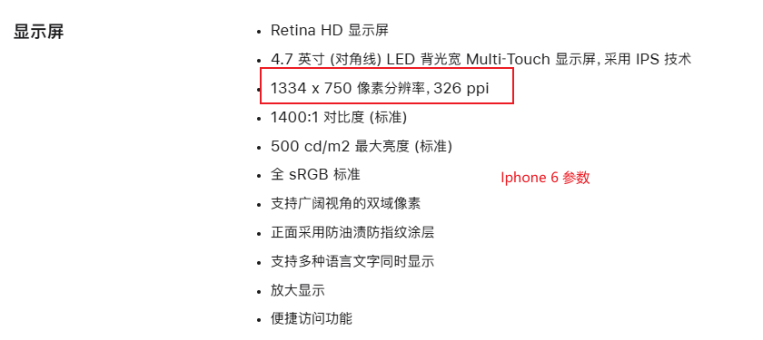

### UI与响应式单位rpx


### 一、两种“像素”

1. **物理像素 (Physical Pixels)**：这是设备屏幕上真正发光的最小物理单元。你的手机屏幕分辨率是 1080x1920，指的就是它在物理上由这么多的点组成。这是硬件层面的概念，固定不变。
2. **CSS 像素 (CSS Pixels)**：也称为逻辑像素 (Logical Pixels) 或设备独立像素 (Device-Independent Pixels)。这是我们在编写 CSS 样式时使用的像素单位，比如 `width: 100px;`。CSS 像素是一个抽象的单位，它的大小不是固定的，而是为了在不同设备上保持视觉上的一致性。




#### 1. iPhone 6 的 **物理像素**

- **分辨率 750 × 1334** 指的就是 **屏幕硬件层面的像素点数量**。
- 宽度方向 = **750 个物理像素点**
- 高度方向 = **1334 个物理像素点**

👉 这些点是屏幕硬件做成的时候就固定好的，**不可改变**。
 你无论写 H5、做小程序，还是刷机，这个数字都是死的。


### 二、DPR 是什么？它的作用是什么？

**DPR（设备像素比）就是 物理像素 和 CSS 像素之间的换算关系**。

```ini
DPR = 物理像素 / CSS 像素  (在单一方向上，如宽度)
```


**DPR 的核心作用**
DPR 的主要目的是为了在高分辨率屏幕上，既能保证网页元素的尺寸看起来“正常”，又能保证内容的清晰度。

- **保证尺寸正常**：随着技术发展，手机屏幕的物理像素密度越来越高。如果 **CSS 像素**和物理像素总是 `1:1` 的关系，那么在一个 4 英寸但拥有超高分辨率的屏幕上，一个 100px 宽的按钮可能会变得**小到看不见**也点不着。 DPR 的出现解决了这个问题，它允许**一个 CSS 像素覆盖多个物理像素**，从而让网页元素的视觉尺寸在不同屏幕上保持相对一致。
- **保证内容清晰**：更高的 DPR 意味着可以用更多的物理像素来渲染一个 CSS 像素的内容。这对于显示高清图片和锐利的文本至关重要。例如，在一个 DPR 为 2 的屏幕上，1个 CSS 像素实际上是由一个 2 x 2 的物理像素网格（即 4 个物理像素）来显示的。

简单来说，DPR 就像一个“翻译官”，告诉浏览器应该用多少个设备的物理像素点来描绘我们写在 CSS 里的一个像素，从而在高密度屏幕上实现高清显示效果。

DPR 为 2 的屏幕上：


假如所有手机的 DPR 都等于 1，这意味着 **1个 CSS 像素就严格等于 1个物理像素**。这在如今高分辨率屏幕普及的时代，会带来两个主要问题：

1. **元素尺寸会变得极小，难以阅读和交互**
   - 想象一下，一台手机的物理分辨率是100*100，手机上显示一个40x40的盒子，显示效果还比较正常。但是假如现在项目需要演示，要放在一个超大屏上，比如参加报告的那种巨屏，一个40x40的盒子，宽度方向上实际40个像素，高度方向上也用40个像素，可以想象，台下的观众可能几乎看不见这个盒子。
   - 一个宽度为 375px 的网页（这是很多移动端设计的基准宽度）在这台手机上只会占到屏幕宽度的三分之一左右。
   - 网页上的文字、按钮、图片都会变得非常小，用户根本无法正常阅读和点击，这将是灾难性的用户体验。
2. **图像会变得模糊不清**
   - 为了在高 DPR 屏幕上显示清晰的图片，前端开发者通常会提供2倍图（@2x）、3倍图（@3x）等高分辨率的图片资源。
   - 例如，在一个 DPR 为 2 的设备上，一个 `` 标签的尺寸是 100*100 (CSS 像素)，它实际上占据了 200 x 200 (物理像素) 的屏幕空间。此时，我们就需要提供一张 200 x 200 的图片才能完美地显示，否则浏览器会强行将 100 x 100 的图片拉伸到 200 x 200 的物理像素上，导致图片看起来模糊、有锯齿。
   - 如果 DPR=1，浏览器就没有了这个“高清显示”的机制，即使设备拥有高清屏幕，我们提供的标准图片也会被直接渲染，无法利用屏幕的高像素密度，显示效果会大打折扣。

**总结：**

DPR 是连接开发者代码（CSS 像素）和物理设备（物理像素）的关键桥梁。它的存在是为了在像素密度越来越高的移动设备上，解决“如何让网页内容既保持合适的视觉大小，又充分利用屏幕的清晰度”这一核心矛盾。

如果没有 DPR (即 DPR=1)，在高分辨率屏幕上，网页要么会变得小到无法使用，要么会牺牲清晰度，无法发挥高清屏的优势。因此，理解并利用好 DPR 是移动端适配中不可或缺的一环。


#### 2. 为什么我们常说 iPhone 6 宽度是 375px？

这是因为：

- 浏览器 / 小程序框架不会直接让开发者面对物理像素（太细了，适配困难）。

- 所以引入了 **逻辑像素（CSS 像素）**，通过 **DPR=2** 映射：

  ```
  750（物理像素宽） ÷ 2 = 375（逻辑像素宽）
  ```

- 前端看到的就是 **375px 宽度的窗口**，而不是 750。


#### 1. `rpx` 的定义

- `rpx`（responsive pixel）是**响应式像素**，会根据屏幕宽度自适应。
- 在 **微信小程序** 和 **uni-app** 里：
  - 规定屏幕宽度为 `750rpx`。
  - 不管设备屏幕实际像素是多少，宽度都被等分为 750 份。
  - **1rpx = 屏幕宽度 / 750 px**。


举例：

- iPhone 6/7/8（宽度 375px）：

```ini
1rpx = 375 / 750 = 0.5px
```

在 iPhone6 上，屏幕宽度为375px，共有750个物理像素，则750rpx = 375px = 750物理像素，1rpx = 0.5px = 1物理像素。


小程序里 **布局用 rpx，字体用 px**，除非有特殊需求才让字体跟随屏幕缩放。


手机那么小的屏幕也可以是1080，电脑那么大的屏幕也是1080，按理说电脑屏幕那么大，是手机的好多倍，那像素应该也是好多倍啊，那为什么也是1080


