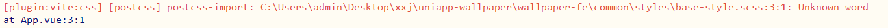

`uniapp`开发，在微信小程序中运行时，关于`scss`文件的一个问题：

报错信息：

```bash
[plugin:commonjs] Unexpected '/'. Escaping special characters with \ may help.
```


```shell
[plugin:vite:css] [postcss] 
postcss-import: C:\Users\admin\Desktop\wallpaper-fe\common\styles\base-style.scss:3:1: Unknown word
at App.vue:3:1
```



我在`App.vue`文件中导入了一个`scss`文件：

`App.vue`

```vue
<script>
export default {
  onLaunch: function () {
    console.log("App Launch");
  },
  onShow: function () {
    console.log("App Show");
  },
  onHide: function () {
    console.log("App Hide");
  },
};
</script>

<style>
/*每个页面公共css */
/* @import "@/common/styles/common.scss"; */
@import "@/common/styles/base-style.scss";
</style>
```


在`uni.scss`中也导入了两个`scss`文件：

`uni.scss`

```scss
@import "@/common/styles/test.scss";
// @import "@/common/styles/base-style.scss";
@import "@/common/styles/common.scss";
```


根据提示的信息是说我的`base-style.scss`文件有问题，但是这个文件毫无问题：

`base-style.scss`

```scss
$brand-theme-color:#28B389;      //品牌主体红色

$border-color:#e0e0e0;           //边框颜色
$border-color-light:#efefef;     //边框亮色

$text-font-color-1:#000;         //文字主色
$text-font-color-2:#676767;      //副标题颜色
$text-font-color-3:#a7a7a7;      //浅色
$text-font-color-4:#e4e4e4;      //更浅
```

