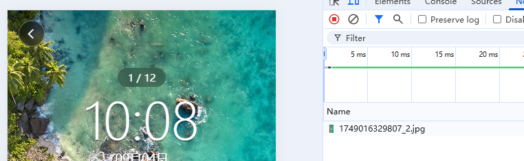

### 预览轮播图

预览页中

进行壁纸预览时，使用的是一个轮播图组件`swiper`，根据图片列表数组，进行`v-for`循环:

```vue
<swiper circular @change="handleIndexChange" :current="curIndex">
    <swiper-item v-for="item in previewList" :key="item._id">
        <image :src="item.picUrl" mode="aspectFill"></image>
    </swiper-item>
</swiper>
```

列表页使用的是小图`url`，预览页使用的时大图`url`，消耗更大。

页面加载时，会直接根据`image`的`src`值获取图片，加入数组比较大，一旦进入预览页面,会一次性加载很多图片，消耗了比较大的网络带宽。因为用户可能只是点击了某一张图进行预览，但是却加载了所有图片的大图，就浪费了流量，可能会造成用户流失。


#### 解决：

使用`v-if`

```vue
    <swiper circular @change="handleIndexChange" :current="curIndex">
      <swiper-item v-for="(item, index) in previewList" :key="item._id">
        <image
          v-if="index === curIndex"
          :src="item.picUrl"
          mode="aspectFill"
          @click="handleMaskState"></image>
      </swiper-item>
    </swiper>
```

`v-if="index === curIndex"`，只有当前图片的索引值 等于 当前预览的图片索引值时，这张图片才会显示，这样就只会加载当前这一张图片，其它的图片都不会加载了。

只有一个网络请求




但是会产生另外的问题：

白屏

就是滑动切换图片时，下一站还没有加载，就会有白屏，用户体验不是很好。


另一个问题就是

切换到上一张已经访问过的图片时，因为`v-if`的原因，还会有白屏，体验不好。


维持一个索引集合，保存当前已经访问过的图片索引，每次访问了一个新的图片时，就把这张图片的索引添加到这个集合中，同时对`image`元素的校验修改为 判断图片索引是否在集合中。

```js
const loadedIndexSet = new Set();

// 当轮播图切换时
const handleIndexChange = (e) => {
  // 最新的索引值
  const newIndex = e.detail.current;
  curIndex.value = newIndex;
  if (!loadedIndexSet.has(curIndex.value)) {
    loadedIndexSet.add(curIndex.value);
  }
};
```


```vue
<image
       v-if="loadedIndexSet.has(index)"
       :src="item.picUrl"
       mode="aspectFill"
       @click="handleMaskState"></image>
```


这样就实现了已经访问的图片，会一直存在，不会再次白屏，但是还可以优化。


#### 预加载

提前加载当前图片的上一张和下一张，为了优化体验

加入当前索引是0，上一张索引是-1，下一张是1，

但是-1肯定不对，-1 % 数组长度就行 = 最后一个索引。


预加载函数

```js
function preLoad() {
  // 加入当前图片索引
  if (!loadedIndexSet.has(curIndex.value)) {
    loadedIndexSet.add(curIndex.value);
  }
  // 加入前一张和后一张图片索引
  let prev =
    (curIndex.value - 1 + previewList.value.length) % previewList.value.length;
  let next = (curIndex.value + 1) % previewList.value.length;
  console.log(prev, curIndex.value, next);
  if (!loadedIndexSet.has(prev)) loadedIndexSet.add(prev);
  if (!loadedIndexSet.has(next)) loadedIndexSet.add(next);
}
```

在每次轮播图切换时，进行预加载

```js
// 当轮播图切换时
const handleIndexChange = (e) => {
  // 最新的索引值
  curIndex.value = e.detail.current;
  preLoad();
};
```

在页面`onLoad()`中首次预加载

```js
onLoad((options) => {
  const picId = options.id;
  // ......
  // 根据当前点击的图片id，确认在数组中的索引index
  curIndex.value = previewList.value.findIndex((item) => {
    return item._id === picId;
  });
  // 获取索引值以后,获取这张图片信息，预加载
  if (curIndex.value !== -1) {
    curImageInfo.value = previewList.value[curIndex.value];
    console.log("curindex", curIndex.value);
    preLoad();
  }
});
```


这样每次就实现预加载，初次会加载三张图：


// 1. 节流；2. 动画；3. 骨架屏；4. 回调地狱优化 5. 换一批

// 尝试使用其它的svg图标

WAServiceMainContext.js?t=wechat&s=1757035689723&v=3.9.2:1 wx.getSystemInfoSync is deprecated.Please use 

回顾async ,await,

js的取余数

### 回调地狱


