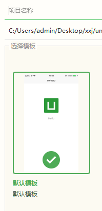
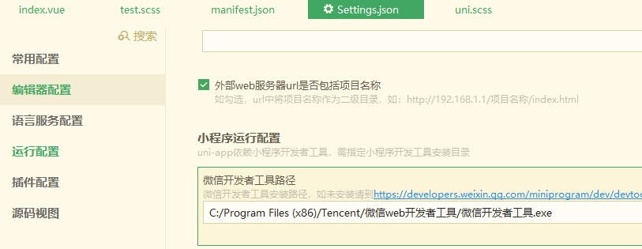
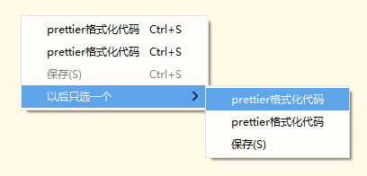
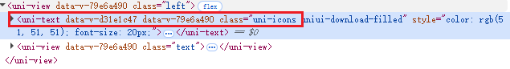
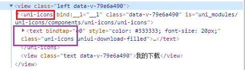
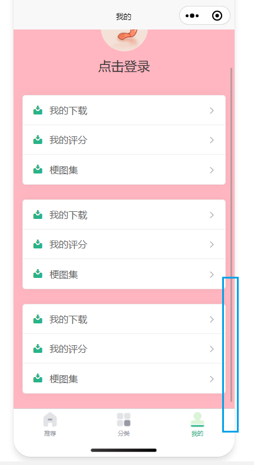
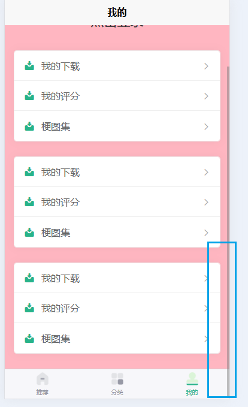
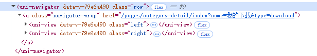
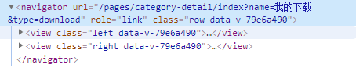

### 配置模板

创建新项目时，通常使用默认模板



但是这个模板内的代码还在使用


### UI与响应式单位rpx

#### 设计稿

设计稿大多是 750px 宽（2x 图）


#### rpx

**rpx（responsive pixel，响应式像素）** 是微信小程序独有的单位。

特点：

- **屏幕宽度恒等于 750rpx**，不管设备多宽。
- 小程序会自动把 `rpx` 转换成不同设备上的实际物理像素。


举例：

假设你写了一个元素：

```css
width: 750rpx;
```


小程序里 **布局用 rpx，字体用 px**，除非有特殊需求才让字体跟随屏幕缩放。


`iphone 6`

1334 x 750 像素分辨率


`static`文件夹下面的资源打包时会全部被打包


微信小程序：

在`工具`-> `设置`-> `Settings.json` -> `运行设置` -> `微信开发者工具路径`

配置微信开发者工具路径




在`manifest.json`中 找到微信小程序配置，配置微信小程序的`AppID`

**AppID**：打开链接https://mp.weixin.qq.com/ 登录以后在`开发管理`中获取


### 自动导入

安装插件

```bash
npm install unplugin-auto-import
```


创建`vite.config.js`文件

在项目根目录下创建该文件，

```js
import { defineConfig } from 'vite'
import uni from '@dcloudio/vite-plugin-uni'
import AutoImport from 'unplugin-auto-import/vite'
 
export default defineConfig({
    plugins: [
        uni(),        
        // 自动导入配置
        AutoImport({
            imports:[
                // 预设
                'vue',
                'uni-app'                
            ]
        })
    ]   
})

```


### HbuildX配置prettier





### 报错：

在uniapp中使用unplugin-auto-import使用报错：

> uniapp require() of ES Module C:\Users\admin\Desktop\xxj\uniapp-wallpaper\wallpaper-fe\node_modules\unimport\dist\index.mjs not supported.

[在uniapp中使用unplugin-auto-import使用报错解决办法汇总，以及新版本HBuilder X如何使用unplugin-auto-import-CSDN博客](https://blog.csdn.net/qq_38733799/article/details/147002695)


### uni.scss

`uni.scss`文件的用途是为了方便整体控制应用的风格。比如按钮颜色、边框风格，`uni.scss`文件里预置了一批scss变量预置。

`uni.scss`是一个特殊文件，在代码中无需 import 这个文件即可在scss代码中使用这里的样式变量。uni-app的编译器在webpack配置中特殊处理了这个`uni.scss`，使得每个scss文件都被注入这个`uni.scss`，达到全局可用的效果。

类似于`vite.config.js`中的如下配置：

```js
export default defineConfig({
    // ......
    css: {
        preprocessorOptions: {
            // 定义全局 SCSS 变量
            scss: {
                api: 'modern-compiler',
                additionalData: `@use "@/styles/variables.module.scss" as *;`
            }
        }
    },
    // ......
})
```

他的含义即是：

在 每个 `.scss` 文件或者组件的 `<style lang="scss">`  编译前，自动插入这一行代码：

```scss
@use "@/styles/variables.module.scss" as *;
```

使得 每个 `.scss` 文件或者组件中都可以使用，该文件中定义的变量。


根据`ChatGPT`的建议：

- `uni.scss` 主要用来存放 **全局 scss 变量、mixin、函数**，而不是全局 `class`。

  ~~在这里定义的全局class，并不会自动全局生效~~

  导入`scss`文件：

  ```scss
  @import "@/common/styles/variables.scss";
  ```


​		`variables.scss`

```scss
$brand-theme-color:#28B389;      //品牌主体红色

$border-color:#e0e0e0;           //边框颜色
$border-color-light:#efefef;     //边框亮色

$text-font-color-1:#000;         //文字主色
$text-font-color-2:#676767;      //副标题颜色
$text-font-color-3:#a7a7a7;      //浅色
$text-font-color-4:#e4e4e4;      //更浅
```


- `App.vue` 中引入的样式文件更适合写 **全局公共样式（reset.css、公共 class等）**，而不是 `scss` 变量。

  ~~在这里定义的 **scss 变量**，**不会自动全局可用**~~

  `App.vue:`

  ```vue
  <style lang="scss">
  /*每个页面公共css样式,全局class可以在这里导入 */
  @import "@/common/styles/reset.scss";
  @import "@/common/styles/utilities.scss";
  </style>
  ```

  

  `reset.scss`

  ```scss
  view,
  swiper,
  swiper-item,
  scroll-view {
    box-sizing: border-box;
  }
  ```


​		`utilities.scss`

```scss
.single-ellipsis {
  white-space: nowrap;
  text-overflow: ellipsis;
  overflow: hidden;
}

.flex-center {
  display: flex;
  justify-content: center;
  align-items: center;
}
```


### uni-icons图标

对应的模板代码：

```vue
<view class="left">
    <uni-icons type="download-filled" size="20"></uni-icons>
    <view class="text">我的下载</view>
</view>
```


使用`uni-icons`图标并修改颜色

直接行内修改

```vue
 <uni-icons type="download-filled" size="20" color="red"></uni-icons>
 <uni-icons type="download-filled" size="20" color="#333"></uni-icons>
```


如果需要使用`scss`变量，就不能直接行内修改了，需要使用`css`定位该元素，然后修改，需要使用`!important`，否则优先级不够。

```css
.left {
    display: flex;
    align-items: center;
    .uni-icons {
        color: $brand-theme-color !important;
    }
```

对于`H5`页面，上面的方法是生效的，但是对于微信小程序，上面的样式无法生效。

审查元素：

**H5:**



可以发现，模板代码中使用的`<uni-icons>`组件，被渲染为

```vue
<uni-text data-v-d31e1c47 data-v-79e6a490 class="uni-icons uniui-download-filled"></uni-text>
```

`<uni-icons>`是一个组件，他的根元素（上面这行代码），同时存在与当前`index.vue`文件中，也存在与这个组件自身中。所以他有两个`data-v-*`属性。

这时候使用

```scss
.left{
	.uni-icons:{
		color: #28B389 !important;
	}
}
```

实际对应的`css`选择器为

```css
.left .uni-icons[data-v-79e6a490] {
    color: #28B389 !important;
}
```

在当前组件中，这个选择器是可以选中元素的。


**微信小程序：**



这时候`<uni-icons>`是一个单独的元素，这个元素没有`class="uni-icons"`.

他的内部，有一个`text`元素`class="uni-icons"`。这说明相对于H5，微信小程序中在渲染这个图标时，内部是多嵌套了一层元素的。

那么这个选择器：

```scss
.left{
	.uni-icons:{
		color: #28B389 !important;
	}
}
```

此时对应的`css`选择器同上：

```css
.left .uni-icons[data-v-79e6a490] {
    color: #28B389 !important;
}
```

但是根据元素渲染结果，带有类`uni-icons`的元素，其并没有属性`data-v-79e6a490`，自然无法选中元素。

观察渲染结果，可以发现对于类`left`所在的元素，两个平台渲染结果一致，而且都带有属性`data-v-79e6a490`，所以可以考虑先选中`left`元素，接着选择其内部的`uni-icons`类对应的元素。

方法一：

这就需要使用`:deep()`选择器

```scss
.left {    
    :deep() {
        .uni-icons {
            color: $brand-theme-color !important;
        }
    }
}
```

对应的`css`选择器为：

```css
.left.data-v-79e6a490 .uni-icons {
    color: #28B389 !important;
}
```

通过在`.left.data-v-79e6a490`元素内部筛选带有类`uni-icons`的元素。


方法二：

条件编译（不行）


使用其它比如iconfont的svg图标


### 适配

当页面高度较高，需要纵向滚动条时

在小程序中，滚动条默认不会进入到`tabBar`内部




但是在`H5`页面中，滚动条会进入到`tabBar`区域内



这时候`H5`页面中，页面的高度就需要单独设置一下，需要减去`tabBar`高度


### 页面跳转

使用`<navigator>`组件跳转到不同页面，与使用`js`代码跳转有什么区别？

`<navigator>`组件传递的查询参数的接收


`<navigator>`组件编译问题：

```vue
<navigator class="row" 
   	 url="/pages/category-detail/index?name=我的下载&type=download">
    <view class="left">
        <uni-icons type="download-filled" size="20"></uni-icons>
        <view class="text">我的下载</view>
    </view>
    <view class="right">
        <view class="text">2</view>
        <uni-icons type="right" size="15" color="#aaa"></uni-icons>
    </view>
</navigator>
```

在H5中编译：



`uni-navigator`里面嵌套了一层`a`元素

本来row是flex布局，让left和right占据左右两边的，现在里面多了一层a元素，flex就作用不到left和right


在微信小程序中编译：



里面没有嵌套

解决这个问题就是：

`<navigator>`内使用一个`view`，包裹`left`和`right`

`<navigator>`元素上不设置`class`，不设置他的样式，把`class="row"`，放在`view`上，

```vue
<navigator
           url="/pages/category-detail/index?name=我的下载&type=download">
    <view class="row">
        <view class="left">
            <uni-icons type="download-filled" size="20"></uni-icons>
            <view class="text">我的下载</view>
        </view>
        <view class="right">
            <view class="text">2</view>
            <uni-icons type="right" size="15" color="#aaa"></uni-icons>
        </view>
    </view>
</navigator>
```


### 页面跳转

navigateTo，redirectTo，......区别


### CSS

width: fit-content;
      margin: auto;


页面生命周期与组件生命周期
