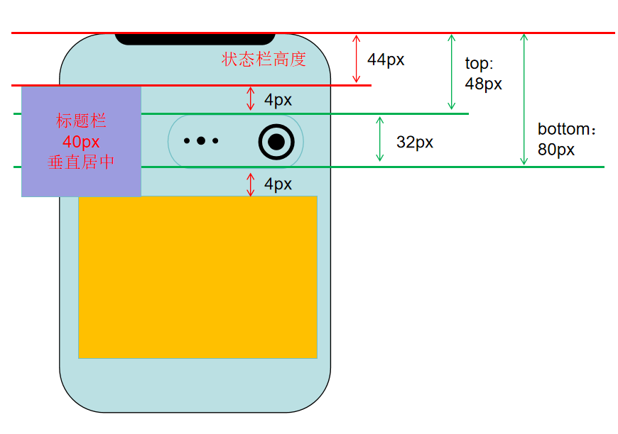

### 布局

要不要设置全局的内边距，可以看到tabbar页面全部有一个相同的内边距，所有会

各种内置组件view，swiper，swiper-item设置为border-box


### image组件的mode模式


使用`uni-icons`

组件，拓展组件，uni-icon图标，

点击下载安装

```html
<uni-icons type="contact" size="30"></uni-icons>
```

替换`type`值即可


文本溢出显示省略号，只有给文字的最近容器设置对应的样式才生效


`scroll-view`横向滚动，比如设置

```css
scroll-view {
    white-space: nowrap;
}
```

而且内部的子元素是行内块元素：`display: inline-block;`

scroll-view不支持flex,默认block;


`<navigator>`组件导航到`tabBar`页面与其它页面有什么区别吗

跳转tabBar	

```vue
<navigator url="/pages/classify/classify" open-type="reLaunch"></navigator>
```

js导航呢


### linear-gradient

怎么理解这个

```css
  // 渐变:写在最上面的,层级最高
  background: linear-gradient(to bottom, transparent, #fff 400rpx),
    linear-gradient(to right, #beecd8 20%, #f4e2d8);
```


小程序中的联系客服

https://mp.weixin.qq.com/ 中获取AppID

进入`基础功能`->`客服`：

首先添加客服，输入对应的微信号


使用客服账号，扫描对应的码


联系客服只能通过`button`实现，无法通过`js`实现跳转

```vue
<button open-type="contact">联系客服</button>
```


### CSS选择器：

```sql
view.section
  ├─ navigator
  │    └─ view.row  
  ├─ navigator
  │    └─ view.row   ← 需要控制

```

想选中 **`.section` 下最后一个 `.row`**，但是 `.row` 外层还有 `navigator`。

不能直接用 `.section .row:last-child`，那会选到每个 `navigator` 内部的最后一个 `.row`（而不是整个 section 内最后一个）。

✅ 正确写法：利用 `navigator:last-child .row`

```css
.section navigator:last-child .row {
  border: none; /* 或者 border-bottom: none; */
}
```


### navigationStyle:

`pages.json`  ->  `pages`  -> `style`  -> `navigationStyle`

导航栏样式，仅支持 `default/custom`。`custom`即取消默认的原生导航栏

`default`的效果如下，分别为H5和微信小程序中的显示效果


```json
{
    "path": "pages/user/index",
    "style": {
        "navigationBarTitleText": "我的",
        "navigationStyle": "custom"
    }
},
```

`custom`的效果如下，分别为H5和微信小程序中的显示效果


区别就时顶部的标题导航没有了，我们可以自定义一个标题栏。

但是需要注意一点的是，现在内容区已经是从屏幕顶部开始了，但是手机的顶部还有一个状态栏会显示信息


像现在这样就是内容已经把状态栏遮住了，所以我们需要在顶部把状态栏高度留出来。


### 状态栏与menuButton

在小程序中设置了自定义的顶部导航栏时，由于设置了`"navigationStyle": "custom"`，顶部导航栏就会把占据手机状态栏的位置


小程序中使用uni.showToast,其它平台都可以使用吗


微信小程序：

状态栏高度44px，但是title还是没有和menuButton对齐，这是因为`menuButton`的`top:48px`，这说明`menuButton`的**顶部**举例`statusBar`的**底部**有4px的距离，而且menuButton的底部距离下面也有4px，所以我们需要按照menuButton的整体高度来设置




可以认为整个胶囊按钮的高度是 4 + 4 + 32 = 40px。如果有盒子需要与胶囊按钮并排，就可以设置高度40px，然后内容垂直居中即可。


### 底部安全区域

手机底部会有一个手势指示条或者是虚拟按键


或者


所以页面底部需要预留出


所有的网络请求如果出错时的处理，`.vue`文件中的调用出错的处理


### 下拉刷新，触底加载

最好是加一个节流： n 秒内只运行一次，若在 n 秒内重复触发，只有一次生效


图片列表已经返回了每一张图的详情，点击预览，以及预览页需要展示的数据，都在列表页已经获取了。

所以进入到预览页时，不要再次获取数据了

把之前的列表页面数据保存，在预览页中获取，即可显示


### 保存图片到手机相册

对于网络图片地址，需要先配置小程序的开发设置：


服务内容声明

使用权限之前需要到， 微信小程序后台，添加对应的权限


```js
// 初次调用会触发用户授权
uni.saveImageToPhotosAlbum({
    filePath:path,
    success: (res) => {
        console.log('下载结果',res);
    },
    fail: (err) => {
        console.log('错误',err)
    }
})
```


点击拒绝会触发`fail`回调，

再次点击下载，会一直进入`fail`回调，


拒绝以后，弹出提示框：


如果点击取消，

如果点击确定，导航到用户开启权限


这里可能是开启了，然后返回；也可能是没有开启，然后返回；所以还要判断

开启或者不开启，都是进入`success`回调，只是内部参数值不同


```
	// #ifdef H5
		uni.showModal({
			title:'下载提示'
			content:"无法下载",
		})
	// #endif

	// #ifndef H5
	const path = await getImageInfo()
		uni.saveImageToPhotosAlbum({
			filePath:path,
			success: (res) => {
						uni.showToast({
							title: "保存成功，请到相册查看",
							icon: "none",
						});
			},
			fail: (err) => {
				console.log('错误',err)
			}
		})
	// #endif
```


### 进入方式

用户直接进入小程序，正常使用

用户通过其他用户分享进入小程序，

有些样式与互动的逻辑不太一样


清缓存

信息弹出的底部安全区域
