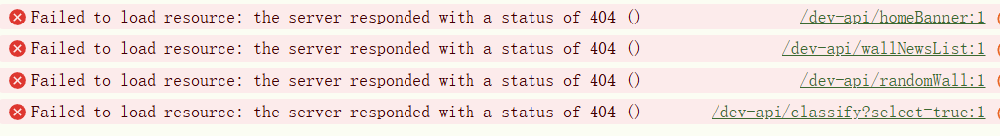
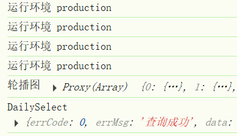

### 🧩 问题背景

- **H5 端跨域问题**
   浏览器环境中（H5 端），会受到 **同源策略** 限制，如果前端域名和后端域名不同，会出现 **CORS 跨域问题**。
- **小程序端（包括微信小程序）**
   小程序本质是原生运行环境，**不受浏览器同源策略限制**，但是有自己的 **合法域名白名单机制**，只能访问后台配置的白名单域名，不支持 `proxy` 等开发代理。


### 一、生产环境中，后端配置反向代理时

**思路：**

1. 配置开发代理
2. 根据不同平台，使用不同的请求前缀
3. h5中使用配置的代理前缀
4. 微信小程序中使用实际的接口地址
5. 所以需要判断不同的平台


#### ⚙️ 步骤一：配置 Web/H5 开发代理（本地开发阶段）

在 `vue.config.js` 或 `vite.config.js` 中添加 `server.proxy` 配置，例如：

```js
  server: {
    host: "localhost", // 指定服务器应该监听哪个IP地址,默认：localhost
    port: 5173, // 指定开发服务器端口,默认：5173
    proxy: {
      "/dev-api": {
        target: "https://tea.qingnian8.com/api/bizhi", // 目标接口
        changeOrigin: true, // 是否换源
        rewrite: (path) => path.replace(/^\/dev-api/, ""),
      },
    },
  },
```

#### ⚙️ 步骤二：配置网络地址前缀

`@/config.js`

```js
// 系统信息
export const SYSTEM_INFO = uni.getSystemInfoSync();

// 小程序端 访问地址前缀
export const BASE_URL_MP = "https://tea.qingnian8.com/api/bizhi";
//  h5 端地址前缀
export const BASE_URL_H5 = "/dev-api";
```


#### ⚙️ 步骤三：根据当前运行平台，使用不同的前缀

`@/utils/request.js`

```js
import { SYSTEM_INFO, BASE_URL_MP, BASE_URL_H5 } from "@/config.js";

export function request(config = {}) {
    let { url, data = {}, method = "GET", header = {} } = config;
    
    const plat = SYSTEM_INFO.uniPlatform;
    const BASE_URL = plat === "web" ? BASE_URL_H5 : BASE_URL_MP;

    return new Promise((resolve, reject) => {
        uni.request({
            url: BASE_URL + url,
            method: method,
            data: data,
            header: header,
            timeout: 10000,
            success: (res) => {
            },
            fail: (err) => {
            },
        });
    });
}
```


**注意：**

在生产环境（`npm run build` 打包部署）时：

- 前端打包出来的 H5 页面 **仍然会请求 `/dev-api/...`**
- 但是此时 **已经没有 proxy 代理** 了，所以：
  - 你要在 **部署环境的反向代理（如 Nginx）** 把 `/dev-api` 转发到后端接口域名
  - 或者 **直接把 `/dev-api` 换成真实域名**（也行，但要配置在前端打包环境变量里）

##### 后端服务器的反向代理

**`nginx.conf`（生产环境）**

```nginx
location /api/ {
    proxy_pass https://your-api-server.com/;
    proxy_set_header Host $host;
}
```


### 二、无法配置后端反向代理时

如果是使用的别人的接口，像我做的这个项目就是使用的别人的后端接口，我没办法修改别人的服务器配置，现在我打包以后的项目，托管到DCloud的前端网页托管中，实际上没有办法正常运行的。

在浏览器中打开，会出现以下的错误



这是因为我们打包到h5平台时，还是使用了`/dev-api`代理前缀，服务器并没有和前端项目部署到同一个域名下，接口服务器也没有设置CORS，这时肯定是无法访问的。

现在我希望，打包到h5平台以后，`/dev-api`自动替换为真实的后端接口地址，由于打包以后是放在服务器上运行的，所以不会再有跨域的问题了。


替换为真实域名

如果希望开发时使用代理前缀，打包以后自动替换为真实的接口地址，就需要设置环境变量了。

`vite.config.js`不用修改

#### 方法一：条件判断

`config.js`

```js
// 系统信息
export const SYSTEM_INFO = uni.getSystemInfoSync();

// 小程序端 访问地址前缀
export const BASE_URL_MP = "https://tea.qingnian8.com/api/bizhi";
// H5开发环境通过代理
export const BASE_URL_H5_DEV = "/dev-api";
// H5生产环境使用真实接口
export const BASE_URL_H5_PROD = "https://tea.qingnian8.com/api/bizhi";
```


网络请求`request.js`

```js
import {
    SYSTEM_INFO,
    BASE_URL_MP,
    BASE_URL_H5_DEV,
    BASE_URL_H5_PROD,
} from "@/config.js";

let BASE_URL = BASE_URL_MP; // 默认小程序用真实地址
export function request(config = {}) {
    let { url, data = {}, method = "GET", header = {} } = config;

    const plat = SYSTEM_INFO.uniPlatform;
    if (plat === "web") {
        // H5 平台：根据环境切换
        if (import.meta.env.MODE === "development") {
            BASE_URL = BASE_URL_H5_DEV; // 开发环境代理
        } else {
            BASE_URL = BASE_URL_H5_PROD; // 生产环境真实地址
        }
    }

    return new Promise((resolve, reject) => {
        uni.request({
            url: BASE_URL + url,
            // ......
        });
    });
}
```

打包发布，可以正常访问




#### 方法二：使用环境变量

#### 📝 第一步：创建环境变量文件

在项目根目录创建以下两个文件：

`.env.development`

```ini
VITE_BASE_API_H5=/dev-api
VITE_BASE_API_MP=https://tea.qingnian8.com/api/bizhi
```

`.env.production`

```ini
VITE_BASE_API_H5=https://tea.qingnian8.com/api/bizhi
VITE_BASE_API_MP=https://tea.qingnian8.com/api/bizhi
```

⚡ `VITE_` 开头是必须的，这是 vite 的规则。
 `NODE_ENV=development/production` 会自动注入，编译时根据你运行 `dev` 还是 `build` 自动加载对应 `.env.xxx`。


#### 📝 第二步：在 config.js 中读取

```js
export const SYSTEM_INFO = uni.getSystemInfoSync();

// 读取环境变量
export const BASE_URL_H5 = import.meta.env.VITE_BASE_API_H5;
export const BASE_URL_MP = import.meta.env.VITE_BASE_API_MP;
```


#### 📝 第三步：在 request.js 中使用

```js
// 导入config.js中变量，在开发/生产环境下，值是不同的
import { SYSTEM_INFO, BASE_URL_MP, BASE_URL_H5 } from "@/config.js";

export function request(config = {}) {
  const { url, data = {}, method = "GET", header = {} } = config;

  const plat = SYSTEM_INFO.uniPlatform;
  const BASE_URL = plat === "web" ? BASE_URL_H5 : BASE_URL_MP;

  return new Promise((resolve, reject) => {
    uni.request({
      url: BASE_URL + url,
      method,
      data,
      header,
      timeout: 10000,
      success: (res) => resolve(res),
      fail: (err) => reject(err),
    });
  });
}
```


特别注意 ⚠️：

`.env.*` 文件的语法是 **`dotenv` 格式**，它有以下规则：

✅ **不加引号** 是最常见做法

```ini
VITE_BASE_API_H5=/dev-api
```

✅ **可以加引号，但会包含在值中**

```ini
VITE_BASE_API_H5="/dev-api"
```

此时 `import.meta.env.VITE_BASE_API_H5` 的值会是
 **`"/dev-api"`（包含双引号字符）**，**不是** `/dev-api`

⚠️ 所以如果加了引号，**你需要手动去掉引号**，否则字符串里会多一对 `"`。


### 拓展：

#### 判断运行平台

#### 🧩 1. `process.env.UNI_PLATFORM`（**编译时**平台）

**在编译阶段就确定**

由 **uni-app 构建工具注入**

表示当前项目**正在编译的目标平台**

常见值：

| 平台         | 值             |
| ------------ | -------------- |
| H5           | `"h5"`         |
| 微信小程序   | `"mp-weixin"`  |
| 支付宝小程序 | `"mp-alipay"`  |
| App          | `"app-plus"`   |
| 抖音小程序   | `"mp-toutiao"` |


示例

```js
if (process.env.UNI_PLATFORM === 'h5') {
  console.log('当前是 H5 平台')
}
```

✅ 适合：**编译期判断、条件编译、区分 H5/小程序/App 等打包目标**

就类似与条件编译，针对不同平台，使用对应的API，其它的平台代码也不会打包进去，就当作是条件编译


#### 🧩 2. `uni.getSystemInfoSync().uniPlatform`（**运行时**平台）

- **运行时才有值**
- 由 `uni-app` 在运行时填充
- 表示当前代码**实际运行的环境**


| 实际运行环境 | 返回值        |
| ------------ | ------------- |
| H5           | `"web"`       |
| 微信小程序   | `"mp-weixin"` |
| 支付宝小程序 | `"mp-alipay"` |
| App          | `"app"`       |

示例

```js
const info = uni.getSystemInfoSync()
console.log(info.uniPlatform) // web / mp-weixin / app ...
```

✅ 适合：**运行时动态判断平台**（比如公共请求封装中动态切换 baseURL）


##### 🟢 建议使用策略

- **在编译期（如条件编译 `#ifdef`）** → 用 `process.env.UNI_PLATFORM`
- **在运行期（如请求封装、运行时逻辑判断）** → 用 `uni.getSystemInfoSync().uniPlatform`

> 换句话说：
>
> - **想在编译时裁剪代码 → `process.env.UNI_PLATFORM`**
> - **想在运行时决定走哪个请求前缀 → `uni.getSystemInfoSync().uniPlatform`**


#### 判断运行环境

在 HBuilderX ，点击“`运行`”编译出来的代码是**开发环境**，点击“`发行`”编译出来的代码是**生产环境**

`uni-app` 可通过 `process.env.NODE_ENV` 判断当前环境是开发环境还是生产环境。一般用于连接测试服务器或生产服务器的动态切换。


也可以用 `import.meta.env.MODE` 来判断当前运行环境：


#### 📌 二者的区别

| 属性                   | 常见值                                            | 说明                                                    |
| ---------------------- | ------------------------------------------------- | ------------------------------------------------------- |
| `process.env.NODE_ENV` | `"development"` / `"production"`                  | Vite 会在构建时自动注入这个变量（webpack 时代就存在）   |
| `import.meta.env.MODE` | `"development"` / `"production"` / `"customName"` | 表示当前使用的 `.env.xxx` 文件中 `xxx` 部分（即模式名） |


#### 📌 使用建议

- 如果只是简单区分 **开发 / 生产**，用哪个都可以，建议：

  ```js
  if (process.env.NODE_ENV === 'development') {
      // 开发环境逻辑
  } else {
      // 生产环境逻辑
  }
  ```

- 如果你使用了多个自定义环境（比如 `.env.test`、`.env.pre` 等），
   就必须使用 `import.meta.env.MODE` 才能区分不同模式：

  ```js
  if (import.meta.env.MODE === 'test') {
      // 测试环境逻辑
  }
  ```


以上针对的都是Hbuild X 4.76 + Vue3 