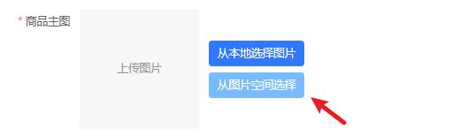
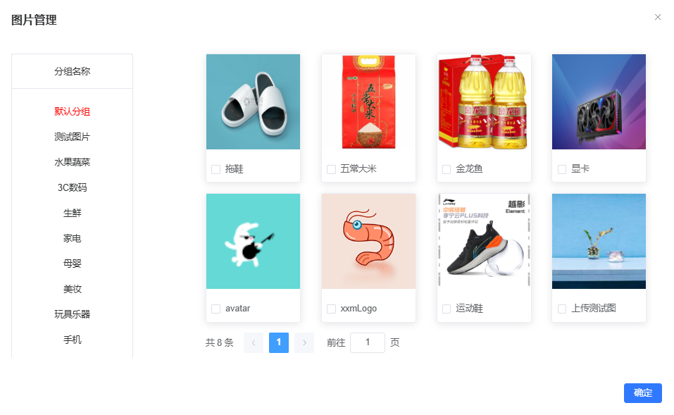

### 需求

开发中经常会遇到的需求就是，点击一个按钮，弹出一个对话框，在对话框内有一些操作，执行一些逻辑，然后关闭这个对话框；

直接在当前的组件中使用`el-diaolog`当然可以，只是如果页面代码比较多，然后又有很多的对话框需要弹出，会让这个组件的代码过于冗长，不利于后期的委会等等，我的目的只是为了简化当前组件的代码，把部分功能放到一个组件中实现。

### 案例

以一个选择图片的组件举例：

点击一个按钮，弹出一个对话框，可以选择图片




对话框



从实现上来说，没有什么难度，只是在结合`v-model`一起使用时，怎么通过`v-model`同时控制子组件本身 与 子组件内部的`dialog`，有一些需要注意的地方，所以记录下来，方便以后查阅。

### 实现

首先有一个当前的组件，可以认为是父组件，父组件内部的代码太多了，所以才把这个功能作为一个组件来实现，这个子组件命名为`ImageSpace.vue`

在父组件中使用：

```vue
<image-space v-model:visible="isShowImageSpace" @confirm="handleImgSpaceConfirm" />
```

实现的效果是通过`v-model`将`isShowImageSpace`绑定到组件内的`visible`上，在子组件内部关闭对话框时，父组件的`isShowImageSpace = false`，让组件隐藏。


#### 逻辑：

因为父组件中通过`v-model:visible="isShowImageSpace"`来控制对话框的显示与隐藏，所以子组件内部需要定义`props：visible`，根据这个`visible`的值，控制对话框的显示与隐藏，这涉及到修改visible，作为props，visible是只读的，所以不能直接将visible绑定到el-dialog上。

通过一个中间变量，计算属性`isShow`，他的值是`props.visible`，可以修改：

```js
isShow = false
```

修改的时候，触发`set()`，发送`update:visible`事件，父组件中的`v-model`是一个语法糖，监听到这个事件以后,会更新`isShowImageSpace = false`，

由于 `isShowImageSpace` 绑定到了子组件的 `v-model:visible`，此值变化后：

```js
props.visible === false
```

子组件中 `isShow.value` 是通过 `get()` 返回 `props.visible`，此时变成 `false`。

对话框就隐藏了。


`ImageSpace.vue`

```vue
<script setup>
const props = defineProps({
  visible: {
    type: Boolean,
    default: false
  }
})

const isShow = computed({
  get() {
    return props.visible
  },
  set(val) {
    console.log('修改计算属性', isShow.value, val)
    emits('update:visible', val)
  }
})
const emits = defineEmits(['update:visible', 'confirm'])


const handleSelectedImg = () => {
  if (checkedList.value.length === 0) {
    ElMessage.info('请选择图片')
    return
  }
  console.log('选中的图片是', checkedList.value)
  const id = checkedList.value[0]
  emits('confirm', id)
  emits('update:visible', false)
}
</script>

<template>
<el-dialog title="图片管理" v-model="isShow">
    <!-- 省略 -->

    <template #footer>
      <el-button type="primary" @click="handleSelectedImg">确定</el-button>
    </template>
</el-dialog>
</template>
```

当我点击右上角的关闭按钮，会触发`isShow=false`，这样会触发set，然后修改`isShowImageSpace = false`，在通过`prop`传递给`isShow = false`，对话框就关闭了。

如果我们操作完成了，点击了确定，这时候通常会传递一个数据给父组件，比如这里需要传递一个`id`过去，所以我们前面定义了`confirm`事件：

同时发送`update:visible`，让对话框组件关闭。

```js
emits('confirm', id)
emits('update:visible', false)
```

### 最后

在父组件中，如果希望子组件每次都是完全销毁与重建，就加上`v-if`

```vue
<image-space v-if="isShowImageSpace" v-model:visible="isShowImageSpace" @confirm="handleImgSpaceConfirm" />
```

这样每次打开对话框，都会重新发送网络请求，请求最新的数据。