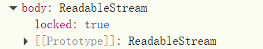

### 下载图片

#### 1. 后端返回的是url地址

如果后端返回的是图片的`ur`l地址

```js
return {
    code: 200,
    msg: 'OK',
    data: {
      downloadUrl: image.imageUrl,
      fileName: image.imageName
    }
  }
```

前端通过网络请求获取到的是这个地址。

##### 后端是否配置Content-Disposition

假如图片链接（例如 `https://picsum.photos/id/1040/300/150`）在服务端并没有加上 `Content-Disposition: attachment` 响应头，浏览器默认是直接**展示**而不是**下载**。

浏览器直接访问这个`url`的效果就是在窗口中显示这张图片，如果配置了`Content-Disposition: attachment`，访问这个`url`就会下载图片。

###### 后端没有配置Content-Disposition

此时，从后端返回的是图片的网络地址，不能直接下载。

首先要根据这个地址再次fetch一次，获取到实际的图片数据。

```js
const response = await fetch(downloadUrl)
```

这是一个`Response` 对象，是 `fetch` API 的标准返回类型。这个对象本质上是对 HTTP 响应的封装，里面包含了：

- 状态码（`response.status`）；

- 响应头（`response.headers`）；

- 响应体（也就是你要的文件内容）；

我们需要的是响应体的数据：



响应体的数据是一个 `ReadableStream`，是字节级别的原始数据。必须使用 `.blob()` / `.text()` / `.json()` 等方法去“读取”它，否则你没法访问实际的内容。

然后 **Response 对象**有一些方法，用来读取响应体内容，比如：

- `response.text()` → 把body 解析为文本（适合 HTML、JSON、CSV 等）；
- `response.json()` → 把 body 解析为 JSON 对象；
- `response.blob()` →  把 body 解析为 Blob（适合图片、视频、PDF 等）；

解析为 Blob数据

```js
const blob = await response.blob()
```

这个 blob 就相当于是「图片的文件实体」，我们可以用它来模拟一个“下载文件”。


```js
const objectUrl = URL.createObjectURL(blob)
```

这一步是**给这个 blob 创建一个临时的可访问链接**（比如 `blob:http://localhost/...`），就像给它一个虚拟地址。

```js
const link = document.createElement('a')
link.href = objectUrl
link.download = fileName // 设置文件名
link.style.display = 'none'
document.body.appendChild(link)
link.click()

 // 清理
link.remove()
URL.revokeObjectURL(objectUrl)
```

完整的下载函数

```js
const handleImgsDownload = async (id) => {
  const res = await downloadImage(id)
  const { downloadUrl, fileName } = res.data

  try {
    const response = await fetch(downloadUrl)
    const blob = await response.blob()

    const objectUrl = URL.createObjectURL(blob)

    const link = document.createElement('a')
    link.href = objectUrl
    link.download = fileName || '未命名图片'
    link.style.display = 'none'
    document.body.appendChild(link)
    link.click()

    // 清理
    link.remove()
    URL.revokeObjectURL(objectUrl)
  } catch (error) {
    console.error('下载失败：', error)
  }
}
```


#### 2. 后端返回的是二进制数据


下载，上传时为什么用try catch