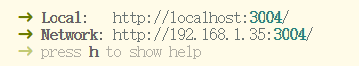
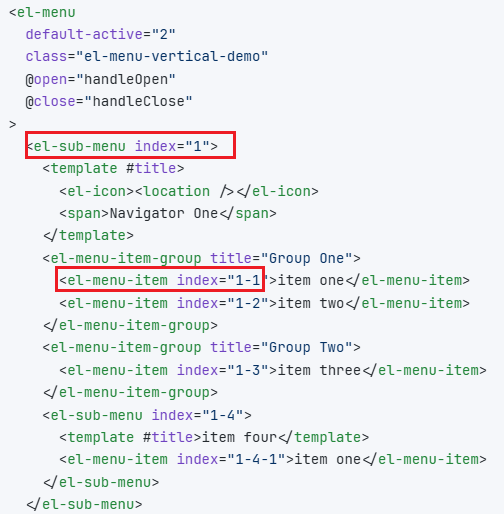

## 介绍商贸城后台管理系统中的动态路由注册的实现

### 静态路由：

静态路由是项目中的公共路由，不依赖与后端生成。

这些路由通常是系统中所有用户（无论其角色或权限如何）都可以访问的基础页面。

**特点:**

- **通用性**：包含所有用户都能访问的页面，例如登录页、404错误页、首页 (Dashboard) 等。
- **无需权限**：访问这些路由不需要特定的用户权限。
- **预先定义**：在前端项目初始化时就已经被加载到路由实例中。

**部分示例代码 (Vue Router):**

```js
// 注册页
{
    path: '/register',
    name: 'register',
    component: () => import('@/views/register/index.vue'),
    meta: {
      hidden: true
    }
  },
  // 登录页
  {
    path: '/login',
    name: 'login',
    component: () => import('@/views/login/index.vue'),
    meta: {
      hidden: true
    }
  },
  {
    path: '/',
    name: '/',
    component: layout,
    redirect: '/dashboard',
    meta: {
      hidden: false
    },
    children: [
    // 首页
      {
        path: 'dashboard',
        name: 'dashboard',
        component: () => import('@/views/dashboard/index.vue'),
        meta: {
          title: 'dashboard',
          icon: 'dashBoard',
          hidden: false
        }
      },
    ]
  },
```

### 动态路由：

在用户登录后，根据其角色和权限，由后端返回相应配置信息的路由。前端在获取到这些路由信息后，再动态地将其添加到路由实例中。

这种方式主要用于实现精细化的权限控制，确保不同的用户只能看到和访问他们被授权的菜单和页面。

**特点:**

- **权限控制**：是实现用户权限管理的核心，不同角色的用户会得到不同的路由配置。
- **后端驱动**：路由的结构和可访问性由后端数据决定，更加灵活和安全。
- **按需加载**：用户登录成功后，前端向后端请求权限路由，然后通过 `router.addRoute()`等方法动态注入。


**部分示例代码 (Vue Router):**

```json
        {
          path: '/product-manage',
          component: 'layout',
          name: 'productManage',
          meta: { title: 'productManage', icon: 'productManage', hidden: false },
          children: [
            {
              path: 'on-sale',
              component: 'product-manage/on-sale/index',
              meta: {
                title: 'onSale',
                icon: '',
                hidden: false
              }
            },
            {
              path: 'product-release',
              name: 'productRelease',
              component: 'product-manage/product-release/index',
              meta: {
                title: 'productRelease',
                icon: '',
                hidden: false
              }
            },
            {
              path: 'pre-sale',
              component: 'product-manage/pre-sale/index',
              meta: {
                title: 'preSale',
                icon: '',
                hidden: false
              }
            },
            {
              path: 'image-space',
              component: 'product-manage/image-space/index',
              meta: {
                title: 'imageSpace',
                icon: '',
                hidden: false
              }
            }
          ]
        },
```


### 侧边栏路由显示规则：

路由的`meta`对象中的`hidden`属性表示路由是否显示在侧边栏中，只有`hidden=true`的路由才会显示


#### 多级路由：

如果父路由的`children`数组中的子路由只有一个需要显示，那么就只显示这一个子路由

如果父路由的`children`数组中的子路由全都不用显示，那么就把父路由作为子路由显示

如果父路由的`hidden = false`，但是`children=[]`数组为空，同样把父路由作为子路由显示

如果父路由的`hidden = false`，`children`数组中有多个需要显示的子级路由，那么就正常显示，显示一级父路由，显示二级的子路由等等。


#### 首页：

首页一般作为静态路由配置，因为不论是什么类型的用户，通常都可以访问首页。

首页通常是由根路径`/` 重定向到首页`dashboard`的。

比如：根路由是`/`，`redirect: '/dashboard`'，首页通常也使用`layout`模板渲染

根路由下面可能还有一些其它页面，同样使用`layout`模板，但是不显示在侧边栏的路由，比如：个人资料`/profile`，通过点击个人头像可以跳转，但是不显示在侧边栏中。

这里`/`和`首页`的路由结构如下：

```js
 {
    path: '/',
    component: layout,
    redirect: '/dashboard',
    meta: {
      hidden: false
    },
    children: [
      {
        path: 'profile',
        component: () => import('@/views/profile/index.vue'),
        meta: {
          title: 'profile',
          icon: 'personnel',
          hidden: true
        }
      },
      {
        path: 'dashboard',
        component: () => import('@/views/dashboard/index.vue'),
        meta: {
          title: 'dashboard',
          icon: 'dashBoard',
          hidden: false
        }
      }
    ]
  },
```

根路由`/`下面，除了首页`dashboard`以外，其它的页面的`hidden:false`，都不会显示在侧边栏中，这时候根路由下面只有一个子路由（`dashboard`）需要显示，那么就只显示这一个子路由，直接作为顶层的路由显示，和其它一级路由属于并列关系。

### 生成路由：

我们需要将后端返回的路由变成前端`vue-router`可以注册的路由，Vue Router 中的 `component` 应该是一个组件对象，或者一个 `defineAsyncComponent` 异步组件加载函数

应该是类型下面的配置：

```js
import Layout from '@/layout/index.vue'

const routes = [
  {
    path: '/product-manage',
    component: Layout,
    name: 'productManage',
    children: [
      {
        path: 'on-sale',
        component: () => import('@/views/product-manage/on-sale/index.vue'),
        meta: { title: 'onSale' }
      },
      ...
    ]
  }
]

```

也就是说，**`component` 需要是实际引入的 Vue 组件，而不是字符串路径**。


前端需要将字符串转换为组件对象，然后进行路由注册。`permission.store.ts`负责完整这部分的功能。

`permission.store.ts`

```js
// @ts-nocheck
import { defineStore } from 'pinia'
import type { RouteRecordRaw } from 'vue-router'
import MenuAPI, { type RouteVO } from '@/api/system/menu.ts'
import { completePath } from '@/utils/menu'
import router, { publicRoutes } from '@/router'

const modules = import.meta.glob('@/views/**/**.vue')
const layout = () => import('@/layout/index.vue')

export const usePermissionStore = defineStore('permissionStore', () => {
  const routes = ref([]) //保存当前用户的所有路由(静态和动态)，
  const hasRoute = ref(false)

  /**
   * 生成动态路由
   */
  function generateDyRoutes() {
    // 表示 Promise 成功时会返回 RouteRecordRaw 类型的数组,,
    // resolve → 接收的参数必须是 RouteRecordRaw[] 类型的数据
    return new Promise<RouteRecordRaw[]>((resolve, reject) => {
      MenuAPI.getRoutes().then((res) => {
        console.log('获取到改用户的动态路由', res.data)

        // 处理路由，变成组件
        const dynamicRoutes = transformRoutes(res.data)
        // 保存全部路由
        routes.value = publicRoutes.concat(dynamicRoutes)
        // 处理路由,path变成完整的路径
        // routes.value = completePath(routes.value)
        console.log('routers', routes.value)

        hasRoute.value = true
        resolve(dynamicRoutes)
      })
    })
  }

  // 移出该用户的全部动态路由,保留静态路由
  const removeRoutes = () => {
    routes.value.forEach((route) => {
      const isExist = publicRoutes.some((item) => item.name === route.name)
      // isExist=false,说明route,不是静态路由,所以可以删除
      if (!isExist) {
        router.removeRoute(route.name)
      }
    })
    hasRoute.value = false
    routes.value = []
    console.log('移出全部动态路由')
  }
  return { routes, hasRoute, removeRoutes, transformRoutes, generateDyRoutes }
})

/**
 * 转换路由数据为组件
 */
const transformRoutes = (routes: RouteVO[]) => {
  const asyncRoutes: RouteRecordRaw[] = []

  routes.forEach((route) => {
    const tmpRoute = { ...route } as RouteRecordRaw
    // 如果对应的组件是layout
    if (tmpRoute.component?.toString() == 'layout') {
      tmpRoute.component = layout
    }
    // 对应的组件是其它的
    else {
      const comp = modules[`/src/views/${tmpRoute.component}.vue`]
      if (comp) {
        tmpRoute.component = comp
      } else {
        tmpRoute.component = () => import('@/views/not-found/index.vue')
      }
    }

    if (route.children) {
      tmpRoute.children = transformRoutes(route.children)
    }

    asyncRoutes.push(tmpRoute)
  })

  return asyncRoutes
}
```

**关键点：**

```js
const modules = import.meta.glob('@/views/**/**.vue')
```

`import.meta.glob('@/views/**/**.vue')`这是**Vite 提供的内置语法**，用于实现**基于文件路径的动态导入**。其中的`@`符号，经过**Vite**解析为`/src`。这是在`vite.config.js`中的配置

```js
// 设置别名@
  resolve: {
    alias: {
      '@': fileURLToPath(new URL('./src', import.meta.url))
    }
  },
```

`@/views/`文件夹下面，保存的是系统全部的组件（`.vue`文件）。

`import.meta.glob('@/views/**/**.vue')`会将这些`.vue`文件的路径作为`key`，对应的组件的懒加载函数作为`value`。

返回的结果`modules`是一个对象，结构如下：

```js
{
  '/src/views/product-manage/on-sale/index.vue': () => import('/src/views/product-manage/on-sale/index.vue'),
  '/src/views/product-manage/pre-sale/index.vue': () => import('/src/views/product-manage/pre-sale/index.vue'),
  ...
}
```

每个 `key` 是文件路径

每个 `value` 是一个函数：调用这个函数时会动态加载对应组件（懒加载）

可以通过这个对象动态加载组件：

```js
const transformRoutes = (routes: RouteVO[]) => {
  const asyncRoutes: RouteRecordRaw[] = []

  routes.forEach((route) => {
    const tmpRoute = { ...route } as RouteRecordRaw
    // 如果对应的组件是layout
    if (tmpRoute.component?.toString() == 'layout') {
      tmpRoute.component = layout
    }
    // 对应的组件是其它的
    else {
      // 从modules中匹配对应的组件
      const comp = modules[`/src/views/${tmpRoute.component}.vue`]
      if (comp) {
        tmpRoute.component = comp
      } else {
        tmpRoute.component = () => import('@/views/not-found/index.vue')
      }
    }
	// 递归处理
    if (route.children) {
      tmpRoute.children = transformRoutes(route.children)
    }
      
    asyncRoutes.push(tmpRoute)
  })

  return asyncRoutes
}
```


#### ⚠️ 注意路径匹配格式

1. `@/views/**\/*.vue` 是别名（需要你项目中配置了 `@ = /src`）
2. 最终查找的是实际文件路径，比如 `/src/views/product-manage/on-sale/index.vue`
3. `import.meta.glob()` 中传入的路径 **不能使用变量拼接字符串**，必须是静态字符串（比如 `'@/views/**/*.vue'`），否则 **Vite** 无法在构建时分析依赖。


### 路由守卫:

当项目启动，执行`npm run dev`：



点击访问 http://localhost:3004/ 实际就是访问 `/` 路径， 根据路由配置：

```js
path: '/',
component: layout,
redirect: '/dashboard',
```

这时候会重定向到首页`/dashboard`，但是如果你没有登录，是无法访问的，只能跳转到登录页；这时候就有了路由拦截，在进入每一个路由之前，都会拦截一次，做一下检查，决定是否通过。

#### **路由拦截的逻辑：**

##### 情况一：用户未登录

1. 跳转到一个路由之前，首页检查是否登录，即检查是否存在`token`

   ```js
   if (userStore.token){}
   else{
       // token 不存在
   }
   ```

2. 如果`token`不存在，说明没有登录，没有登录那就要检查跳转的页面是否在白名单中；如果在白名单中，意味着访问的路由不需要要登录，那就直接放行

   ```js
   if (userStore.token){}
   else{
       if (whiteList.indexOf(to.path) > -1) {
           next()
       }
   }
   ```

3. 如果`token`不存在，跳转的页面也不在白名单中，那么就重定向到登录页，这时要把路径的参数全部带着，因为可能用户是没有登录系统，直接通过赋值`url`来访问的，所以登录以后，要回到用户本来想访问的页面。

   ```js
   if (userStore.token){}
   else{
       if (whiteList.indexOf(to.path) > -1) {
           next()
       }
       else {
           redirectToLogin(to, next)
       }
   }
   ```

   这里的`redirectToLogin()`函数，是用来解析`url`地址，记录查询参数，然后再重定向到登录页

   ```js
   router.push('/login?redirect=/dashboard')
   ```

   这里的`/dashboard`就是本来应该访问的页面，但是因为没有登录，现在被跳转到了`login`页面，通过`redirect`参数记录需要访问的页面，在登录成功以后，获取到`redirect`后面的路径，再次跳转过去；

   这样就实现了

   > 从**未登录**用户访问`/dashboard` -> 跳转到登录页 -> 登录成功 -> 跳转到`/dashboard` 


##### 情况二：用户已登录

即：

```js
if (userStore.token){ 
    
}
```

**访问登录页：**

如果用户已经登录了，我们首先检查用户将要访问的页面是否是登录页`/login`，通过来说，已经登录的用户，不允许再次访问登录页，除非首先退出登录。

如果再次访问登录页，将其重定向到`/`路径

```js
 if (userStore.token){
  if (to.path === '/login') {
      next('/')
    }
 }
```

**如果访问的不是登录页：**

访问的不是登录页，就需要考虑这个页面有没有注册完成，就是否进行了动态路由注册。

动态路由注册，用一个`store`文件来管理，位于`stores/modules/permission.js`，暂时忽略文件内部代码。

其中的`permissionStore.hasRoute`，是一个布尔值，`true`表示已经完成了路由注册，`false`表示没有完成。

如果路由注册完成了，就放行。

```js
if (permissionStore.hasRoute) {
    next()
}
```

如果没有注册完成，则进行路由注册，调用`permissionStore.generateDyRoutes()`可以获取全部的动态路由，

之后注册路由，注册完成之后，则继续导航。

```js
// 注册动态路由
dyRoutes.forEach((route) => {
    router.addRoute(route)
})
```

**注意：**

> 在拦截器中使用`next()`和`next(to)`或者 `next('/xxx')` 的效果有一些区别

✅ `next()`

表示**允许当前的导航继续执行**，不进行任何更改或重定向。

✅ `next(to)`（to 是一个路径字符串或一个路由对象）

表示**中断当前导航并重定向到其他路由**。也就是说，它会**取消当前的跳转**，并**执行你传给它的跳转目标**。

⚠️ 注意：如果调用 `next(to)`，**必须确保不会出现无限重定向**（例如你每次都重定向到 `/login`，但 `/login` 本身也被路由守卫拦截了，又跳回去）。

简单总结就是，`next(to)`可能会导致**无限重定向**


**路由守卫代码：**

```js
import router from '@/router'
import { useUserStore } from '@/stores/modules/user'
import { usePermissionStore } from '@/stores/modules/permission'

// 白名单
const whiteList = ['/login', '/register']

router.beforeEach(async (to, from, next) => {
  const userStore = useUserStore()
  if (userStore.token) {
    // 登录了，但是去的是登录页，跳到首页
    if (to.path === '/login') {
      next('/')
    }
    // 登录了，而且去的不是登录页，要看有没有完成路由注册
    else {
      const permissionStore = usePermissionStore()
      if (permissionStore.hasRoute) {
        // 这个next()不会再次触发路由拦截
        next()
      }
      // 没有完成路由注册，就注册一下
      else {
        try {
          const dyRoutes = await permissionStore.generateDyRoutes()
          // 注册动态路由
          dyRoutes.forEach((route) => {
            router.addRoute(route)
          })
          // 这个next(to)会再次触发一次路由拦截
          next(to)
        } catch (error) {
          // 注册路由出问题了,清除数据,跳转回登录页面
          redirectToLogin(to, next)
        }
      }
    }
  } else {
    if (whiteList.indexOf(to.path) > -1) {
      next()
    }
    else {
      redirectToLogin(to, next)
    }
  }
})

function redirectToLogin(to, next) {
  const params = new URLSearchParams(to.query)
  const queryString = params.toString()
  // to的路径有参数，拼接上，没有参数，直接to.path
  const redirectUrl = queryString ? `${to.path}?${queryString}` : to.path

  // 跳转过去
  // 利用redirect=/x/x/x/x 把这个路径传给login页面，可以通过route.query 获取到 {redirect: '/x/x/x/x'} 对象
  next(`/login?redirect=${encodeURIComponent(redirectUrl)}`)
}

```

其中`redirectToLogin()`是用来记录导航路由的信息的：

当用户未登录时，把用户重定向到 `/login` 页面，并携带当前试图访问的路径和参数（作为 `redirect` 参数），这样用户登录成功后可以自动跳回原来的页面。


### 侧边栏组件：

`Sidebar/index.vue`

这是侧边栏的根组件

```vue
<template>
  <el-scrollbar>
    <SidebarMenu :data="permissionStore.routes" base-path="" />
  </el-scrollbar>
</template>

<script setup>
// 这个页面可以设置布局
import SidebarMenu from './components/SidebarMenu.vue'
import { usePermissionStore } from '@/stores/modules/permission'

const permissionStore = usePermissionStore()
</script>
```

`base-path=""`的作用是为了拼接出完整路径，因为`el-menu`组件中需要配置`index='路由的完整路径'`


`SidebarMenu.vue`

```vue
<script setup>
// import path from 'path-browserify-esm'
import path from 'https://cdn.jsdelivr.net/npm/path-browserify-esm/index.esm.js'
import { useAppStore } from '@/stores/modules/app'
import SidebarMenuItem from './SidebarMenuItem.vue'

const props = defineProps({
  // data: 当前系统的所有路由，静态＋动态的
  data: {
    type: Array,
    default: () => []
  },
  //   侧边栏的根路径，
  basePath: {
    type: String,
    required: true,
    example: '/system'
  }
})
// console.log('data', props.data)
const route = useRoute()
const appStore = useAppStore()
console.log('route', route)

/**
 * 获取完整路径
 *
 * @param routePath 当前路由的相对路径  /user
 * @returns 完整的绝对路径 D://vue3-element-admin/system/user
 */
function resolveFullPath(routePath) {
  // 解析路径，生成完整的绝对路径
  // 利用传递过来的父级路径，和当前路由的相对路径，生成一个完整路径
  const fullPath = path.resolve(props.basePath, routePath)
  return fullPath
}
</script>

<template>
  <el-menu :default-active="route.path" :collapse="!appStore.sidebarOpened" router unique-opened>
    <SidebarMenuItem
      v-for="route in data"
      :key="route.path"
      :routeItem="route"
      :base-path="resolveFullPath(route.path)"
    ></SidebarMenuItem>
  </el-menu>
</template>

<style lang="scss" scoped></style>
```


`SidebarMenuItem.vue`

```vue
<script>
export default {
  name: 'SidebarMenuItem'
}
</script>

<script setup>
import path from 'https://cdn.jsdelivr.net/npm/path-browserify-esm/index.esm.js'
import SidebarMenuItemTitle from './SidebarMenuItemTitle.vue'
const props = defineProps({
  /**
   * 当前路由对象
   */
  routeItem: {
    type: Object,
    required: true
  },

  /**
   * 父级完整路径
   */
  basePath: {
    type: String,
    required: true
  }
})

/**
 * 检查是否仅有一个可见子节点
 * 当前路由下有children数组，数组内的路由有多个，但是只有一个是可见的，那么就不显示父级路由，直接显示这个可见的子级路由
 * 当前路由下有children数组，但是数组为空，那就只显示父路由
 * 当前路由下没有children数组，那就只显示父路由，
 *
 * @param children 子路由数组
 * @param parent 父级路由
 * @returns 是否仅有一个可见子节点
 */
// 可见的唯一子节点
const onlyOneChild = ref(null)
function hasOneShowingChild(children = [], parent) {
  // 过滤出可见子节点数组：正常来说，如果是只有一个可见子节点，这个数组只有一个元素
  const showingChildren = children.filter((route) => {
    if (!route.meta?.hidden) {
      onlyOneChild.value = route
      return true
    }
    return false
  })

  // 仅有一个节点
  if (showingChildren.length === 1) {
    return true
  }

  // 无子节点时：children数组的所有路由都不显示，这时应该把父级路由当作是唯一显示节点，而且不要展开了
  if (showingChildren.length === 0) {
    // 父节点设置为唯一显示节点，并标记为无子节点
    onlyOneChild.value = { ...parent, path: '', noShowingChildren: true }
    return true
  }
  return false
}

/**
 * 获取完整路径，适配外部链接
 *
 * @param routePath 路由路径
 * @returns 绝对路径
 */
function resolvePath(routePath) {
  // 拼接父路径和当前路径
  return path.resolve(props.basePath, routePath)
}

</script>

<template>
  <!-- 只渲染 hidden: false 的路由 -->
  <template v-if="routeItem.meta && !routeItem.meta.hidden">
    <!-- 情况一：只有一个可显示的子节点，则直接显示子节点 ；
        或者是父节点没有子节点，直接把父节点当作子节点显示 
        routeItem.children,如果没有children属性，就是undefined，就会使用默认值[]
    -->
    <template v-if="hasOneShowingChild(routeItem.children, routeItem)">
      <el-menu-item :index="resolvePath(onlyOneChild.path)">
        <SidebarMenuItemTitle
          :title="onlyOneChild.meta.title"
          :icon="onlyOneChild.meta.icon"
        ></SidebarMenuItemTitle>
      </el-menu-item>
    </template>

    <!-- 情况二：有多个子节点，渲染为子菜单 -->
    <template v-else>
      <el-sub-menu :index="resolvePath(routeItem.path)">
        <!-- 这是标题部分 -->
        <template #title>
          <SidebarMenuItemTitle
            :title="routeItem.meta.title"
            :icon="routeItem.meta.icon"
          ></SidebarMenuItemTitle>
        </template>

        <!-- 循环渲染自身组件（这是内容部分） -->
        <SidebarMenuItem
          v-for="item in routeItem.children"
          :key="item.path"
          :routeItem="item"
          :base-path="resolvePath(item.path)"
        ></SidebarMenuItem>
      </el-sub-menu>
    </template>
  </template>
</template>

<style lang="scss" scoped></style>
```


`SidebarMenuItemTitle.vue`

```vue
<script setup>
import { generateTitle } from '@/utils/i18n'

defineProps({
  title: {
    type: String,
    required: true
  },
  icon: {
    type: String,
    required: true,
    default: ''
  }
})
</script>

<template>
  <div class="flex items-center justify-center">
    <!-- 如果icon=''或者没有icon字段，就不显示图标，否则就显示图标 -->
    <SvgIcon v-if="icon" :icon-class="icon" class="mr-2"></SvgIcon>
    <span>{{ generateTitle(title) }}</span>
  </div>
</template>

<style lang="scss" scoped></style>
```


`el-menu`组件中：



配合`el-sub-menu`和`el-menu-item`使用时，必须给`index`属性，这个属性时必填的。它的作用是`唯一的标识`每一条路由。

在启用 `vue-router` 模式以后，在激活导航时以 `index` 作为 `path` 进行路由跳转 使用 `default-active` 来设置加载时的激活项。这里的`index`必须是一个完整路径，比如：

```js
{
  path: '/product-manage', 
  component: 'layout',
  children: [
    {
      path: 'on-sale', // 注意：相对路径
      component: 'product-manage/on-sale/index',
    }
  ]
}
```

对应到`el-menu`中，开启`router`模式：

```vue
<el-menu :default-active="route.path" router>
  <el-sub-menu index="/product-manage">
    <template #title>商品管理</template>
    <el-menu-item index="/product-manage/on-sale">在售商品</el-menu-item>
  </el-sub-menu>
</el-menu>
```

> <el-sub-menu index="/product-manage">
>
> 和
>
> <el-menu-item index="/product-manage/on-sale">
>
> index = '完整的路由路径'

基于这一点，后端返回的路由中，可以给出每一个路由的完整路径。如果后端没有返回完整路径，就要前端来手动处理。

由于本系统中后端没有给出每一条`route`的完整路径，所以需要前端处理。路径组件`SidebarMenu.vue`中的`base-path`正是为了计算完整路径而设计的。


### 错误：

使用path-browserify包：

```
import path from 'path-browserify'
 ReferenceError: process is not defined
```

使用path-browserify-esm 替换 path-browserify，还是报错，

直接使用

```
import path from 'https://cdn.jsdelivr.net/npm/path-browserify-esm/index.esm.js';
```

