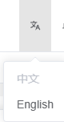

### 国际化


#### 语言包：

语言包就是一个`js`文件。默认导出一个对象，导出时分模块导出，可以更好的组织代码，类似下面的结构：

其中的`login`，`route`，`tagsView`等就表示不同模块对应的语言包

`@/i8n/lang/zh.js`

```js
export default {
  login: {
    title: '用户登录',
    loginBtn: '登录',
    usernameRule: '用户名为必填项',
    passwordRule: '密码不能少于6位',
  },
  route: {
    dashboard: '首页',
    productManage: '商品管理',
    onSale: '在售商品',
    productRelease: '商品发布',
    preSale: '待售商品',
    imageSpace: '图片空间',
    batchImport: '批量导入',
    productSubstitution: '商品替代',
  },
  tagsView: {
    refresh: '刷新',
    close: '关闭',
    closeOther: '关闭其他',
    closeLeft: '关闭左侧',
    closeRight: '关闭右侧',
    closeAll: '关闭所有'
  },
  langSelect: {
    message: {
    	success: '切换语言成功！'
    }
  },
}
```


上面是中文用户的，同样的，还需要一个英文用户的语言包，也是类似上面的结构：

`@/i8n/lang/en.js`

```js
export default {
  login: {
    title: 'User Login',
    loginBtn: 'Login',
    usernameRule: 'Username is required',
    passwordRule: 'Password cannot be less than 6 digits',
  },
  route: {
    dashboard: 'Dashboard',
    productManage: 'ProductManage',
    onSale: 'OnSale',
    productRelease: 'ProductRelease',
    preSale: 'PreSale',
    imageSpace: 'ImageSpace',
    batchImport: 'BatchImport',
    productSubstitution: 'ProductSubstitution',
  },
  tagsView: {
    refresh: 'Refresh',
    closeRight: 'Close Rights',
    closeOther: 'Close Others'
  },
  langSelect: {
    message: {
    	success: 'Switch Language Successful!'
    }
  },
}
```


这两个文件中导出对象，内部的key值


#### 创建`i18n`实例

`@/i18n/index.js`

```js
import { createI18n } from 'vue-i18n'
import { useAppStoreHook } from '@/stores/modules/app'
const appStore = useAppStoreHook()
// 本地语言包
import mZhLocale from './lang/zh'
import mEnLocale from './lang/en'

// 定义语言资源
const messages = {
  en: {
    ...mEnLocale
  },
  // 为什么要使用zh-cn而不是zh？是为了适配element-plus的国际化,它里面使用的是zh-cn
  'zh-cn': {
    ...mZhLocale
  }
}

// 创建i18n实例
const i18n = createI18n({
  legacy: false, // 推荐在 Vue3 中使用 Composition API 模式
  globalInjection: true, // 全局注入 $t 函数
  locale: appStore.language, // 默认语言：初始化用
  fallbackLocale: 'en', // 备用语言
  messages
})

export default i18n

// 全局注册 i18n
export function setupI18n(app) {
  app.use(i18n)
}
```

其中`appStore`中定义了系统初始应该使用哪个语言包，是一个字符串，可以认为是`key`，对应的是`message`对象，不同的`key`会选择不同的语言包。


`@/stores/modules/app.js`

```js
import { defineStore } from 'pinia'
import { pinia } from '@/stores'

export const useAppStore = defineStore(
  'appStore',
  () => {
    const sidebarOpened = ref(true)
    const language = ref('zh-cn')

    const triggerSidebarOpened = () => {
      sidebarOpened.value = !sidebarOpened.value
    }
    const setLanguage = (lang) => {
      language.value = lang
    }

    return {
      sidebarOpened,
      language,
      triggerSidebarOpened,
      setLanguage
    }
  },
  {
    persist: {
      paths: ['language']
    }
  }
)

/**
 * 在组件外使用 Pinia store 实例 @see https://pinia.vuejs.org/core-concepts/outside-component-usage.html
 */
export function useAppStoreHook() {
  return useAppStore(pinia)
}
```


#### 切换语言的组件

效果图：



`@/components/LangSelect/index.vue`

```vue
<template>
  <el-dropdown trigger="click" @command="handleLanguageChange">
    <div>
      <svg-icon iconClass="language" />
    </div>
    <template #dropdown>
      <el-dropdown-menu>
        <el-dropdown-item
          v-for="item in langOptions"
          :key="item.value"
          :disabled="appStore.language === item.value"
          :command="item.value"
        >
          {{ item.label }}
        </el-dropdown-item>
      </el-dropdown-menu>
    </template>
  </el-dropdown>
</template>

<script setup>
import { useI18n } from 'vue-i18n'
import { useAppStore } from '@/stores/modules/app'

const appStore = useAppStore()
const i18n = useI18n()

const langOptions = [
  { label: '中文', value: 'zh-cn' },
  { label: 'English', value: 'en' }
]

const handleLanguageChange = (lang) => {
  appStore.setLanguage(lang)
  // 手动改变ii8n实例的local值，它不会自动改变
  i18n.locale.value = lang
  ElMessage.success(i18n.t('langSelect.message.success'))
}
</script>
```


现在通过国际化组件切换语言时，侧边栏的路由名称会全部改变，这是因为侧边栏中使用`translateRouteTitle(title)`

会根据对应的`key`值，选择对应的值

```vue
<template>
  <div class="flex items-center">
    <!-- 如果icon=''或者没有icon字段，就不显示图标，否则就显示图标 -->
    <SvgIcon v-if="icon" :icon-class="icon" class="mr-2"></SvgIcon>
    <span class="ellipsis w-[110px]" :title="translateRouteTitle(title)">
      {{ translateRouteTitle(title) }}
    </span>
  </div>
</template>
```


#### i18n工具函数

```js
import { useAppStoreHook } from '@/stores/modules/app'
const appStore = useAppStoreHook()
import i18n from '@/i18n'
export function translateRouteTitle(title) {
  return i18n.global.t('route.' + title)
}
```

