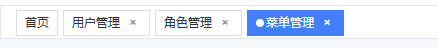

### 标签栏

**标签栏**或者**页签导航**：

一般会记录你访问过的菜单（或页面），方便快速切换，而不用重新打开（配置缓存）。



标签栏其实是：**路由与 UI 的一层同步状态**，记录已访问的页面（路由信息 + 展示信息），并负责打开/切换/关闭/缓存/持久化这些“标签页”的行为。

### 标签分类

标签可以分为固定的标签和动态标签。固定标签是始终固定在那个位置的，不可以关闭。动态标签则可以关闭。


### 需求：

默认显示固定的标签页

切换路由时，如果是初次访问的，就添加一个标签页，重复访问则不做任何操作

除了固定的标签页之外，其它标签页都有一个关闭按钮，可以关闭

鼠标移入到每一个标签页时，右键可以弹出一个弹窗，可以刷新该标签对应的页面，关闭标签，关闭其它标签，关闭左侧，关闭右侧，关闭所有标签。

当前路由对应的标签有对应的激活样式


### 数据模型：

标签栏中的每一个标签是什么？

#### 1. 从**产品角度**看

- 标签是**页面的快捷入口**，类似浏览器的多标签页。

- 每个标签代表你访问过的一个**具体页面状态**，可能带着参数和上下文（例如 `/user/123?tab=profile`）。

- 用户可以通过它：
  - 快速返回某个页面
  - 保留多个页面同时打开的状态
  - 在不同任务之间切换
  
  

#### 2. 从**技术角度**看

每一次访问一个新的路由时，就会创建一个标签

一个标签是一个**数据对象**，通常会包含这些信息（字段名因项目而异）：

| 字段                 | 作用                                       |
| -------------------- | ------------------------------------------ |
| `title`              | 标签显示的标题（来自路由 meta 或接口返回） |
| `path`               | 路由路径（可能包含 query/params）          |
| `fullPath`           | 完整路径（path + query），用于路由跳转     |
| `name`               | 路由名称（用于 keep-alive 缓存匹配）       |
| `params`             | 动态路由参数                               |
| `query`              | URL 查询参数                               |
| `meta`               | 路由元信息（权限、图标、是否固定等）       |
| `closable` / `affix` | 是否可关闭                                 |
| `componentName`      | 对应组件的名称（缓存用）                   |
| `timestamp`          | 打开时间（可用于最近访问排序）             |

换句话说，标签其实就是**“当前页面的路由信息” + “显示用的标题和配置”**。


#### 3. 从**运行时的关系**看

- 标签栏只是把这些标签对象渲染成 UI（比如 `<el-tabs>` 里的每个 `<el-tab-pane>`）。
- 当你点击标签时，本质是 `router.push(tab.fullPath)`。
- 当你关闭标签时，本质是从 `visitedViews` 列表中移除这个对象，并跳转到其他标签对应的路由。


### 设计状态（store）和对外 API

这样的一个标签栏可以单独设计为一个组件`TagsView.vue`

每一个标签是一个对象，而我们会创建很多个这样的标签，所以一定需要一个数组。

对于**后台管理系统的标签栏功能**（`TagsView.vue`），绝大多数情况下 **要用 store 来管理 `visitedViews`**，不要只放在组件内部。

原因很简单：标签栏的状态**不是 TagsView 组件自己的私事**，而是整个系统的共享状态。

#### **为什么用 store 管理而不是仅放在组件里？**

##### 1. **跨组件访问**

- 标签栏的变化可能由其他地方触发，比如：
  - 点击左侧菜单（Sidebar.vue）时新增标签
  - 在面包屑、按钮操作中关闭当前标签
  - 在右键菜单组件中批量关闭标签
- 如果状态只在 `TagsView.vue` 里，这些外部组件都没法直接改它，只能用事件通知，非常绕。

##### 2. **路由钩子统一更新**

- 我们通常会在 `router.afterEach` 中调用 `addVisitedView(route)`。
- 这个更新逻辑属于**全局行为**，如果把数据放在组件里，就要想办法让 router 和组件通信，反而更复杂。
- 放在 store 里，router 可以直接调用 store 的 action 来更新。

##### 3. **持久化与恢复方便**

- 如果要做标签持久化（localStorage/sessionStorage），从 store 同步到本地很方便；
   如果放在组件里，要额外写同步逻辑。

##### 4. **更好维护和扩展**

- 后期可能要做：
  - Keep-alive 缓存
  - 标签拖拽排序
  - 权限变更时批量清理
- 这些都更适合集中在 store 里做，而不是塞在一个 UI 组件里。


cachedViews 和 visitedViews 的关系：

共同点：只有route.meta.hidden=false的路由才会添加进去

不同点：

​	visitedViews：只要hidden = false ，就可以添加进数组

​	cachedViews：只有route.meta.keepAlive = true才会添加到数组中

​	如果从visitedViews中删除元素时，cachedViews中对应的元素也要删除


#### store 模块

**状态state：**

```js
visitedViews: [],   // [{ title, fullPath, name, meta, affix, ... }]
cachedViews: []     // [componentName, ...]
```

问题：

是否需要额外维护一个 `activeTag` 状态？ **不需要**

原因：

路由本身就是“当前活动标签”，`route=useRoute()`可以很方便的获取到当前路由，避免状态重复维护。

所以：

```js
const visitedViews = ref([]) // 已访问视图列表
const cachedViews = ref([]) // 需要缓存的视图集合
```

tag对象的类型：

```ts
  interface TagView {
    /** 页签名称 */
    name: string;
    /** 页签标题 */
    title: string;
    /** 页签路由路径 */
    path: string;
    /** 页签路由完整路径 */
    fullPath: string;
    /** 页签图标 */
    icon?: string;
    /** 是否固定页签 */
    affix?: boolean;
    /** 是否开启缓存 */
    keepAlive?: boolean;
    /** 路由查询参数 */
    query?: any;
  }
```


**方法action：**

既然有了上面两个数组，肯定需要想数组中添加tag，删除tag，以及删除左侧、删除右侧、删除其它等等。

首先是对`visitedViews`数组的操作

```ts
  /**
   * 添加已访问视图到已访问视图列表中
   */
  function addVisitedView(view: TagView) {
    // 如果已经存在于已访问的视图列表中或者是重定向地址，则不再添加
    if (view.path.startsWith("/redirect")) {
      return;
    }
    if (visitedViews.value.some((v) => v.name === view.name)) {
      return;
    }
    // 如果视图是固定的（affix），则在已访问的视图列表的开头添加
    if (view.affix) {
      visitedViews.value.unshift(view);
    } else {
      // 如果视图不是固定的，则在已访问的视图列表的末尾添加
      visitedViews.value.push(view);
    }
  }

  /**
   * 从已访问视图列表中删除指定的视图
   */
  function delVisitedView(view: TagView) {
    return new Promise((resolve) => {
      visitedViews.value = visitedViews.value.filter((v) => {
        return v.path !== view.path
      })
      resolve([...visitedViews.value])
    })
  }

  // 删除其它，保留自身与固定标签
  function delOtherVisitedViews(view: TagView) {
    return new Promise((resolve) => {
      visitedViews.value = visitedViews.value.filter((v) => {
        return v?.affix || v.path === view.path;
      });
      resolve([...visitedViews.value]);
    });
  }


 
  /**
   * 判断当前视图是否是活动视图：是否正在打开
   */
  function isActive(tag: TagView) {
    return tag.path === route.path
  }

```


event.target与event.currentTarget区别