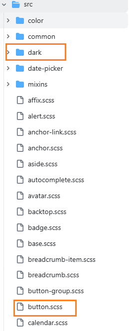

### 日间-夜间模式切换

假如项目没有使用`Element-Plus`组件库，实现思路就是：

首先统一页面中的所有部分的样式，把这些样式定义为`css`变量

在代码中使用这些变量

切换到深色模式就是给`html`添加一个类`dark`,同时在`html.dark`的情况下，之前定义的那些变量，将他们重新赋值，修改为深色模式需要的样式即可。


#### 适配Element-Plus组件的深色模式

当前系统使用了Element-Plus组件，组件库本身就配置了深色模式，只需要引入

`main.js`

```js
import 'element-plus/theme-chalk/dark/css-vars.css'
```

然后通过添加或者删除`dark`类

```js
 const theme = ref('light') // 主题
 
 //修改主题
 function changeTheme(val) {
     theme.value = val
 }

// 切换深色主题
const toggleDarkMode = (isDark) => {
    if (isDark) {
        document.documentElement.classList.add('dark')
    } else {
        document.documentElement.classList.remove('dark')
    }
}
```

就可以让Element-Plus组件变成`深色/浅色`模式。


但是系统中还有一些页面中使用了是自己定义的颜色，我们需要把这些颜色边框阴影等全部修改为使用类似`--el-bg-color`变量的形式，这样才能和组件库保持一致。


#### 适配过程

首先打开Element-Plus组件库的样式源代码

[Element-Plus/theme](https://github.com/element-plus/element-plus/tree/dev/packages/theme-chalk/src)

如下：这里有组件库中各种组件所使用的样式变量



我们以`el-table`为例说明，假如我们自己写了一个表格，需要把他们的样式统一

首先找到表格相关的`scss`文件：`table.scss`


结合浏览器调试工具，查看当前页面上的`el-table`组件的样式：

```scss
.el-table {
    --el-table-border-color: var(--el-border-color-lighter);
    --el-table-border: 1px solid var(--el-table-border-color);
    --el-table-text-color: var(--el-text-color-regular);
    --el-table-header-text-color: var(--el-text-color-secondary);
    --el-table-row-hover-bg-color: var(--el-fill-color-light);
    --el-table-current-row-bg-color: var(--el-color-primary-light-9);
    --el-table-header-bg-color: var(--el-bg-color);
    --el-table-fixed-box-shadow: var(--el-box-shadow-light);
    --el-table-bg-color: var(--el-fill-color-blank);
    --el-table-tr-bg-color: var(--el-fill-color-blank);
    --el-table-expanded-cell-bg-color: var(--el-fill-color-blank);
    --el-table-fixed-left-column: inset 10px 0 10px -10px rgba(0, 0, 0, 0.15);
    --el-table-fixed-right-column: inset -10px 0 10px -10px rgba(0, 0, 0, 0.15);
    position: relative;
    overflow: hidden;
    box-sizing: border-box;
    height: -moz-fit-content;
    height: fit-content;
    width: 100%;
    max-width: 100%;
    background-color: var(--el-table-bg-color);
    font-size: 14px;
    color: var(--el-table-text-color);
}
```

可以看到对于表格的边框样式，背景颜色，文本颜色等等都有明确的`css`变量，我们只需要把自己的样式替换为这些变量即可。


```css
:root {
    color-scheme: light;
    --el-color-primary: #409eff;
    --el-color-primary-light-3: rgb(121, 187, 255);
    --el-color-primary-light-5: rgb(160, 207, 255);
    --el-color-primary-light-7: rgb(198, 226, 255);
    --el-color-primary-light-8: rgb(217, 236, 255);
    --el-color-primary-light-9: rgb(236, 245, 255);
    --el-color-primary-dark-2: rgb(51, 126, 204);
    --el-color-success: #67c23a;
    --el-color-success-light-3: rgb(149, 212, 117);
    --el-color-success-light-5: rgb(179, 225, 157);
    --el-color-success-light-7: rgb(209, 237, 196);
    --el-color-success-light-8: rgb(225, 243, 216);
    --el-color-success-light-9: rgb(240, 249, 235);
    --el-color-success-dark-2: rgb(82, 155, 46);
    --el-color-warning: #e6a23c;
    --el-color-warning-light-3: rgb(238, 190, 119);
    --el-color-warning-light-5: rgb(243, 209, 158);
    --el-color-warning-light-7: rgb(248, 227, 197);
    --el-color-warning-light-8: rgb(250, 236, 216);
    --el-color-warning-light-9: rgb(253, 246, 236);
    --el-color-warning-dark-2: rgb(184, 130, 48);
    --el-color-danger: #f56c6c;
    --el-color-danger-light-3: rgb(248, 152, 152);
    --el-color-danger-light-5: rgb(250, 182, 182);
    --el-color-danger-light-7: rgb(252, 211, 211);
    --el-color-danger-light-8: rgb(253, 226, 226);
    --el-color-danger-light-9: rgb(254, 240, 240);
    --el-color-danger-dark-2: rgb(196, 86, 86);
    --el-color-error: #f56c6c;
    --el-color-error-light-3: rgb(248, 152, 152);
    --el-color-error-light-5: rgb(250, 182, 182);
    --el-color-error-light-7: rgb(252, 211, 211);
    --el-color-error-light-8: rgb(253, 226, 226);
    --el-color-error-light-9: rgb(254, 240, 240);
    --el-color-error-dark-2: rgb(196, 86, 86);
    --el-color-info: #909399;
    --el-color-info-light-3: rgb(177, 179, 184);
    --el-color-info-light-5: rgb(200, 201, 204);
    --el-color-info-light-7: rgb(222, 223, 224);
    --el-color-info-light-8: rgb(233, 233, 235);
    --el-color-info-light-9: rgb(244, 244, 245);
    --el-color-info-dark-2: rgb(115, 118, 122);
    --el-bg-color: #ffffff;
    --el-bg-color-page: #f2f3f5;
    --el-bg-color-overlay: #ffffff;
    --el-text-color-primary: #303133;
    --el-text-color-regular: #606266;
    --el-text-color-secondary: #909399;
    --el-text-color-placeholder: #a8abb2;
    --el-text-color-disabled: #c0c4cc;
    --el-border-color: #dcdfe6;
    --el-border-color-light: #e4e7ed;
    --el-border-color-lighter: #ebeef5;
    --el-border-color-extra-light: #f2f6fc;
    --el-border-color-dark: #d4d7de;
    --el-border-color-darker: #cdd0d6;
    --el-fill-color: #f0f2f5;
    --el-fill-color-light: #f5f7fa;
    --el-fill-color-lighter: #fafafa;
    --el-fill-color-extra-light: #fafcff;
    --el-fill-color-dark: #ebedf0;
    --el-fill-color-darker: #e6e8eb;
    --el-fill-color-blank: #ffffff;
    --el-box-shadow: 0px 12px 32px 4px rgba(0, 0, 0, .04), 0px 8px 20px rgba(0, 0, 0, .08);
    --el-box-shadow-light: 0px 0px 12px rgba(0, 0, 0, .12);
    --el-box-shadow-lighter: 0px 0px 6px rgba(0, 0, 0, .12);
    --el-box-shadow-dark: 0px 16px 48px 16px rgba(0, 0, 0, .08), 0px 12px 32px rgba(0, 0, 0, .12), 0px 8px 16px -8px rgba(0, 0, 0, .16);
    --el-disabled-bg-color: var(--el-fill-color-light);
    --el-disabled-text-color: var(--el-text-color-placeholder);
    --el-disabled-border-color: var(--el-border-color-light);
    --el-overlay-color: rgba(0, 0, 0, .8);
    --el-overlay-color-light: rgba(0, 0, 0, .7);
    --el-overlay-color-lighter: rgba(0, 0, 0, .5);
    --el-mask-color: rgba(255, 255, 255, .9);
    --el-mask-color-extra-light: rgba(255, 255, 255, .3);
    --el-border-width: 1px;
    --el-border-style: solid;
    --el-border-color-hover: var(--el-text-color-disabled);
    --el-border: var(--el-border-width) var(--el-border-style) var(--el-border-color);
    --el-svg-monochrome-grey: var(--el-border-color)
}
```


简单来说，就是在项目中只使用组件库的颜色变量，如果一定有一些需要自定义的，就定义变量，然后dark模式下，修改变量值。