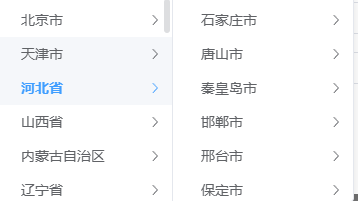

cascader 





构造每一个城市数据的结构

```
{
    "name": "北京市",
    "code": "110000",
    "children": [],
    "leaf": false
}
```


回显，只通过一个code是没有办法实现的

要么是后端返回code路径，要么是前端获取一次完整code数组。

目前就这样了。


```vue
<script setup>
import { getRegionChild } from '@/api/common/common'

const props = defineProps({
  modelValue: {
    type: String,
    default: ''
  }
})

const emits = defineEmits(['update:modelValue'])

const code = computed({
  get() {
    return props.modelValue
  },
  set(val) {
    emits('update:modelValue', val)
  }
})

// 选择城市的级联数据
// const regionOptions = ref([])
const selectedValue = ref([])

// 自定义懒加载属性配置
const cascaderProps = {
  lazy: true,
  lazyLoad: loadNodeData,
  value: 'code',
  label: 'name',
  emitPath: false // 如果只想要最后一级，可以设置为 false
}

async function getCityChild(code = '') {
  try {
    const res = await getRegionChild(code)
    const data = res.map((item) => {
      return {
        name: item.name,
        code: item.code,
        leaf: item.type === 'district'
      }
    })
    return data
  } catch (error) {
    console.error('获取城市数据失败:', error)
    return []
  }
}

// 模拟请求接口加载下级数据
async function loadNodeData(node, resolve) {
  const code = node.level === 0 ? '' : node.value
  try {
    const data = await getCityChild(code)
    resolve(data)
  } catch (error) {
    console.error('加载节点失败:', error)
    resolve([])
  }
}

const handleRegionChange = (value) => {
  code.value = value
}

// 外部 v-model="formData.reg_code" 清空时，界面也能同步清空。
// watch(
//   () => props.modelValue,
//   (newVal) => {
//     if (!newVal) selectedValue.value = []
//   }
// )
</script>

<template>
  <el-cascader
    v-model="selectedValue"
    :props="cascaderProps"
    style="width: 100%"
    clearable
    @change="handleRegionChange"
  />
</template>

<style lang="scss" scoped></style>
```

