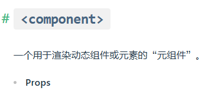

vue-router 的两种模式区别，

如果部署到同一个域名的不同文件夹下面时，这个router模式好像有影响

在setup中使用router = useRouter() 与 import router from "@/router"的区别

vite.config.js中的
 base: './',

的作用

打包时ts报错问题

记住密码都还没做

[MCP 工具](vscode-webview://0ljs41d19s5h40rqt1k8et2mlh1ll7i7je38o82quojl6jatjf0n/index.html?id=2332293c-6846-46a7-af0d-d7743964e704&parentId=1&origin=474dd5fa-6600-4baa-b8f5-2a54815788af&swVersion=4&extensionId=Alibaba-Cloud.tongyi-lingma&platform=electron&vscode-resource-base-authority=vscode-resource.vscode-cdn.net&parentOrigin=vscode-file%3A%2F%2Fvscode-app&purpose=webviewView#)。

CI/CD

