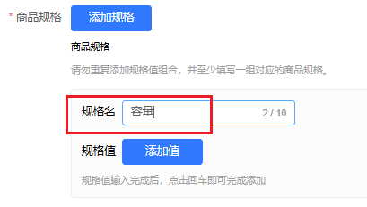
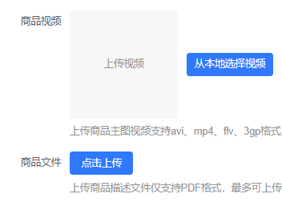

register.vue文件


登录以后，回到之前的页面


动态的表格：

首先一整个页面都是一个表单，有很多字段要填写。


### 物流管理模块

#### 发货设置：

编辑和新增表单的封装

#### 售卖区域：

添加/编辑售卖区域：

选择城市：数据结构是 嵌套的结构，所有的省/直辖市构成了一个数组，每一个省是一个对象，对象内部有类似children数组，保存的是下级市/区数据。

把所有已经选择的城市回显到到页面上，省份，市，复选框选中和取消选中的逻辑有哪些？

#### 物流模板：

#### 


### 商品管理模块

#### 发布商品

商品管理系统中，根据用户输入的多个规格名和规格值，自动生成一个“笛卡尔积”形式的表格。

属于典型的“**多规格商品生成 SKU 表格**”的场景

这个表格的每一行代表一个完整的规格组合（即一个 SKU），每一列表示一个规格名。


有一个按钮，点击可以添加一组规格

```js
{
  name: '',
  isFixed: false, //输入完规格名称以后,不可以修改,只能删除以后再新建
  value: [],
  tempValue: '',
  // 是否正在添加规格值，即决定是否显示输入框
  isShowAddInput: false
}
```

每一组规格中可以输入规格名称，还有规格值

规格名称是唯一的，但是规格值可以是多个的，举例来说，衣服的尺码，颜色

规格名称：尺码。 规格值：S码，M码，等等

规格名称：颜色。 规格值：黑色，白色，蓝色 ...


规格名输入完成以后键入 `enter`，添加规格名，添加时把规格名添加到一个集合`Set`中，用来限制规格名不能重复，同时设置`isFixed=true`，表示这组规格名添加完成。

```js
const specNameChange = (index) => {
  const curSpec = productForm.custom_spec_list[index]
  const specName = curSpec.name
  if (specNameSet.has(specName)) {
    ElMessage.error('规格名称不能重复')
    curSpec.name = ''
    return
  } else {
    specNameSet.add(specName)
    curSpec.isFixed = true
  }
}
```


生成Sku表格

每一组规格是一个对象结构的数据，有一个数组，保存了这些规格，这个数组是`custom_spec_list`

```js
[
    {
        "name": "尺码",
        "isFixed": false,
        "value": [
            "s",
            "m"
        ],
        "tempValue": "",
        "isShowAddInput": false
    },
    {
        "name": "颜色",
        "isFixed": false,
        "value": [
            "黑色",
            "白色"
        ],
        "tempValue": "",
        "isShowAddInput": false
    }
]
```

对于这个数组来说，真正重要的就是`name`和`value`值

对于生成表格来说，我要定义表格的列，比如颜色列，尺码列，使用的是`el-table-column`，要设置`prop`属性和`label`属性，这些列是根据用户输入的规格名称来生成的，输入了多少组就生成多少列，删除规格时，对应的列也要删除，所以是一个动态的列。


sku表格对应的数组结构应该是下面这种：

```js
[
	{'尺码'：'s', '颜色':'黑色',......},
	{'尺码'：'s', '颜色':'白色',......},
	{'尺码'：'m', '颜色':'黑色',......},
	{'尺码'：'m', '颜色':'白色',......}
]
```

根据这个最终表格，我们可以得出，使用`el-table-column`设置`prop`时，需要设置中文，而且设置的内容就是用户输入的规格名称。

```vue
<!-- label="尺码" 是列的标题头，列名。    prop="尺码" 对应到表格数据中对应的key值 ，要显示对应的值 -->
<el-table-column prop="尺码" label="尺码"/>
<el-table-column prop="颜色" label="颜色"/>
```

从`custom_spec_list`中提取出`el-table-column`展示需要的数据，它需要一个`prop`，需要一个`label`，值都是用户输入的值

列是动态的，所以需要定义一个数组`tableColumns`动态生成列，渲染时 循环遍历这个数组

```js
  tableColumns.value = productForm.custom_spec_list.map((spec) => ({
    prop: spec.name,
    label: spec.name
  }))

// 模板代码
<el-table-column
    v-for="column in tableColumns"
    :key="column.prop"
    :prop="column.prop"
    :label="column.label"
    align="center"
/>
```


笛卡尔积：

```js
[
    ['s', '黑色'] , ['s', '白色'] , ['m', '黑色'] , ['m', '白色']
]
```

笛卡尔积有多少组，表格就要生成多少行数据，每一组笛卡尔积，就是每行数据的 动态部分，


`specList`保存输入的规格名与值信息

```js
[
    {
        "name": "尺码",
        "value": ["s","m"],
    },
    {
        "name": "颜色",
        "value": ["黑色","白色"],
    }
]
```


根据每一组规格值`value`，生成笛卡尔积`cartesianProduct`

```js
[
    ["s","黑色"],
    ["s","白色"],
    ["m","黑色"],
    ["m","白色"]
]
```


`tableColumns`保存动态列信息

```js
tableColumns = specList.map((spec)=>{
    prop: spec.name,
    label: spec.name
})

/*
    tableColumns:
    [
        {prop:"尺码",label:"尺码"},
        {prop:"颜色",label:"颜色"}
    ]
*/ 
```


生成表格每一行数据，`cartesianProduct`数组长度是4，表格就有4行

对于每一组 ，比如`["s","黑色"]`，`s`对应的`key`是`尺码`，`黑色`对应的`key`是`颜色`

怎么确定这种对应关系呢，

这里是按照笛卡尔积的顺序做的，`specList`数组`0`索引的`name`是尺码，`1`索引的`name`是颜色。

正好对应`["s","黑色"]`的索引

```js
 cartesianProduct.map((combination)=>{
     const row = {}
     combination.forEach((val, idx) => {
         row[specList[idx].name] = val
     })
     // ......
     return row
 })

/*
 row:
 { 
 	尺码:"s",
 	颜色:"黑色"
 	.....
 }
 
 tableData:
 [
 	{ 
        尺码:"s",
        颜色:"黑色"
    },
    { 
        尺码:"s",
        颜色:"白色"
    }
 ]
*/
```


添加图片：

input标签选中图片以后，就直接上传，上传到后端返回了一个id，前端根据这个id拼接url，展示预览的img，

问题是会不会对服务器造成过大压力，因为每次选中图片就默认上传了，要修改图片，又会上传一次，

如果是前端用base64或者其它来预览，还要考虑到从图片空间选择图片的适配

还有添加视频的适配。


商品规格：

规格名输入最好和规格值的类似



商品视频与文件上传

文件上传要支持多个一起上传



立即发布：ACTIVE

暂不发布：进入草稿箱：DRAFT

定时发布：进入草稿箱：DRAFT


#### 在售商品

1， 表格展开行：

```vue
<el-table-column type="expand"> ... </el-table-column>
```

`展开行的展开/收起`都会触发模板的重新渲染，导致整个表格的一部分重新渲染，而`table-column`内部调用的方法也会重新执行。

```vue
<el-table-column label="商品">
<template #default="{ row }">
  <div class="flex items-center">
    <div class="flex flex-col gap-1">
      <div class="text-sm">{{ row.name }}</div>
      <div class="text-xs text-[#A8A8A8]">{{ getCategoryNames(row).join(' > ') }}</div>
    </div>
  </div>
</template>
</el-table-column>
```

 `getCategoryNames` 被多次调用。

解决：

​	将这个值 **预处理好**，存储在 `tableData` 里，避免在模板中频繁调用函数。在请求数据以后，对每条数据额外添加一个属性，保存需要的值。


2，编辑跳转到编辑页面，传递的应该是id，编辑页面重新获取数据，要保证获取最新的数据

3，跨页面传递参数时，跳转到页面，获取到参数以后，还要继续通过prop传递给子组件数据

4, *keep-alive*缓存问题

5, `searchForm`表单重置，只要每个 `el-form-item` 添加 `prop`，就可以重置，直接调用 `resetFields()` 重置表单，重置字段值为**最初绑定时的值**（页面首次渲染时 `model` 的值）。

6，商品sku表格

**前端商品sku表格**

https://blog.chensihang.cn/Vue%20%E5%95%86%E5%9F%8E%E5%90%8E%E5%8F%B0%E7%94%9F%E6%88%90%E5%95%86%E5%93%81SKU%E8%A7%84%E6%A0%BC%E5%88%97%E8%A1%A8/#%E6%9C%80%E8%BF%91%E7%BB%88%E4%BA%8E%E6%9C%89%E6%97%B6%E9%97%B4%E4%BA%86-%E8%87%AA%E5%B7%B1%E5%B0%86SKU-%E6%92%B8%E4%BA%86%E4%B8%80%E9%81%8D


#### 图片空间：

上传组件

网络地址上传图片

点击复制图片链接

**网络图片提取时，怎么修改名称** 

**分组名称修改**


### 仓储管理


### 登录模块：

登录过期以后要记得之前的地址，登录成功了再回到之前的页面中，

现在这里如果登录时出错了，url会拼接的越来越长，原因是什么？


自定义指令：

针对input自定义指令，自动删除空格，等等

#### **`v-model.number` 类型转换问题**

- 在 `<el-input type="number">` 上使用 `v-model.number` 是常见写法，但需防止输入非法字符后 `NaN` 传入表单模型。

嵌套表单冗余

传逻辑耦合较重


### 问题/要点记录

#### el-upload组件自定义上传的实现


#### img的src：net::**ERR_BLOCKED_BY_ORB**

直接在浏览器中输入：https://b2b.ebcrack.com/seller.php?mode=resource_dump&resource_id=30 可以正常显示图片，

但是设置`img`的`src`

```html

```

就不能访问了，图片无法显示。

错误提示：网络请求的状态栏：

```
net::ERR_BLOCKED_BY_ORB
```

**ORB (Opaque Response Blocking)** 是现代浏览器的一项安全特性，旨在防止某些类型的跨域资源在不应该被读取的情况下泄露信息。

**核心原因：**

当浏览器为 `` 标签（这是一个 "no-cors" 请求）请求一个跨域资源时，如果服务器返回的响应：

1. **没有** 包含明确的 CORS 头部（如 Access-Control-Allow-Origin）。
2. 并且其 **Content-Type 头部** 表明它是一个不应该被不透明地嵌入的敏感类型（比如 text/html, application/json, text/xml 等），而不是一个安全的、可嵌入的类型（如 image/jpeg, image/png, text/css, application/javascript）。

浏览器就会阻止这个响应，显示 ERR_BLOCKED_BY_ORB。它这样做是为了防止恶意网站通过  或 <script> 等标签嵌入一个看起来无害的资源，但实际上该资源可能是一个包含用户敏感信息的 HTML 页面或 JSON 数据。

**针对这种情况，这强烈暗示：**

当  标签请求 https://b2b.ebcrack.com/seller.php?mode=resource_dump&resource_id=30 时，服务器 b2b.ebcrack.com 返回的响应中，**Content-Type 头部不是一个浏览器认可的图片类型** (如 image/jpeg, image/png, image/gif 等)。


请求头信息：

```http
GET /seller.php?mode=resource_dump&resource_id=30 HTTP/1.1
Accept: image/avif,image/webp,image/apng,image/svg+xml,image/*,*/*;q=0.8
Accept-Encoding: gzip, deflate, br, zstd
Accept-Language: zh-CN,zh;q=0.9
Connection: keep-alive
Host: b2b.ebcrack.com
Referer: http://localhost:3004/
Sec-Fetch-Dest: image
Sec-Fetch-Mode: no-cors
Sec-Fetch-Site: cross-site
Sec-Fetch-Storage-Access: active
User-Agent: Mozilla/5.0 (Windows NT 10.0; Win64; x64) AppleWebKit/537.36 (KHTML, like Gecko) Chrome/137.0.0.0 Safari/537.36
sec-ch-ua: "Google Chrome";v="137", "Chromium";v="137", "Not/A)Brand";v="24"
sec-ch-ua-mobile: ?0
sec-ch-ua-platform: "Windows"
```

响应头信息：

```http
HTTP/1.1 200 OK
Server: nginx/1.18.0
Date: Tue, 10 Jun 2025 09:09:51 GMT
Content-Type: application/json; charset=UTF-8
Content-Length: 25
Connection: keep-alive
X-Powered-By: PHP/7.2.10
Set-Cookie: PHPSESSID=496vsr75u46mce5epf1hg5meka; path=/
Expires: Thu, 19 Nov 1981 08:52:00 GMT
Cache-Control: no-store, no-cache, must-revalidate
Pragma: no-cache
Set-Cookie: SELLER@YKD.SESSID=496vsr75u46mce5epf1hg5meka; expires=Wed, 11-Jun-2025 09:09:51 GMT; Max-Age=86400
```


我的理解：

1.  标签期望接收一个图片类型 (如 image/jpeg, image/png 等)。
2. 服务器 b2b.ebcrack.com 针对这个  标签的请求，返回了一个 200 OK 状态码，但其 Content-Type 是 application/json。
3. 浏览器看到 `Content-Type` 是 `application/json`（一个非图片、非脚本、非CSS的安全可嵌入类型），并且这是一个跨域请求，它会认为这可能是一个不安全的响应（例如，一个本应受保护的API响应被错误地嵌入到  标签中，可能泄露信息）。
4. 为了安全起见，浏览器的 ORB (Opaque Response Blocking) 机制会阻止这个响应被  标签使用，从而显示 `net::ERR_BLOCKED_BY_ORB`。


**为什么服务器会返回 JSON？**

Content-Length: 25 表明这个 JSON 内容非常短。结合 Set-Cookie 头部（特别是 PHPSESSID 和 SELLER@YKD.SESSID），这强烈暗示：

- seller.php 脚本可能需要用户登录或有效的会话才能提供图片。
- 当你通过  标签跨域请求时，必要的 Cookie (如 PHPSESSID 或 SELLER@YKD.SESSID) **没有** 被发送到服务器。
- 由于缺少有效的会话/身份验证，seller.php 脚本没有输出图片数据，而是输出了一个简短的 JSON 响应，内容可能是类似 `{"error":"unauthorized"}`、`{"status":"login_required"}` 或类似的信息。


**为什么直接在浏览器地址栏输入可以显示？**

- **不同的请求上下文**：直接在地址栏输入，浏览器将其视为顶层导航。此时，即使 Content-Type 是 text/html，浏览器也会尝试渲染它。如果内容恰好是图片数据，有些浏览器可能会足够“智能”地尝试显示它（尽管这不规范）。
- **不同的请求头**：如之前讨论的 Referer、Cookie 等可能不同，导致服务器端 seller.php 脚本的行为不同。
  - 例如，如果 seller.php 依赖某个 Cookie 进行身份验证，直接访问时 Cookie 存在，脚本输出图片。通过  跨域请求时，Cookie 可能没发送或被阻止，脚本输出一个 HTML 错误页，其 Content-Type 就是 text/html，从而触发 ORB。

直接在浏览器输入链接时：

请求头信息：

```http
GET /seller.php?mode=resource_dump&resource_id=30 HTTP/1.1
Accept: text/html,application/xhtml+xml,application/xml;q=0.9,image/avif,image/webp,image/apng,*/*;q=0.8,application/signed-exchange;v=b3;q=0.7
Accept-Encoding: gzip, deflate, br, zstd
Accept-Language: zh-CN,zh;q=0.9
Cache-Control: max-age=0
Connection: keep-alive
Cookie: PHPSESSID=r70k5rva43oriio0lb48d3bfue; SELLER@YKD.SESSID=r70k5rva43oriio0lb48d3bfue
Host: b2b.ebcrack.com
Sec-Fetch-Dest: document
Sec-Fetch-Mode: navigate
Sec-Fetch-Site: none
Sec-Fetch-User: ?1
Upgrade-Insecure-Requests: 1
User-Agent: Mozilla/5.0 (Windows NT 10.0; Win64; x64) AppleWebKit/537.36 (KHTML, like Gecko) Chrome/137.0.0.0 Safari/537.36
sec-ch-ua: "Google Chrome";v="137", "Chromium";v="137", "Not/A)Brand";v="24"
sec-ch-ua-mobile: ?0
sec-ch-ua-platform: "Windows"
```

和之前的请求头对比，猜测可能的原因就是后端身份验证相关的问题。


临时的解决：

使用`vite`代理转发

```js
'/seller.php?mode=resource_dump': {
    target: 'https://b2b.ebcrack.com',
    changeOrigin: true
}
```

使用：后缀拼接`id`

```js
 
```

**现在通过 Vite dev server 代理后：**

Vite dev server (它是一个 Node.js 服务器) 会**代表你的浏览器**，向 target 即

`https://b2b.ebcrack.com/seller.php?mode=resource_dump&resource_id=...` 发起一个新的 HTTP 请求。

**Cookie 的处理**：

- 当你的浏览器直接访问 `https://b2b.ebcrack.com` 并登录或进行某些操作时，`b2b.ebcrack.com` 会在你的浏览器中设置 Cookie（如 PHPSESSID, SELLER@YKD.SESSID）。

- 当 Vite dev server 作为代理向 https://b2b.ebcrack.com 发起请求时，**它默认不会携带你浏览器中针对 b2b.ebcrack.com 域的 Cookie**。它是一个独立的 HTTP 客户端。

- **那么为什么它能工作呢？** 这里有几种可能性：

  1. **目标服务器 b2b.ebcrack.com 对于来自“服务器”（如 Vite dev server 的 Node.js 环境）的请求，其鉴权逻辑可能更宽松，或者不依赖于之前在浏览器端设置的那些特定会话 Cookie。** 也就是说，它可能允许没有特定 PHPSESSID 的请求访问某些资源，或者它有其他机制（比如IP白名单，或者它认为这是一个内部请求）。
  2. **seller.php 脚本在判断是否返回图片时，对请求来源的某些特性（如 Referer，User-Agent，或者仅仅是 Host 头的正确性）有不同的处理逻辑。** 直接的跨域  请求和 Vite 代理发出的请求，在这些头部上会有差异。代理请求可能恰好满足了 seller.php 返回图片的条件。
  3. **如果你之前通过代理访问过 b2b.ebcrack.com 的其他页面（比如登录页面），并且 b2b.ebcrack.com 通过 Set-Cookie 给 Vite dev server（作为客户端）设置了 Cookie，那么 Vite dev server 在后续代理请求到同一目标时，可能会自动带上这些 Cookie。** 很多代理库（如 http-proxy-middleware，Vite底层可能用到）会处理 Cookie jar，从而在代理会话中保持 Cookie。**这是最可能的情况，如果图片确实需要登录。** 你在浏览器中直接访问 `https://b2b.ebcrack.com` 时能看到图片，说明你浏览器里有有效的 Cookie。如果 Vite 代理能成功获取图片，说明代理服务器在向 b2b.ebcrack.com 请求时也成功“认证”了。

  

  **说明了：**

  服务器 `b2b.ebcrack.com` 在**不同请求上下文**下（直接浏览器跨域  vs. Vite 代理服务器请求）的行为是不同的。

  Vite 代理通过**改变请求的上下文**，使得 b2b.ebcrack.com 服务器返回了预期的图片响应。

  

####  `props` 的行为：

```js
// 子组件product-info.vue
const props = defineProps({
  itemId: {
    type: Number,
    default: -1
  }
})
```

```vue
// 父组件 
const editItemId = ref(null)
<product-info :itemId="editItemId" />
```

##### 默认值生效的条件: 

当 **父组件没有传递 `item-id`** 时，`itemId` 会使用定义中的 `default` 值，也就是 `-1`。

当 **父组件传递了 `item-id`**（例如 `<MyComponent :item-id="123" />`），则 `itemId` 的值就是 `123`，**不会再用默认值**。

##### **props 初始化时机**

- Vue 在 **组件实例创建时** 就会解析 `props`，所以 `itemId` 在**组件初始化时就已经是最终值（要么是父组件传递的，要么是默认值）**。

##### 组件实例创建时：

在 Vue 3 中，**组件实例的创建发生在 `setup()` 执行之前**，但并不直接对应某个“生命周期钩子”——**它是 Vue 内部的初始化阶段**。

**Vue 3 的组件实例是在 `setup()` 执行之前完成创建的**，这对应于 Vue 2 中的 `beforeCreate` 和 `created` 之间的那段时间。

所以对于prop数据来说，先不考虑响应式变化，在`setup`中，不论是父组件传递过来的数据，还是默认值数据，可以直接访问直接用。

如果使用`watch`监听

```js
watch(
  () => props.itemId,
  (newId, oldId) => {
    console.log('props.itemId changed:', newId, oldId)
  },
  { immediate: true } // 
)
```

watch监听的时候，prop已经初始化完成了，immediate: true，只是为了立即执行一次watch中的回调函数。

##### **加了 `immediate: true` 之后：**

- Vue 会在 **侦听器创建那一刻**，**就立即执行一次回调函数**。
- **不是因为值变了，而是人为“立即调用一次”你写的回调函数**。

也就是说，即使没有变化，Vue 也会主动触发一次你写的回调，**把当前的值当作 newVal，传进去，oldVal 是 `undefined`**。

```
watch(
  () => props.regionType,
  (newVal, oldVal) => {
    fetchData(newVal)
  },
  { immediate: true }
)
```

就是：

> “我希望组件一挂载时，就用当前的 `regionType` 请求数据（newVal），**并且之后如果 `regionType` 再变，我也要继续请求**。”

##### ✅ 举个现实例子（超级清楚）

想象你监听一个房间的温度：

```js
watch(() => 温度, (newTemp, oldTemp) => {
  console.log('温度变了:', newTemp, oldTemp)
})
```

默认情况下，只有温度真的变了（比如从 20 → 25），你才收到通知。

现在你说：

> “我想**一开始就知道当前温度是多少**，然后后面再继续监听变化。”

那你就加上：

```js
{ immediate: true }
```

相当于你说：

> “请你告诉我现在的温度（哪怕没有变化），然后继续帮我盯着有没有变动。”

✅ 小结一句话：

`{ immediate: true }` 的意思是：**watch 在监听开始的那一刻，就先执行一次回调函数**，让你能立刻处理当前值，而不等它变化。


setup,prop,watch，等先后顺序


#### [Violation]

```
[Violation] Added non-passive event listener to a scroll-blocking 'touchstart' event. Consider marking event handler as 'passive' to make the page more responsive.
```

##### 问题描述

在使用 `echarts` 或其他涉及 `wheel`、`touchstart` 事件的库时，会在控制台看到如下警告


#####  原因分析

###### 1️⃣ 事件监听器的默认行为

在 JavaScript 中，我们可以使用 `addEventListener` 监听事件，例如：

```js
window.addEventListener("wheel", (event) => {
  event.preventDefault(); // 阻止默认滚动行为
});
```

但是，如果 `wheel` 事件处理程序中调用了 `event.preventDefault()`，浏览器在执行事件处理函数时 **必须等待** 代码执行完毕，以决定是否允许页面滚动。这样会导致 **滚动卡顿**，影响用户体验。

######  `passive: true` 的作用

了优化滚动性能，现代浏览器引入了 `{ passive: true }` 选项，表示 **该事件监听器不会调用 `event.preventDefault()`，浏览器可以直接执行默认行为（如滚动）而无需等待事件处理程序执行完毕**。

```js
window.addEventListener("wheel", (event) => {
  console.log("鼠标滚动");
}, { passive: true }); // 告诉浏览器，不会调用 event.preventDefault()
```

通过 `passive: true`，浏览器可以 **立即处理滚动**，提升页面流畅度，避免性能损耗。


##### 🛠 解决方案

###### 1️⃣ 安装 `default-passive-events`

由于部分库（如 `echarts`）在内部使用 `wheel`、`touchstart` 事件时 **未显式声明 `{ passive: true }`**，我们可以使用 `default-passive-events` 自动为默认事件添加 `{ passive: true }`，避免手动修改代码。

```shell
npm install default-passive-events
// 或者
pnpm add default-passive-events
```


###### 2️⃣ 在 `main.ts` 引入

```ts
// 解决非被动事件监听警告，提升滚动性能  
import "default-passive-events";
```


##### 总结

1️⃣ 浏览器默认的 `wheel`、`touchstart` 等事件监听器可能会阻塞滚动，导致卡顿。
2️⃣ `passive: true` 允许浏览器立即执行滚动，提高页面流畅度。
3️⃣ default-passive-events 库可以自动为默认事件添加 `{ passive: true }`，无需手动修改代码，解决浏览器警告并优化性能 🎉。


### 待优化：

待售商品或者其它页面中的tabs点击时使用异步组件（-）

发布商品时从图片空间选择图片的组件样式，图片过多时，显示效果调整（后端没有分页接口）（-）

商品发布时的sku表格的生成 （好像没有办法避免不适用中文key）（-）

入库管理中 添加商品 从item_list接口中选择商品，还要手动拼接出sku_id（√）

出入库/调拨表单的时间校验（√）

添加商品的搜索（√）

出库入库单的打印（X）

出入库单的查看，不同出入库类型时，是不是显示的不一样 （X）

出库，调拨时数量有限制，有一个属性好像用错了（√）

仓库管理的路由结构可能需要重构 （√）

登录时重定向 （√）

响应式设计 （X）


### 缺少接口：

在售商品页：批量删除，批量下架，批量修改物流信息

图片空间：关键字查询，分页，批量删除

--------------------------------------------------------------------

06-04

批量上架，批量调价

待售商品->待发布商品：查询定时发布的商品，是加一个接口，还是根据release_method值过滤

店铺设置-> 店铺装修页面相关接口 

店铺设置，缺少 店铺Logo(手机端) 这个属性

店铺商品分类，分类列表是否需要分页

店铺信息->开户银行->确认提交->短信验证码校验

店铺信息->开票信息： 分页；

店铺信息-> 经营类目：

​	1，关键字搜索；分页，导出

​	2，返回的是类别id,每个都要发送请求获取类目名称，会发送很多请求；

​	3，远丰的有分佣比例属性，但是这边后端没有返回这个属性，也没有添加分佣比例的接口

​	4，获取每一个品牌详情数据

​	添加经营类目没做？

店铺设置->合同模板

​	1，模板名称查询，模板状态查询，分页

​	2，前端需要展示模板状态，后端没有返回状态的key，

店铺设置->发票管理：

​	1，返回的status状态指的是当前enable的审核状态，还是申请时的enable的状态

​	2，没有审核备注这个字段

店铺设置->质保金：

​	1，根据日期，订单号，原因，来源账号查询，按照全部账单与违规罚扣账单 查询

​	2， 分页

​	3，导出账单

​	4， 获取质保金商品类目额度标准

​				

​	5， 质保金操作：提现，充值，补缴
​			充值页面：获取当前余额，对公账户信息，充值流水和分页，支付成功以后状态列表status_list = []

​			提现：到账账户，提现明细和分页

​			补缴：补缴明细和分页

店铺管理：账号设置：

​	1， 角色列表分页

​	

客服设置，客服列表页，缺少分页；获取指定客服的聊天记录；

客服设置，自动回复页，缺少分页；


### 客服系统：

部分图片的获取，获取快捷用语， 是通过 seller.php....，必须要商家登录，如果仅仅只有客服登录是访问不了

获取左侧联系人，返回的结果中需要有这个联系人的头像信息，昵称或者手机号信息，前端需要显示

与当前联系人进行聊天以后，会话处于进行中的状态，可以点击结束会话主动结束，或者xx分钟之内都没有再次进行对话，就自动结束。
