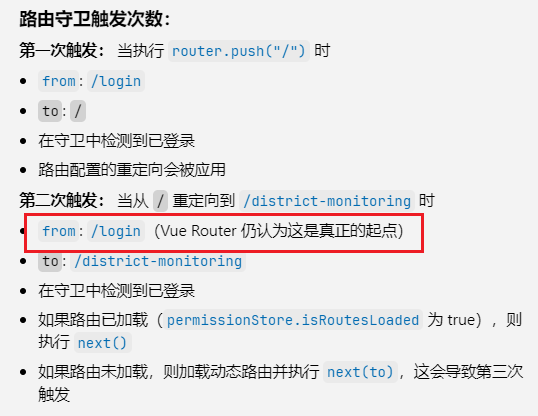

### token存取

后端返回了token，只有一个token，怎么做保存，怎么验证失效，失效了怎么做。

采用的是单个token，如果过期了，后端仅仅是返回一个过期通知以及状态码401。

**思路：**

前端定义一个token的过期时间。登录成功，获取到token以后，再把token和当前时间戳`timestamp`保存，格式如下：

```js
const TOKEN_INFO_KEY = "tokenInfo";
const TOKEN_VALID_TIME = 1000 * 60 * 60 * 2; // 2小时

const tokenInfo: TokenInfo = {
    token,
    timestamp: Date.now(), // 记录获取token的时间戳
  };
```

这样就把每次登录时的时间戳记录了下来。之后，在每次的网络请求拦截器中，获取`tokenInfo`，可以拿到`token`以及`timestamp`。同时获取`Date.now()`时间，结合有效期时间`TOKEN_VALID_TIME`，可以确认是否过期。

```js
// 检查token是否过期
export const isTokenExpired = (): boolean => {
  // 获取不到token，就认为是过期了
  const tokenInfo = getTokenInfo();
  if (!tokenInfo) return true;

  return Date.now() - tokenInfo.timestamp > TOKEN_VALID_TIME;
};
```

完成的存取`token`以及检查是否过期的工具代码如下：

```ts
// 设置token,获取token等
const TOKEN_INFO_KEY = "tokenInfo";
const TOKEN_VALID_TIME = 1000 * 60 * 60 * 2; // 2小时

// 保存tokenInfo
export const setToken = (token: string) => {
  const tokenInfo: TokenInfo = {
    token,
    timestamp: Date.now(), // 记录获取token的时间戳
  };
  localStorage.setItem(TOKEN_INFO_KEY, JSON.stringify(tokenInfo));
};

// 获取完整 tokenInfo 的方法
export const getTokenInfo = (): TokenInfo | null => {
  const str = localStorage.getItem(TOKEN_INFO_KEY);
  if (!str) return null;
  try {
    const data = JSON.parse(str);
    return isValidTokenInfo(data) ? data : null;
  } catch (err) {
    console.error("获取tokenInfo失败:", err);
    return null;
  }
};

// 获取token
export const getToken = (): string | null => {
  const tokenInfo = getTokenInfo();
  return tokenInfo?.token || null;
};

// 检查token是否过期
export const isTokenExpired = (): boolean => {
  // 获取不到token，就认为是过期了
  const tokenInfo = getTokenInfo();
  if (!tokenInfo) return true;

  return Date.now() - tokenInfo.timestamp > TOKEN_VALID_TIME;
};

// 删除token
export const clearToken = () => {
  localStorage.removeItem(TOKEN_INFO_KEY);
};

interface TokenInfo {
  token: string;
  timestamp: number;
}

// 类型守卫（防御性编程）
function isValidTokenInfo(obj: any): obj is TokenInfo {
  return obj && typeof obj.token === "string" && typeof obj.timestamp === "number";
}
```


### 环境变量设置：

现在是开发环境，`.env.development`

```shell
# 变量必须以 VITE_ 为前缀才能暴露给外部读取
# app 名称
VITE_APP_TITLE = 'waterlogging syetem'

# 应用端口
VITE_APP_PORT = 3005

# 代理前缀
VITE_APP_BASE_URL = '/dev-api'

# 接口地址
VITE_APP_TARGET_API_URL = 'http://tmws.zksy.com/apiProxy'
```


### `Axios`网络请求的封装：

#### 创建请求实例：

```js
const instance = axios.create({
  baseURL: import.meta.env.VITE_APP_BASE_URL,
  timeout: 1000 * 10,
  headers: {
    "Content-Type": "application/json;charset=UTF-8",
  },
  paramsSerializer: (params) => qs.stringify(params),
});
```

#### 参数配置

- `baseURL`：

  - 给所有网络请求添加的前缀，比如`/api`，那么`axios.get('/user') => axios.get('/api/user')`  。
  - 可以根据这个前缀设置反向代理。如果是生产环境，也可以是真实的后端接口地址`https://api.example.com`

- `headers`：

  - 设置请求头，告诉服务器：本次发送的请求的**数据格式**是 JSON，**字符编码**是 UTF-8，避免出现中文乱码等问题。
  - `Content-Type` 是**请求头字段**，表示**请求体（body）里的数据格式**是什么。
  - 服务器收到请求携带的数据以后，会根据 `Content-Type` 判断怎么解析数据。
  - 如果没设置，服务器可能会默认用 `application/x-www-form-urlencoded`（表单格式）去解析，导致读不到正确的数据。

- `paramsSerializer`:

  - 自定义**查询参数的序列化方式**。

  - 默认 `axios` 会把 `GET` 请求的 `params` 对象序列化成 URL 参数，但如果你的参数里有嵌套对象或数组，用默认的可能不符合后端要求。

  - `qs.stringify(params)` 使用 `qs` 库来序列化，能正确处理复杂的对象和数组，比如把：

    ```js
    { a: 1, b: [2, 3] }
    ```

    转成 URL：

    ```js
    a=1&b[0]=2&b[1]=3
    ```

    不过这里并没有定义，参数有嵌套对象或者数组时的序列化方式，可选的方式如下：

    ```js
    qs.stringify({ a: [1, 2, 3] }, { arrayFormat: 'brackets' })
    // => 'a[]=1&a[]=2&a[]=3'
    
    qs.stringify({ a: [1, 2, 3] }, { arrayFormat: 'indices' })
    // => 'a[0]=1&a[1]=2&a[2]=3'
    
    qs.stringify({ a: [1, 2, 3] }, { arrayFormat: 'repeat' })
    // => 'a=1&a=2&a=3'（跟默认一样）
    
    qs.stringify({ a: [1, 2, 3] }, { arrayFormat: 'comma' })
    // => 'a=1,2,3'
    
    // 等等......
    ```


##### 关于`Content-Type`：

| Header 字段            | 谁设置？             | 用于什么                              |
| ---------------------- | -------------------- | ------------------------------------- |
| `Content-Type`（请求） | 前端发送请求时设置   | 告诉服务器请求体是什么格式，例如 JSON |
| `Content-Type`（响应） | 服务器返回响应时设置 | 告诉客户端响应体是什么格式，例如 JSON |

如果想控制接收的数据格式，可以设置 `Accept`：

```js
headers: {
  'Accept': 'application/json'
}
```

##### 是否有必要设置 `Content-Type`？

以下来自chatGPT，未手动验证

| 情况                                                   | 是否需要手动设置 `Content-Type` | 说明                                                         |
| ------------------------------------------------------ | ------------------------------- | ------------------------------------------------------------ |
| 发送 JSON 数据（`axios.post('/api', { foo: 'bar' })`） | ❌ 不需要                        | Axios 会自动设置为 `application/json;charset=utf-8`          |
| 发送 `FormData` 数据（如上传文件）                     | ❌ 不需要                        | Axios 会自动设置为 `multipart/form-data`，并带上正确的 `boundary` |
| 发送 URL 编码数据（使用 `URLSearchParams`）            | ❌ 不需要                        | Axios 会自动设置为 `application/x-www-form-urlencoded;charset=utf-8` |
| 自定义序列化格式或特殊要求的服务端接口                 | ✅ 建议手动设置                  | 例如你使用了特殊的 `qs.stringify`，或者服务端对头信息要求严格 |

##### 📌 Axios 的默认行为（你不用手动设置的情况）

Axios 会根据你传入的数据类型自动判断并设置合适的 `Content-Type`。示例如下：

| 数据类型                      | Axios 自动设置的 Content-Type                     |
| ----------------------------- | ------------------------------------------------- |
| JavaScript 对象 (`{}`)        | `application/json;charset=utf-8`                  |
| `FormData` 对象               | `multipart/form-data; boundary=...`（自动）       |
| `URLSearchParams` 对象        | `application/x-www-form-urlencoded;charset=utf-8` |
| 其他类型（Blob, ArrayBuffer） | 根据浏览器行为，Axios 可能不自动设置              |

⚠️ 注意：**不要给 `FormData` 手动设置 `Content-Type`**

```js
// ❌ 不要这样
headers: {
  'Content-Type': 'multipart/form-data'
}
```

因为浏览器在发送 multipart/form-data 时，会自动生成带有 boundary 的 Content-Type，如果你手动写死，会导致请求失败或服务器解析失败。

##### 总结：

绝大多数场景下你不需要手动设置 `Content-Type`，Axios 会帮你自动设置。

只有在你需要精细控制请求格式、对接特别严格的后端，或者使用了 Axios 的 `transformRequest`、自定义 data 序列化逻辑时，才需要手动设置。

对于 JSON 请求，可以设置也可以不设置，不影响使用：


#### 请求拦截器：

请求拦截器，是网络请求拦截器，在发送网络请求之前进行拦截，那么我们通常在网络请求拦截中做什么呢？

后端的有些接口，是需要携带`token`才能访问的，所以可以在这里统一添加`token`

##### 标准、推荐的做法是：

请求拦截器只负责添加 token，不负责判断是否过期；token 是否有效由响应拦截器统一处理。


```js
// 请求拦截器
instance.interceptors.request.use(
  (config: InternalAxiosRequestConfig) => {
    // 请求拦截器中 判断是否存在token,并添加到请求头 Authorization 中
    // 逻辑代码,获取token，检查是否过期
    const token = getToken();
    const isExpire = isTokenExpired();

    if (token) {
      if (!isExpire) {
        config.headers.Authorization = `Bearer ${token}`;
      } else {
        console.log("token过期，跳转到登录页面");
        clearToken();
        router.push("/login");
      }
    }

    // 假如token被我手动删除了，我刷新页面，按照道理来说，这次请求拿不到token,就不应该放行的，所以有一点瑕疵的。
    return config;
  },
  (error) => {
    return Promise.reject(error);
  }
);
```

逻辑优化：

```js
instance.interceptors.request.use(
  (config: InternalAxiosRequestConfig) => {
    // 请求拦截器中 判断是否存在token,并添加到请求头 Authorization 中
    // 逻辑代码,获取token，检查是否过期
    const token = getToken();
    const isExpire = isTokenExpired();

    // 能获取到token的情况
    if (token) {
      if (!isExpire) {
        config.headers.Authorization = `Bearer ${token}`;
        return config;
      } else {
        console.log("token过期，跳转到登录页面");
        clearToken();
        router.push("/login");
        // 中断请求，走 .catch 逻辑
        return Promise.reject(new Error("token过期"));
      }
    }
    // 获取不到token情况
    else {
      if (whiteList.some((url) => config.url?.startsWith(url))) {
        return config; // 白名单放行
      } else {
        console.log("未登录，跳转到登录页面");
        router.push("/login");
        // 中断请求，走 .catch 逻辑
        return Promise.reject(new Error("未登录"));
      }
    }
  },
  (error) => {
    return Promise.reject(error);
  }
);
```

两个 `return Promise.reject()` 的意义：

**中断当前请求链：**

axios 拿到 reject，**不会真正发起请求**。

**错误可以被后续 `.catch` 捕获**：

```js
instance.get('/xxx')
  .then(res => {
    // 正常处理
  })
  .catch(err => {
    // 捕获到"未登录"或"token过期"的错误
    console.error(err.message);
  });

```

不 reject，`catch` 根本捕获不到，程序无法正确响应异常！

**符合 Promise 规范**：
 axios 本身就是基于 Promise 的，reject 才是正确的异常流。


3. 响应拦截器：

   ```js
   // 响应拦截器
   instance.interceptors.response.use(
     /* 
     HTTP状态码，2xx  或 3xx 范围内的状态码都会触发该函数。
     服务器成功返回了响应（HTTP 状态码为 2xx 或 3xx）就会触发，即使业务上是失败的(指后端)
     */
     (response: AxiosResponse) => {
       // 如果响应是二进制流，则直接返回，用于下载文件、Excel 导出等
       if (response.config.responseType === "blob") {
         return response;
       }
   
       const { code, msg } = response.data;
       // 后端返回的code 状态码
       if (code === 200) {
         return response.data;
       } else if (code === 401) {
         ElMessage.warning("登录过期，请重新登录");
         // 登出，回到登录页面
         clearToken();
         router.push("/login");
         // 手动抛出异常, 中断请求链。
         return Promise.reject(new Error("登录过期"));
       } else {
         // 业务失败（后端返回 code 非 200）
         ElMessage.error(msg || "请求失败");
         return Promise.reject(new Error(msg || "Error")); // 手动抛出异常
       }
     },
   
     // HTTP 层面错误处理（超时、401、500 等），  超过200状态码的会触发这个函数，
     (err) => {
       console.error("request error", err); // for debug
   
       const { response } = err;
       if (response) {
         ElMessage.error(err.message || "系统出错");
       }
   
       return Promise.reject(err);
     }
   );
   ```

   拦截器中拦截到的`response`的结构是：

   ```ts
   interface AxiosResponse<T = any> {
     data: T;              // 后端返回的业务数据（比如 { code, msg, data }）
     status: number;       // HTTP 状态码（比如 200、404）
     statusText: string;   // HTTP 状态文本（比如 OK、Not Found）
     headers: any;         // 响应头
     config: InternalAxiosRequestConfig; // 本次请求时的配置（请求头、参数、url 等）
     request?: any;        // 低层请求对象（浏览器 XMLHttpRequest、Node.js http）
   }
   ```

   详细的结构：

   ```json
   {
     "data": {
       "code": 200,
       "msg": "ok",
       "data": {
         "id": 1,
         "username": "张三"
       }
     },
     "status": 200,
     "statusText": "OK",
     "headers": {
       "content-type": "application/json; charset=utf-8"
     },
     "config": {
       "url": "/api/login",
       "method": "post",
       "headers": {...},
       "data": "{\"username\":\"admin\",\"password\":\"123456\"}",
       ...
     },
     "request": {...}
   }
   ```

   通常`response.data`返回的结构是：

   ```json
   {
       "code": 200,
       "msg": "ok",
       "data": {
         "id": 1,
         "username": "张三"
   }
   ```

   其中的`code`是后端自己定义了业务字段，根据业务逻辑来返回不同的状态码，这是后端来自定义的。

   `data`字段是需要的数据

   **完整代码：**

   ```json
   import axios, { type InternalAxiosRequestConfig, type AxiosResponse } from "axios";
   import qs from "qs";
   import { getToken, isTokenExpired, clearToken } from "@/utils/auth";
   import router from "@/router";
   
   const instance = axios.create({
     baseURL: import.meta.env.VITE_APP_BASE_URL,
     timeout: 1000 * 10,
     headers: {
       "Content-Type": "application/json;charset=UTF-8",
     },
     paramsSerializer: (params) => qs.stringify(params),
   });
   
   // 请求拦截器
   const whiteList = ["/login", "/register"];
   
   instance.interceptors.request.use(
     (config: InternalAxiosRequestConfig) => {
       // 请求拦截器中 判断是否存在token,并添加到请求头 Authorization 中
       // 逻辑代码,获取token，检查是否过期
       const token = getToken();
       const isExpire = isTokenExpired();
   
       // 能获取到token的情况
       if (token) {
         if (!isExpire) {
           config.headers.Authorization = `Bearer ${token}`;
           return config;
         } else {
           console.log("token过期，跳转到登录页面");
           clearToken();
           router.push("/login");
           return Promise.reject(new Error("token过期"));
         }
       }
       // 获取不到token情况
       else {
         if (whiteList.some((url) => config.url?.startsWith(url))) {
           return config; // 白名单放行
         } else {
           console.log("未登录，跳转到登录页面");
           router.push("/login");
           return Promise.reject(new Error("未登录"));
         }
       }
     },
     (error) => {
       return Promise.reject(error);
     }
   );
   
   // 响应拦截器
   instance.interceptors.response.use(
     /* 
     HTTP状态码，2xx  或 3xx 范围内的状态码都会触发该函数。
     服务器成功返回了响应（HTTP 状态码为 2xx 或 3xx）就会触发，即使业务上是失败的(指后端)
     */
     (response: AxiosResponse) => {
       // 如果响应是二进制流，则直接返回，用于下载文件、Excel 导出等
       if (response.config.responseType === "blob") {
         return response;
       }
   
       const { code, msg } = response.data;
       // 后端返回的code 状态码
       if (code === 200) {
         return response.data;
       } else if (code === 401) {
         ElMessage.warning("登录过期，请重新登录");
         // 登出，回到登录页面
         clearToken();
         router.push("/login");
         // 手动抛出异常, 中断请求链。
         return Promise.reject(new Error("登录过期"));
       } else {
         // 业务失败（后端返回 code 非 200）
         ElMessage.error(msg || "请求失败");
         return Promise.reject(new Error(msg || "Error")); // 手动抛出异常
       }
     },
   
     // HTTP 层面错误处理（超时、401、500 等），  超过200状态码的会触发这个函数，
     (err) => {
       console.error("request error", err); // for debug
   
       const { response } = err;
       if (response) {
         ElMessage.error(err.message || "系统出错");
       }
   
       return Promise.reject(err);
     }
   );
   
   export default instance;
   ```

   

### 路由守卫

在完成了`token`存取，和`axios`的封装的基础上，就可以加入动态的路由注册了，这一步需要在用户登录完成以后进行。


如果token过期了，但是没有清除token，陷入死循环，系统崩溃。

token过期了，但是存在，获取到以后，进入 `/` 重定向到 `/district-monitoring`，动态路由注册完成，直接放行了。

系统启动  http://localhost:3005/ ，访问的是不是 / ，是不是就触发了 路由守卫（直接启动访问/是不触发路由守卫的），放行以后，才触发redirect，之后再次触发了路由守卫，是不是这样的

然后你访问 `http://localhost:3005/`，那么将会看到如下流程：

1. 首先进入 `/`，守卫触发一次，`to.fullPath` 是 `/`；
2. 然后因为 `/` 路由配置了 `redirect`，自动重定向到 `/district-monitoring`；
3. 所以会再次触发守卫，`to.fullPath` 是 `/district-monitoring`。


### layout

### redirect


#### 无法找到模块“qs”的声明文件

```shell
npm install -D @types/qs
```

#### 用户活动监控（可选）

设置30分钟无操作自动登出


一个登录系统的逻辑

只考虑一个JWT token的情况，token过期后端会返回对应的状态码，前端就是让用户重新登录。

1. token存取方式
   1. 这里使用localStorage + JSON 保存
   2. 保存的同时保存一个时间戳，就是此刻的时间戳，用来判断是否过期的
   3. 把token和时间戳作为一个对象一起存储
2. axios的封装
3. 配置login相关的api
4. 配置userStore的属性与方法
5. vue页面中使用store完成登录逻辑


配置动态路由

后端返回的路由结构：

```json

```

根据`component`字段的路径，配置本地的路由目录。

配置获取路由的`api`和方法


路由守卫：

每次进行路由跳转时，都会触发路由守卫：`router.beforeEach`

路由守卫中做什么：

1. **获取token，判断是否登录。**

   **目的**：有些页面是只能登录才能进入的。如图没有登录，只能访问白名单页面或者 回到登录页。

   **token存在：**

   ​	判断进入的是否是 login页面：

   ​	进入login页面：

   ​		已经登录了，就不要再次进入登录页面了，直接回到  `/` 

   ​	不进入login页面：

   ​		去其它页面,就要判断动态路由有没有注册完成

​		**token不存在：**

​		要不要检查token是否过期？

​			不用检查。即使token过期了，进入页面以后，肯定会触发网络请求，在网络请求中，会检查token是否过期。

2. **去其它页面：**

   

### 无限重定向问题:

####  next() 与 next(route)。

在路由守卫中，beforeEach钩子中进行拦截，

```js
// 关键代码
if (permissionStore.isRoutesLoaded) {
    // next();
    // 这个触发了无限重定向
    next({ ...to, replace: true });
}
```

报错：

```
Detected a possibly infinite redirection in a navigation guard when going from "/" to "/district-monitoring". Aborting to avoid a Stack Overflow.
Are you always returning a new location within a navigation guard? That would lead to this error. Only return when redirecting or aborting, that should fix this. This might break in production if not fixed.
```

```js
next();
// 这个触发了无限重定向
// next({ ...to, replace: true });
区别是什么：
```

在Vue Router的导航守卫中，

​	当你使用 `next()` 时，它会继续导航到目标路由，不会触发新的导航，**也不会再次调用路由守卫**

​	但当你使用 `next(route)` 时，它会**中断当前导航并开始一个新的导航**，即使新的目标与当前目标相同。**再次触发所有导航守卫**

从 "/" 重定向到 "/district-monitoring" 时：

1. 首先，路由配置中的重定向生效，将路径从 "/" 改为 "/district-monitoring"
2. 这触发了路由守卫 router.beforeEach
3. 在守卫中检查到用户已登录且路由已加载 (permissionStore.isRoutesLoaded 为 true)
4. 然后执行 next({ ...to, replace: true })

问题就出在这一步：

- next({ ...to, replace: true }) 实际上是在说"中断当前导航，开始一个新的导航到同样的地址"
- 这相当于再次导航到 "/district-monitoring"，即使用户已经在导航到这个地址的过程中
- 这就触发了新一轮的导航过程，再次调用路由守卫
- 由于条件没变，守卫会再次执行 next({ ...to, replace: true })

- 如此循环往复，形成无限循环


login - > / - > 




排查：

if...else...的逻辑，在不同的逻辑代码中输出，确实进到哪个代码块，结合控制台输出调试。


假如用户登录了系统，在某一个页面中停留过长，导致token过期了，但是没有删除掉，当用户刷新页面时。

触发路由守卫，存在token，也完成了路由注册，直接放行。

触发网络请求拦截，检查了token过期，直接打回到 /login，再次触发路由守卫

路由守卫发现，token还是存在的，已经登录了，所以不会进入到login页面，进入到 / 

产生死循环。

解决：

路由守卫中也要检查token是否过期，过期要清除token。


最佳实践是在多个层面处理token过期问题：

1. 路由守卫中检查，防止用户访问需要认证的页面

1. 请求拦截器中检查，防止发送无效请求

1. 响应拦截器中处理401/403响应，清除无效token并重定向


