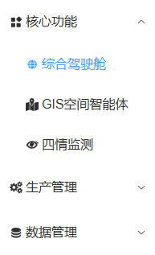
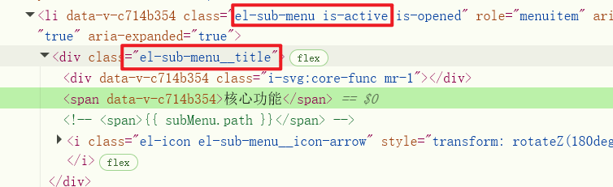

子级菜单激活时，父级菜单没有激活样式，实际代码中是有对应的类的




重新给对应的样式就行了

```scss
:deep(.el-menu) {
    .el-sub-menu.is-active > .el-sub-menu__title {
        color: var(--el-color-primary) !important;
        background-color: var(--el-color-primary-light-9) !important;
    }
}
```

