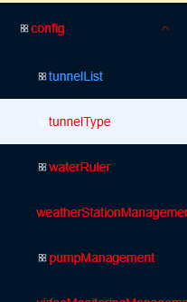
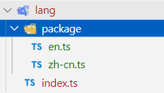

### 国际化

**比如后端返回的路**由是下面这样的

```js
[
    {
        "name": "/data-monitoring",
        "path": "/data-monitoring",
        "meta": {
            "title": "dataMonitoring",
            "icon": "dataMonitoring",
            "noCache": false,
            "hidden": false
        }
    }
]
```

没有给出中文的菜单名称，渲染以后的菜单如下图：



现在需要把这些菜单变成中文，一个简单的思路就是写一个转化函数，比如

```js
function fn(key){
	const dict = {
		...
		"dataMonitoring":"数据检测",
		...
	}
	
	return dict[key]
}
```

#### 思路：

国际化就是对一些特定的文本，在切换语言时，显示不同语言的文本值，这些文本需要一个key来标识。

不论是中文还是英文，都是用一个`key`，但是对应的`value`又不同，`value`才是真正显示的文本。

比如，侧边栏某一个路由在中文环境显示 `配置管理`，英文环境显示 `Configuration Management`

```js
config: "Configuration Management",
tunnelList: "Tunnel List",
tunnelType: "Tunnel Type",
```

```js
config: "配置管理",
tunnelList: "隧道列表",
tunnelType: "隧道类型",
```

使用`config`来标识它，根据语言环境，读取不同的语言包，读取`config`的值即可。


#### 安装依赖

安装`vue-i18n`

```shell
npm install vue-i18n
```

#### 创建语言包

在`src`目录下创建如下结构的目录：



其中`en.ts`和`zh-cn.ts`是中英文的语言包，对应了系统中的所有的`key`以及`value`

这里将语言拆分成了不同的模块，比如侧边栏的对应于`sidebar`部分，便于维护。

`zh-cn.ts`

```js
export default {
  // 侧边栏/路由的国际化配置
  sidebar: {
    config: "配置管理",
    tunnelList: "隧道列表",
    tunnelType: "隧道类型",
    //......
  },
};

```

`en.ts`

```js
export default {
  sidebar: {
    config: "Configuration Management",
    tunnelList: "Tunnel List",
    tunnelType: "Tunnel Type",
    //.....
  },
};
```

#### 创建`i18n`实例

在 `src/lang/index.ts` 中创建配置：

```ts
import type { App } from "vue";
import { createI18n } from "vue-i18n";
import { useAppStoreHook } from "@/store/modules/app.store.ts";

const appStore = useAppStoreHook();

// 本地语言包
import zhCn from "./package/zh-cn";
import en from "./package/en";

// appStore.language的值要和 这个对象的key一样
const messages = {
  "zh-cn": {
    ...zhCn,
  },
  en: {
    ...en,
  },
};

//  i18n 实例
const i18n = createI18n({
  legacy: false, // 使用 Composition API 模式
  globalInjection: true, // 可以全局使用 $t
  locale: appStore.language, // 默认语言
  fallbackLocale: "en", // 回退语言
  messages,
});

// 全局注册 i18n
export function setupI18n(app: App<Element>) {
  app.use(i18n);
}

export default i18n;
```


#### 全局注册

`src/plugins/index.ts`中进行全局注册

```js
// 注册所有插件
import type { App } from "vue";
import { setupElIcons } from "./icons";
import { setupStore } from "@/store";
import { setupRouter } from "@/router";
import { setupPermission } from "./permission";
import { setupI18n } from "@/lang";

// 自定义的插件，默认导出一个对象，内部有一个install方法
export default {
  install(app: App<Element>) {
    // Element-plus图标
    setupElIcons(app);

    // 国际化
    setupI18n(app);

    // 路由
    setupRouter(app);

    // 状态管理(pinia)
    setupStore(app);

    // 路由守卫
    setupPermission();
  },
};
```

#### 使用

使用时需要按照模块来使用：

`sidebar`就是对应的模块，`title`是`key`，这里利用函数对`key`做了一次检查，如果确定存在，可以省略

```js
// src\layout\components\Sidebar\components\SidebarMenuItemTitle\utils\i18n.ts
import i18n from "@/lang/index";

// 判断是否存在国际化配置，如果没有原生返回,只针对侧边栏的一个函数
export function translateRouteTitle(title: any) {
  const hasKey = i18n.global.te("sidebar." + title);
  if (hasKey) {
    return i18n.global.t("sidebar." + title);
  }
  return title;
}
```

在 `src\layout\components\Sidebar\components\SidebarMenuItemTitle\index.vue`中使用

```vue
<script setup lang="ts">
import { translateRouteTitle } from "./utils/i18n";
// 省略......
</script>

<template>
  <SvgIcon v-if="isShowIcon" :icon-name="iconName" color="#fff" size="20px"></SvgIcon>
  <span class="ml-2 text-base">{{ translateRouteTitle(title) }}</span>
</template>

<style lang="scss" scoped></style>
```

在组件中可以通过以下方式使用：

- 模板中：`$t('sidebar.xxx')`

- 代码中：`i18n.global.t('sidebar.xxx')`

在`vue模板`中使用`$t()`：

```vue
<div>{{ $t("sidebar.config") }}</div>
<div>{{ $t("sidebar.warningRule") }}</div>
```


#### 补充：

上面使用这一节可以直接忽略：

在 `src\layout\components\Sidebar\components\SidebarMenuItemTitle\index.vue`中使用

直接使用`{{ $t(sidebar.${title}) }}`

```vue
<script setup lang="ts">

defineProps({
  isShowIcon: {
    type: Boolean,
    default: true,
  },
  iconName: {
    type: String,
    default: "defaultMenuIcon",
  },
  title: {
    type: String,
    default: "defaultMenuText",
  },
});

</script>

<template>
  <SvgIcon v-if="isShowIcon" :icon-name="iconName" color="#fff" size="20px"></SvgIcon>
  <span
    class="ml-2 text-base text-ellipsis whitespace-nowrap overflow-hidden"
    :title="$t(`sidebar.${title}`)"
  >
    <span>{{ $t(`sidebar.${title}`) }}</span>
  </span>
</template>

<style lang="scss" scoped></style>
```


#### **测试**

当前利用一个按钮测试切换语言，侧边栏的文本并没有切换为中/英文，原因是：

在`app.store.ts`中，切换语言的方法`toggleLanguage()`仅仅是修改了`appstore`的`language`值：

```js
const toggleLanguage = () => {
    const newLang = language.value === "zh-cn" ? "en" : "zh-cn";
    language.value = newLang;
};
```

并没有修改`i18n`实例的`locale`值，`i18n`实例在最开始进行了注册，注册时的`locale`默认是`zh-cn`，这个是注册了以后，不手动修改，就不会改变的

```js
//  i18n 实例
const i18n = createI18n({
  legacy: false, // 使用 Composition API 模式
  globalInjection: true, // 可以全局使用 $t
  locale: appStore.language, // 默认语言
  fallbackLocale: "en", // 回退语言
  messages,
});
```

所以，切换语言的时候，还需要手动修改`i18n.global.locale`值。

```js
const toggleLanguage = () => {
    const newLang = language.value === "zh-cn" ? "en" : "zh-cn";
    language.value = newLang;
    // 切换以后要更新i18n 实例的locale值
    i18n.global.locale.value = newLang;
};
```

也可以是使用`watch`：

```js
import { watch } from "vue";
import i18n from "@/i18n";

watch(language, (newLang) => {
  i18n.global.locale.value = newLang;
});
```


#### Vue I18n 工作机制简述

**`createI18n()` 初始化时**，你传入了 `locale: appStore.language`，但这个值只是**初始化 locale 的值**。它不会在之后自动追踪 `appStore.language` 的变化。

`Vue I18n` 使用的是自己的全局状态：`i18n.global.locale.value` —— 这个才是用来实际控制页面上 `$t()` 显示内容使用哪个语言的地方。

当你点击“切换语言”按钮时，流程如下：

你调用 `toggleLanguage()`：

```js
const newLang = language.value === "zh-cn" ? "en" : "zh-cn";
language.value = newLang;
i18n.global.locale.value = newLang;
```

手动同步了 `i18n.global.locale.value`。

`Vue I18n` 内部检测到 `locale` 改变，**自动刷新所有使用 `$t() / $te（）`  的地方的翻译**，页面语言立即更新。


#### `t()`和`te()`的区别：

`i18n.global.t()`：

- 这是**翻译函数**，用于**获取指定 key 的翻译文本**

- 如果 key 不存在，它会返回 key 本身

- 例如：`i18n.global.t('sidebar.home')` 会返回 '首页' 或 'Home'

- 如果 `'sidebar.home'` 这个 key 不存在，它会直接返回 `'sidebar.home'`

`i18n.global.te()`

- 这是**检查函数**，用于检查指定的 key **是否存在**翻译

- 返回布尔值：true 表示存在翻译，false 表示不存在

- 例如：`i18n.global.te('sidebar.home')` 会返回 true 或 false

- 它只是检查，不会返回翻译文本


#### element-plus组件的国际化：

上面是针对系统的部分页面需要国际化，但是项目中还使用一些组件，在切换语言时，这些组件的语言要一起切换。


##### 导入 Element Plus 中英文语言包

在`src/store/modules/app.store.ts`文件中添加代码

```js
// ......

// 导入 Element Plus 中英文语言包
import zhCn from "element-plus/dist/locale/zh-cn.mjs";
import en from "element-plus/dist/locale/en.mjs";

export const useAppStore = defineStore("app", () => {
  // ......

  // 默认语言
  const language = ref("zh-cn");

  // element-plus 组件库的语言包
  const locale = computed(() => (language.value === "zh-cn" ? zhCn : en));

 // ......

  return {
   // ......
    locale,
  // ......
  };
});

// ......
```

##### 修改`src/App.vue`文件

```vue
<script setup lang="ts">
import { useAppStoreHook } from "@/store/modules/app.store.ts";

const appStore = useAppStoreHook();
const locale = computed(() => appStore.locale);
</script>

<template>
  <el-config-provider :locale="locale">
    <router-view />
  </el-config-provider>
</template>

<style scoped></style>
```

##### 报错

```
ReferenceError: Cannot access 'useAppStore' before initialization
```

修改`main.ts`中`App.vue`的引入顺序：

```js
import { createApp } from "vue";
import "@/styles/index.scss";

// UnoCSS
import "virtual:uno.css";

// 各种插件
import setupPlugins from "@/plugins";

// App.vue中使用了pinia,确保了 Pinia 在 App.vue 使用之前就已经初始化完成
import App from "./App.vue";

// 本地SVG图标
import "virtual:svg-icons-register";

const app = createApp(App);

// 注册所有插件
app.use(setupPlugins);

// 挂载应用
app.mount("#app");
```

上面的报错解决了，但是原因好像没找对