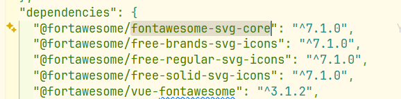
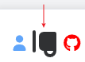
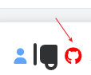
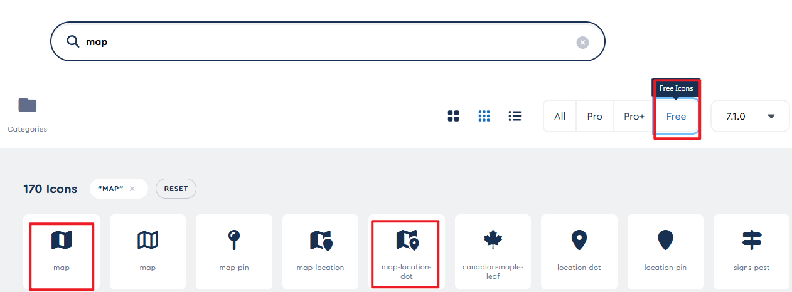
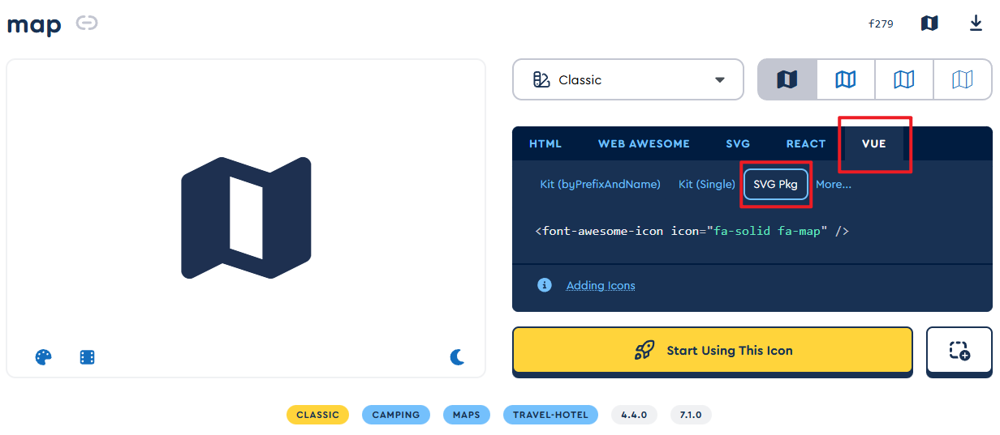
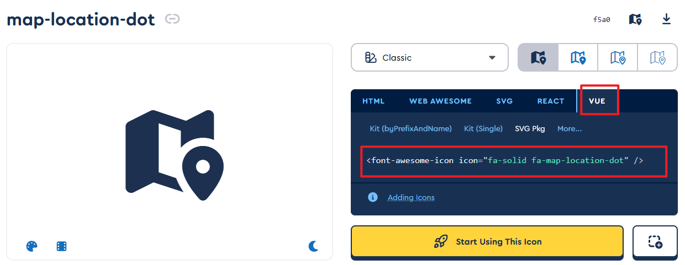

### 🧩 方式一：直接用 CDN（简单粗暴）

适合：小项目、临时代码、懒人模式

#### 在 index.html 引入

```html
<link rel="stylesheet" href="https://cdnjs.cloudflare.com/ajax/libs/font-awesome/6.5.0/css/all.min.css">
```

#### 组件里直接用 class

```html
<i class="fa-solid fa-user"></i>
<i class="fa-brands fa-github"></i>
```

💡 这种方式**不能 tree-shake**，会加载所有图标，但是最快捷。


```

<Icon icon="mdi-light:home" />
```


### 🧩 方式二：Vue3+Vite使用 `@fortawesome/vue-fontawesome`（官方推荐）

#### 1️⃣ 安装依赖

按需安装你要的 icon 包：

```ini
pnpm install @fortawesome/vue-fontawesome@latest-3
pnpm install @fortawesome/fontawesome-svg-core

pnpm install @fortawesome/free-solid-svg-icons
pnpm install @fortawesome/free-regular-svg-icons
# 如果要品牌图标（比如 GitHub）
pnpm install @fortawesome/free-brands-svg-icons
```

默认安装最新的版本，如果需要使用旧版，手动指定，这里使用的版本是`7.1.0`




#### 2️⃣ 注册font-awesome图标

`@/plugins/font-awesome.ts`

```ts
import type { App } from "vue";

import { FontAwesomeIcon } from "@fortawesome/vue-fontawesome";
import { library } from "@fortawesome/fontawesome-svg-core";

// 按需导入图标
import {
  faUser,
  faCoffee,
} from "@fortawesome/free-solid-svg-icons";
import { faGithub } from "@fortawesome/free-brands-svg-icons";

// 加入库
library.add(faUser, faCoffee,faGithub);

export function setupFontAwesome(app: App<Element>) {
  app.component("font-awesome-icon", FontAwesomeIcon);
}
```


`@/plugins/index.ts`

```ts
import type { App } from "vue";

import { setupRouter } from "@/router/index";
import { setupStore } from "@/stores";
import { setupFontAwesome } from "./font-awesome";

export default {
  install(app: App<Element>) {
    // 路由(router)
    setupRouter(app);
    // 状态管理(store)
    setupStore(app);
    // font-awesome 图标库
    setupFontAwesome(app);
  },
};
```


#### 3️⃣ 在入口文件里配置（main.ts）

这里不需要改动

```ts
import { createApp } from "vue";
import App from "./App.vue";

import "./styles/index.scss";
import "virtual:uno.css";

import setupPlugins from "@/plugins";

const app = createApp(App);
app.use(setupPlugins);
app.mount("#app");
```


#### 3️⃣ 在组件里使用

超简单，就像用普通组件一样。

```vue
<template>
  <div>
    <font-awesome-icon icon="user" />
    <font-awesome-icon icon="coffee" />
    <font-awesome-icon :icon="['fab', 'github']" />
  </div>
</template>
```

`['fab','github']` 代表从 *brands* 图标包里拿 icon。


#### 样式调整

##### ① 结合`Tailwind css` 设置图标大小与颜色

```html
<font-awesome-icon icon="user" class="text-xl text-blue" />
<font-awesome-icon icon="coffee" />
<font-awesome-icon :icon="['fab', 'github']" />
```


##### ② 结合官网的[**Styling Tools**](https://docs.fontawesome.com/web/style)

font-awesome提供了一些类，来调整图标的大小、颜色、动画等等

比如：大小

| Relative Sizing Class | Font Size | Equivalent in Pixels |
| :-------------------- | :-------- | :------------------- |
| `fa-2xs`              | 0.625em   | 10px                 |
| `fa-xs`               | 0.75em    | 12px                 |
| `fa-sm`               | 0.875em   | 14px                 |
| `fa-lg`               | 1.25em    | 20px                 |
| `fa-xl`               | 1.5em     | 24px                 |
| `fa-2xl`              | 2em       | 32px                 |

```html
<font-awesome-icon icon="coffee" class="fa-2xl fa-rotate-90" />
```




##### ③ 行内样式设置

```html
 <font-awesome-icon :icon="['fab', 'github']" style="font-size: 22px; color: red" />
```




### 使用流程

打开官网：[Solid Style Icons | Font Awesome](https://fontawesome.com/icons)

假如我们需要使用一个`map`图标
搜索`map`，筛选出`free`的图标，如下图，假如我们使用`map`和`map-location-dot`图标



点击图标，弹出对话框，选择`VUE -> SVG Pkg`







主题图标的名称以及所属的库

`fa-solid`表示图标在`@fortawesome/free-solid-svg-icons`包中

`fa-map`表示图标的名称叫做`map`


使用之前去`font-awesome.ts`文件中导入这两个图标

其中图标导入时名称采用驼峰式命名`map-location-dot`对应`faMapLocationDot`

```ts
// 按需导入图标
import {
  faUser,
  faCoffee,
  faMapMarkedAlt,
  faMapLocationDot,
  faMap,
} from "@fortawesome/free-solid-svg-icons";

// 加入库
library.add(faUser, faCoffee, faGithub, faMapMarkedAlt, faMapLocationDot, faMap);
```

组件中使用

```html
<font-awesome-icon icon="fa-solid fa-map" />
<font-awesome-icon icon="fa-solid fa-map-location-dot" />
```


这样麻烦之处就是，每次使用一个图标，就需要手动导入这个图标，不过都是在`font-awesome.ts`文件中导入，也还可以接受。


测试发现，下面两种写法都可以生效

```html
<font-awesome-icon icon="fa-solid fa-map-location-dot" />
都可以生效
<font-awesome-icon :icon="['fas', 'map-location-dot']" />
```


这种写法，貌似只能在`html`中生效，`vue`文件中不生效

```html
<i class="fas fa-map"></i>
```


同时还发现，当前`V7`版本的图标，整体上比V6版本的图标 **要小一点**，即使他们设置同样的字体大小，`V7`还是会小一点，所以图标最好都来自同一个版本。


### 🎯 怎么区分图标属于哪个包？

#### ✔ 方法 1：看图标名前缀（最稳最快）

Font Awesome 的图标都有“前缀”，前缀就对应包。

| 前缀    | 含义           | 对应包（你需要 import 的库）          |
| ------- | -------------- | ------------------------------------- |
| **fas** | solid 实心     | `@fortawesome/free-solid-svg-icons`   |
| **far** | regular 空心   | `@fortawesome/free-regular-svg-icons` |
| **fab** | brands 品牌类  | `@fortawesome/free-brands-svg-icons`  |
| **fal** | light（Pro）   | 付费版，没有 free 包                  |
| **fad** | duotone（Pro） | 付费版                                |

##### 举例

- `faUser` → 前缀是 `fas` → solid → **solid 包**
- `faAddressBook` → 默认是 regular → **regular 包**
- `faGithub` → 前缀 `fab` → 品牌 → **brands 包**
- `faGoogle` → `fab` → **brands 包**
- `faCoffee` → solid → **solid 包**

------

#### ✔ 方法 2：查看图标定义文件（适合你是工程师那种“我直接看源码”风格）

比如你鼠标悬停到 `faCoffee`，编辑器会跳到这个类型：

```js
export const faCoffee: IconDefinition
```

你点进去它的文件路径一定是：

```js
node_modules/@fortawesome/free-solid-svg-icons/faCoffee.js
```

如果你看到：

```js
/free-brands-svg-icons/xxx
```

那就说明它来自 brands。

这是最精确的方法，连网络都不用查。

------

#### ✔ 方法 3：去 Font Awesome 官网查（最人性化）

搜图标时官网会直接告诉你包：

官网：https://fontawesome.com/search?o=r&m=free

比如搜 github，会显示：
 **fab · Brands**

搜 user，会显示：
 **fas · Solid**
 **far · Regular（付费免费视情况）**

------


#### ~~🧡 最偷懒的方法：我给你封一个“小助手”~~

~~你如果愿意，我可以帮你封一个工具函数：~~

```js
function resolveFaPackage(prefix: 'fas' | 'far' | 'fab') {
  return {
    fas: '@fortawesome/free-solid-svg-icons',
    far: '@fortawesome/free-regular-svg-icons',
    fab: '@fortawesome/free-brands-svg-icons'
  }[prefix];
}
```

~~然后你只要看图标前缀，就能自动知道 import 来源。~~

~~甚至我能给你写一个 **自动按图标名 import 对应库** 的脚本（类似 unplugin-icons 体验）。~~
