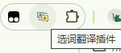

# 一、 `Chrome` 插件术语

### 1. 清单（`Manifest.json`）

`Chrome` 插件的清单是唯一且必须具有特定文件名的必需文件：**`manifest.json`**；

#### 1.1 示例展示

```json
{
  "manifest_version": 3,
  "name": "文本翻译插件",
  "version": "1.0.0",
  "description": "选词翻译",
  "permissions": ["contextMenus", "scripting", "storage"],
  "host_permissions": ["<all_urls>", "http://api.fanyi.baidu.com/"],
  "icons": {
    "16": "icons/icon-16.png",
    "32": "icons/icon-32.png",
    "48": "icons/icon-48.png",
    "64": "icons/icon-64.png",
    "128": "icons/icon-128.png"
  }
}
```

#### 1.2 `manifest.json` 文件必需的字段

1. `manifest_version`：用于指定插件使用的清单文件格式版本，目前是 3
2. `name`：插件名称，一般情况下 `hover` 插件图标展示的文案也是 `name`
3. `version`：插件版本


#### 1.3 发布 `Chrome` 应用商店需要的字段

1. `description`：插件描述
2. `icons`：图标


#### 1.4 各字段对应的信息


#### 1.5 icons图标介绍

为什么需要图标？虽然在开发过程中[图标](https://developer.chrome.google.cn/docs/extensions/reference/manifest/icons?hl=zh-cn)是可选的，但如果您打算在 Chrome 应用商店中分发扩展程序，则必须提供图标。它们还会显示在扩展程序管理页面等其他位置。

图标通常应采用 PNG 格式，因为 PNG 可最有效地支持透明度。

==**注意**：不支持 WebP 和 SVG 文件。==

在清单中声明图标：

```json
"icons": {
    "16": "icons/icon-16.png",
    "32": "icons/icon-32.png",
    "48": "icons/icon-48.png",
    "64": "icons/icon-64.png",
    "128": "icons/icon-128.png"
},
```

**这些不同尺寸的图标在哪里显示？

| 尺寸                              | 常见用途                                                     |
| --------------------------------- | ------------------------------------------------------------ |
| **16×16**                         | 工具栏图标（浏览器右上角扩展栏按钮的小图标）、上下文菜单（右键菜单）、开发者工具面板标签页上的小图标。 |
| **32×32**                         | 部分高 DPI 屏幕下，替代 16×16 用于工具栏显示。               |
| **48×48**                         | Chrome 扩展管理页面（`chrome://extensions/`）里展示扩展时的图标。 |
| **128×128**                       | 安装扩展时的弹窗、Chrome 网上应用店中的图标展示、扩展详情页的大图标。 |
| **其他尺寸（如 64×64、256×256）** | 一些浏览器（尤其是 Firefox）在高分屏下会优先使用更高分辨率的图标，256×256 也经常作为商店展示图标。 |


浏览器右上角工具栏图标：


右键上下文菜单中图标：


拓展程序页：


##### 各浏览器的差异

- **Chrome / Edge (Chromium)**
   官方推荐至少提供 `16, 48, 128` 三个尺寸。
   如果要兼容 HiDPI 屏幕，建议额外提供 `32` 或 `256`。
- **Firefox**
   支持的尺寸更多（`16, 32, 48, 64, 128, 256`），在扩展管理页面和工具栏上会根据 DPI 自动选择最合适的。
- **Safari**
   对图标的要求比较特殊，通常会需要大图标（比如 `512×512`），尤其是 App Store 分发时。


### 2. 操作项（`Action`）

#### 2.1 示例

```json
"action": {
    "default_icon": "icons/icon.png",
    "default_title": "选词翻译插件",
    "default_popup": "popup/index.html"
},
```


`popup/index.html`

```html
<!DOCTYPE html>
<html lang="en">
  <head>
    <meta charset="UTF-8" />
    <meta name="viewport" content="width=device-width, initial-scale=1.0" />
    <title>Document</title>
    <style>
      * {
        padding: 0;
        margin: 0;
      }
      div {
        width: 300px;
        height: 300px;
        text-align: center;
        line-height: 300px;
        background: rgb(213, 110, 110);
      }
    </style>
  </head>
  <body>
    <div>popup html</div>
  </body>
</html>

```


#### 2.2 `Action` 字段

`action` 字段定义的内容，主要就是浏览器**右上角扩展图标按钮**的外观（图标）、提示文字（title）、点击后弹出的页面（popup）。

其中的`default_icon`，`default_title`字段定义了右上角的插件使用的图标 以及 鼠标移入该插件时的提示文字。

1. `default_icon` 没设置时：

   浏览器会去用 **`icons` 字段里的图标** 来作为工具栏按钮图标。

   **如果连 `icons` 都没有设置**：这时候才会退化为浏览器的默认灰色拼图图标。

2. `default_title` 没设置时：

   浏览器会使用 **manifest.json 里的 `name` 字段** 来作为 tooltip

   ```json
   {
       "name": "文本翻译插件",
       "action": {}
   }
   ```

3. `default_popup` 没设置时

   点击图标时不会打开任何 UI，只会触发 **后台脚本（background service worker）里的 `action.onClicked` 事件**。

   - 这样你可以在点击扩展图标时执行逻辑，而不是弹出页面。


鼠标hover时：



点击图标时：


### 3. 背景（`Background - Service Worker`）


### 4. 内容脚本（`Content scripts`）


所有自动运行的内容脚本都必须指定[匹配模式](https://developer.chrome.google.cn/docs/extensions/develop/concepts/match-patterns?hl=zh-cn)。


### 文件目录结构示例

您可以通过多种方式构建扩展程序项目；不过，唯一的前提是将 `manifest.json` 文件放在扩展程序的**根目录**中

