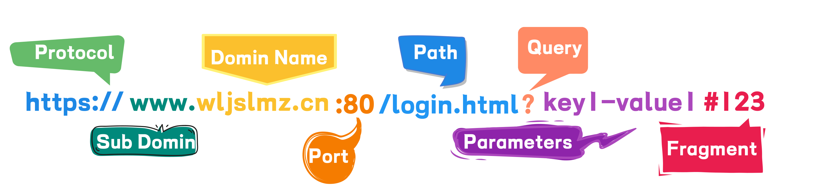
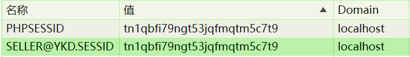

### HTTP Cookie

HTTP Cookie（也叫 Web Cookie 或浏览器 Cookie）是`服务器`发送到`用户浏览器`并保存在本地的一小块数据。浏览器会存储 cookie 并在下次向同一服务器再发起请求时携带并发送到服务器上。


#### URL结构



###### Protocol（协议）


#### 作用范围

`Domain` 和 `Path` 是用来 **限制 Cookie 作用范围** 的两个重要属性，它们决定了浏览器在请求哪些地址时，会自动携带这个 Cookie。

#####  一、`Domain` 的作用

`Domain` 决定了 **哪个域名** 下的请求会带上这个 Cookie。

###### 1. 默认行为：不设置

默认情况下，Cookie 只能被 **设置它的域名访问**，比如：

```http
Set-Cookie: sessionId=abc123; Path=/;
```

如果这个 Cookie 是在 `www.example.com` 设置的，则它默认只在 `www.example.com` 有效，**不包含子域名**

###### 2. 显式设置 `Domain`

如果指定了 `Domain`，则一般包含子域名；可以设置为当前域名的“父域”，例如：

```http
Set-Cookie: sessionId=abc123; Domain=example.com; Path=/;
```

此时，`example.com`、`www.example.com`、`` 都会携带这个 Cookie。


###### 总结：

- 默认不设置`Domain`，只有在访问完全相同的域名时才会携带Cookie
- 如果设置Domain，通常来说，设置的是二级域名，比如： `Domain=mozilla.org`，那么在访问下面的子域名，（如 `developer.mozilla.org`），也会携带Cookie.
- 如果你设置 `Domain=developer.mozilla.org`，那么：只会在 `developer.mozilla.org` 及其下的路径生效。不会在 `www.mozilla.org` 或 `mozilla.org` 生效。

 所以，设置 `Domain=主域`（如 `mozilla.org`）可以实现**跨子域共享 Cookie**

如果让多个子系统（如 admin、user）共享登录状态，**设置 `Domain=主域名` 是必须的前提之一**，但也还要考虑：

- 使用 HTTPS
- 设置 `SameSite=None; Secure` 才能跨子域传 Cookie
- CORS 的 `credentials: true` 配合使用
- 等等


###### 举例：

前端开发中，执行`npm run dev`，项目运行在`http://localhost:3004`，假如默认打开登录页：`http://localhost:3004/#/login`

现在我登录系统，登录成功以后会返回`set-cookie`信息

```http
set-cookie: PHPSESSID=tn1qbfi79ngt53jqfmqtm5c7t9; path=/
set-cookie: SELLER@YKD.SESSID=tn1qbfi79ngt53jqfmqtm5c7t9; expires=Sat, 05-Jul-2025 02:05:14 GMT; Max-Age=86400
```

默认没有设置`Domain`，默认的 `Domain` 就是：`localhost`



这意味着：

- **这个 Cookie 只会在发往 `localhost` 的请求中被浏览器携带**。
- 端口（如 `3004`）不影响 Cookie 的匹配逻辑。Cookie 是根据域名匹配，不考虑端口。


###### 关于端口号问题

1. **从服务器角度看（Set-Cookie 设置规则）**

后端返回的`Set-Cookie` 头的 `Domain` 属性，只涉及：

**域名**`Domain`（如 `example.com`）

**路径**`Path`（如 `/admin`）

协议 **不包含端口匹配规则**。换句话说：

> 服务器端返回的 Cookie 不会包含“端口”字段，`Set-Cookie` 里也不能写 `Domain=localhost:3004` —— 这是无效的。

✅ 所以 **从协议角度讲，“端口不影响 Cookie 匹配逻辑”是正确的。**


2. **从浏览器角度看（客户端是否发送 Cookie）**

浏览器实现了更严格的 **“同源策略”**：浏览器只会在 **协议 + 域名 + 端口 都一致** 的请求中，才携带该 Cookie。

换句话说：

- 浏览器会把 `localhost:3004` 和 `localhost:3005` 当成两个“完全不同的站点”
- 即使两个页面的 `Domain=localhost` 相同，**但端口不同，浏览器也不会共享 Cookie**


###### 总结

协议标准中 Cookie 的 `Domain` 和 `Path` 不考虑端口，

但浏览器在实际应用中，会把端口作为“同源判断”的一部分，从而影响 Cookie 是否被发送。


#####  二、`Path` 的作用

`Path` 限定了 **URL 路径**，只有请求的路径 **以此开头** 时才会携带 Cookie。

###### 1. 默认行为

默认值为当前请求路径的“目录”，比如：
 请求 URL 是 `https://example.com/user/login`，如果没有显式设置 `Path`，默认是 `/user/`，那么只在 `/user/*` 下有效。

###### 2. 显式设置 `Path`

```http
Set-Cookie: authToken=xxx; Path=/admin;
```

表示只有当请求路径以 `/admin` 开头时才会带上这个 Cookie。


###### 举例

在 `https://admin.example.com/dashboard` 下设置了：

```http
Set-Cookie: token=abc; Domain=example.com; Path=/dashboard;
```

则以下请求中：

- ✅ `https://admin.example.com/dashboard/stats`：会带上 Cookie（匹配 Domain 和 Path）
- ✅ `https://www.example.com/dashboard`：也会带（Domain 和 Path 都符合）
- ❌ `https://admin.example.com/user`：Path 不匹配，不带
- ❌ `https://other.com/dashboard`：Domain 不匹配，不带