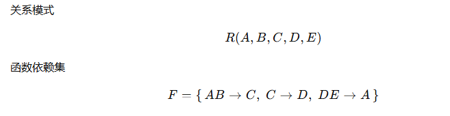
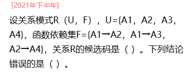
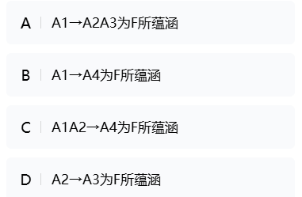
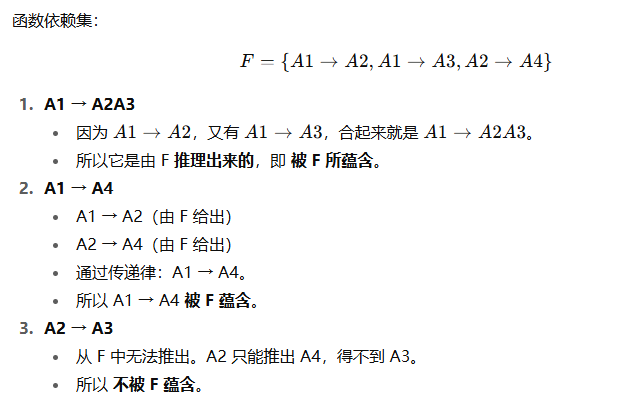
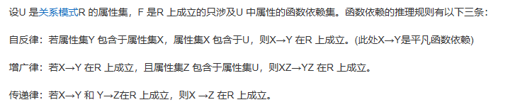

### 一、函数依赖（Functional Dependency）

在关系数据库中，**函数依赖**描述的是属性之间的约束关系。

广义上，**函数依赖**指的是「属性集 X 的值能唯一确定属性集 Y 的值」，记作

​															`X→Y`

这是最基本的定义。

 形式化表示：

- 设有关系模式 R，X 和 Y 是属性集，
- 如果在 R 中，任意两个元组，只要它们的 X 值相同，它们的 Y 值也一定相同，
- 就称 **X → Y**（X 函数确定 Y），也就是 **Y 依赖于 X**。

📌 举例：
 学生表：`(学号, 姓名, 专业)`

- 学号 → 姓名（因为学号唯一确定一个姓名）
- 学号 → 专业
   但反过来，姓名 → 学号 不一定成立（重名）。

👉 这个“依赖”就是理解范式的核心。


#### 1. 完全依赖（Full Functional Dependency）

**定义：**
 在一个关系模式中，若某个属性集 **完全依赖** 主键，意思是它依赖主键的**所有属性**，而不是其中一部分。

📌 举例：

```ini
表：成绩表(学号, 课程号, 分数)
主键 = (学号, 课程号)
```

- 分数 依赖于 (学号, 课程号)
- 不能只靠学号确定分数，也不能只靠课程号确定分数
   👉 这就是**完全依赖**。

------


#### 2. 部分依赖（Partial Functional Dependency）

**定义：**
 非主属性依赖于主键的一部分，而不是整个主键。

📌 举例：

```ini
表：选课表(学号, 课程号, 姓名)
主键 = (学号, 课程号)
```

- 姓名 依赖于 学号（学号能唯一确定姓名）
- 但 姓名 并不依赖于 课程号
   👉 这就是**部分依赖**。

⚠️ 部分依赖会导致数据冗余：同一个学生报多门课，姓名会重复存储。

------


#### 3. 传递依赖（Transitive Dependency）

**定义：**
 如果 A → B，B → C，那么就说 **C 传递依赖于 A**（前提是 C 不是主属性）。

📌 举例：

```ini
表：学生表(学号, 系号, 系名)
主键 = 学号
```

- 学号 → 系号（因为学号能确定系号）
- 系号 → 系名
- 所以学号 → 系名（但这是通过 系号 间接得到的）
   👉 这就是**传递依赖**。

⚠️ 传递依赖也会导致冗余：同一系下的学生会重复存储相同的系名。

------


#### 🎯 总结对比

| 类型         | 定义                                             | 举例                                      | 问题       |
| ------------ | ------------------------------------------------ | ----------------------------------------- | ---------- |
| **完全依赖** | 非主属性依赖整个主键                             | 分数依赖 (学号, 课程号)                   | ✅ 合理     |
| **部分依赖** | 非主属性只依赖主键的一部分                       | 姓名 依赖 学号（但主键是 (学号, 课程号)） | ❌ 数据冗余 |
| **传递依赖** | 非主属性依赖于另一个非主属性（通过中间属性传递） | 系名 依赖 系号，系号 依赖 学号            | ❌ 数据冗余 |


### 二、范式

#### 1、第一范式（1NF，First Normal Form）

**定义：**
 **1NF** 要求：**属性不可再分**，即每个`字段`都`是`**原子值**。

📌 举例：

- 不符合 1NF：

  ```ini
  学生表(学号, 姓名, 电话号1, 电话号2)
  ```

  因为电话号其实是一个集合，不是原子值。

- 符合 1NF：

  ```ini
  学生表(学号, 姓名, 电话号)
  ```

  一人多电话就多行记录。

👉 总结：1NF 约束的是**字段的原子性**。

------


#### 2、第二范式（2NF，Second Normal Form）

**定义：**
 2NF 要求：

1. 必须先满足 1NF。
2. 表中的`非主属性`（不是主键的一部分）必须 **完全依赖** 于`主键`，而`不能出现`**部分依赖**。

📌 举例：
 假设有关系：

```ini
选课表(学号, 课程号, 姓名, 课程名, 分数)
```

- 主键是 (学号, 课程号)。
- 分数 完全依赖于 (学号, 课程号)。✅
- 但是 姓名 只依赖于学号，课程名 只依赖于课程号 —— 出现**部分依赖** ❌。

解决办法：拆表：

```ini
学生表(学号, 姓名)
课程表(课程号, 课程名)
成绩表(学号, 课程号, 分数)
```

👉 总结：2NF 主要解决 **冗余** 和 **插入/删除异常** 问题。

------


#### 3、第三范式（3NF，Third Normal Form）

**定义：**
 3NF 要求：

1. 必须先满足 2NF。
2. 表中`非主属性`之间`不存在`**传递依赖**。

📌 举例：

```ini
学生表(学号, 姓名, 系号, 系名)
```

- 主键是学号。
- 姓名 依赖于学号 ✅。
- 系号 依赖于学号 ✅。
- 但是 系名 依赖于 系号，而 系号 又依赖于 学号 —— 出现**传递依赖** ❌。

解决办法：拆表：

```ini
学生表(学号, 姓名, 系号)
系表(系号, 系名)
```

👉 总结：3NF 进一步减少数据冗余，防止**传递依赖**导致的不一致。


#### 4、总结类比

- **1NF：** 字段必须原子化（不要一列存数组）。
- **2NF：** 每个非主键字段必须依赖整个主键（不要部分依赖）。
- **3NF：** 非主键字段不要依赖其他非主键（不要传递依赖）。

用生活例子：

- 1NF：电话本里，一个联系人只能写一个号码，不要在一个格子里写“138, 139”。
- 2NF：联系人和公司职位不能放在“联系人+公司”主键的表里，不然职位和公司会冗余。
- 3NF：公司名别放在联系人表里，应该拆出公司表。


### 三、补充

在函数依赖（Functional Dependency, FD）里，我们写成：

​															`X→Y`

- 左边 X 叫 **LHS**（Left Hand Side，左手边，决定因素）。
- 右边 Y 叫 **RHS**（Right Hand Side，右手边，被决定因素）。

> 如果有些属性没有出现在 **RHS** 上，则这些属性永远不会被依赖推出 ，**它们必须包含在候选码里**。否则，无法推导出这些属性。


### 四、根据函数依赖推导候选码

#### 练习题：



#### 第一步：找必然要包含的属性：

看 **RHS**：

- 出现过的有 C，D，A。
- 没出现的有 B，E。

👉 所以任何候选码 ***必须包含 B,E**。

#### 第二步：算闭包

（1）我们基于来扩展。

考虑根据 {B，E} 与依赖关系能否推出其它全部属性。

能，那么 {B，E} 就是候选码

不能，考虑添加别的属性，再尝试推导

这里没法触发任何 FD（AB 需要 A，C 需要 C，DE 需要 D）

（2） {B，E，A} 

用AB->C

用C->D，

所以 {B，E，A} 是超键

检查最小性：

去掉B，

去掉E，

所以 {B，E，A} 是候选码

（3） {B，E，C} 

（4） {B，E，D} 


#### 第三步：候选码集合

综上，候选码一共有 **3 个**：

​											`{A,B,E},{B,C,E},{B,D,E}`

#### 第四步：主属性 / 非主属性

- **主属性**：出现在候选码中的属性 = `{A,B,C,D,E}`，即 **全部属性**。
- **非主属性**：空集。

👉 主属性个数 = 5，非主属性个数 = 0。


### 五、所蕴含






什么叫做所蕴含：

可以把 “所蕴含” 理解成 **“必然成立的推论”**。

就像数学里的“由已知条件必然能推出结论”，这个结论就是“被蕴含”的。




AmStrong公理：



推理规则：


分解关系模式：

无损连接，并保存函数依赖