### 项目初始化

创建项目：

```js
 npm create vite@latest vue3-element-admin --template vue-ts
```

npm create vite@latest : **创建一个基于 Vite 的前端项目模板**，它会引导你完成一个新项目的初始化流程。

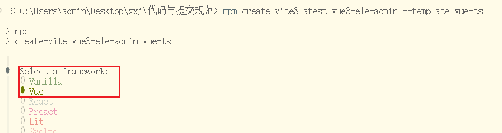

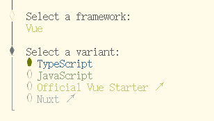

- **`vue3-ele-admin` **: 自定义的项目名称
- **`vue-ts`** ： `vue` + `typescript` 模板的标识，查看 [create-vite](https://github.com/vitejs/vite/tree/main/packages/create-vite) 以获取每个模板的更多细节：vue，vue-ts，react，react-ts


配置别名：

**vite.config.js/ts中别名配置**

```js
import path from "path";
const pathSrc = path.resolve(__dirname, "src");
export default defineConfig({
  resolve: {
    alias: {
      "@": pathSrc,
    },
  },
  plugins: [vue()],
});
```


### 配置自动导入：

**概念**

为了避免在多个页面重复引入 `API` 或 `组件`，由此而产生的自动导入插件来节省重复代码和提高开发效率。

自动导入有两种：

`unplugin-auto-import`： 自动导入 ref，reactive,watch,computed 等API

unplugin-vue-components ： 自动导入Element Plus 等三方库和 指定目录下的 自定义组件

**安装插件依赖**

```
npm install -D unplugin-vue-components unplugin-auto-import
```

**vite.config.js/ts中自动导入的配置**

**api与组件的自动导入**

```js
// 引入
import AutoImport from 'unplugin-auto-import/vite'
import Components from 'unplugin-vue-components/vite'
import { ElementPlusResolver } from 'unplugin-vue-components/resolvers'
```

在plugins配置项中加入：

```js
  plugins: [
    vue(),
    AutoImport({
      resolvers: [ElementPlusResolver()],
    }),
    Components({
      resolvers: [ElementPlusResolver()],
    }),
  ],
```

其中：

```js
// 自动导入API
AutoImport({
  // 导入 Element Plus函数，如：ElMessage, ElMessageBox 等
  // 比如代码中使用 ElMessage.success() 时，会自动导入 ElMessage
  resolvers: [ElementPlusResolver()],
}),
// 自动导入组件
Components({
   // 导入 Element Plus 组件，比如代码中使用组件 el-table等时，会自动导入
  resolvers: [ElementPlusResolver()],
}),
```

还可以配置vue，vue-router，pinia之类的自动导入

```js
 AutoImport({
     // 导入 Vue 函数，如：ref, reactive, toRef 等,以及其它库的函数，比如vue-router中的useRouter
      imports: ["vue", "@vueuse/core", "pinia", "vue-router"],
      resolvers: [ElementPlusResolver()],
    }),
```

**配置类型的自动导入：**

新建 `/src/types` 目录用于存放自动导入函数和组件的TS类型声明文件

```js
    AutoImport({
      imports: ["vue", "@vueuse/core", "pinia", "vue-router"],
      resolvers: [ElementPlusResolver()],

      eslintrc: {
        enabled: true, // 是否自动生成 eslint 规则，建议生成之后设置 false
        filepath: "./.eslintrc-auto-import.json", // 指定自动导入函数 eslint 规则的文件
        globalsPropValue: true,
      },
      vueTemplate: true, //允许在 .vue 模板中使用自动导入的函数
      // 导入函数TS类型声明文件路径
      //  dts: false,
      dts: "src/types/auto-imports.d.ts", // 指定自动导入函数TS类型声明文件路径
    }),
    // 自动导入组件
    Components({
      // 导入 Element Plus 组件，比如代码中使用组件 el-table等时，会自动导入
      resolvers: [ElementPlusResolver()],
      // 指定自定义组件位置(默认:src/components)
      dirs: ["src/components", "src/**/components"],
      // 导入组件类型声明文件路径 (false:关闭自动生成)
      //  dts: false,
      dts: "src/types/components.d.ts", // 指定自动导入组件TS类型声明文件路径
    }),
```

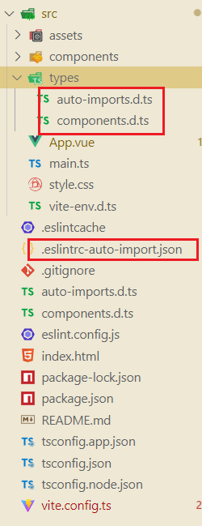

### 整合Element-plus

**安装 Element Plus**

```shell
npm install element-plus
```

**安装图标包**：`element-plus/icons-vue`

```shell
npm install @element-plus/icons-vue
```

#### 全局注册所有图标：

需要从 `@element-plus/icons-vue` 中导入所有图标并进行全局注册。

```ts
// main.ts

// 如果您正在使用CDN引入，请删除下面一行。
import * as ElementPlusIconsVue from '@element-plus/icons-vue'

const app = createApp(App)
for (const [key, component] of Object.entries(ElementPlusIconsVue)) {
  app.component(key, component)
}
```

**示例代码：**

```vue
  <!-- 结合 el-icon 使用 -->
  <div>
    <p>结合 el-icon 使用</p>
    <el-button type="primary">
      Upload
      <el-icon><Upload /></el-icon>
    </el-button>

    <el-button type="warning">
      Plus
      <el-icon><Plus /></el-icon>
    </el-button>
  </div>

  <!-- 直接使用 SVG 图标 -->
  <!-- 由于SVG图标默认不携带任何属性 -->
  <!-- 你需要直接提供它们 -->
  <div style="font-size: 20px">
    <p>直接使用 SVG 图标</p>
    <Edit style="width: 1em; height: 1em; margin-right: 8px" />
    <Share style="width: 1em; height: 1em; margin-right: 8px" />
    <Delete style="width: 1em; height: 1em; margin-right: 8px" />
    <Search style="width: 1em; height: 1em; margin-right: 8px" />
  </div>
```

**效果预览**

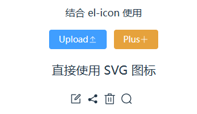


#### 配置图标自动导入

**安装自动导入 Icon 依赖**，需要完成上面一节的 **自动导入** 的安装和配置

```shell
npm i -D unplugin-icons
```

**vite.config.ts 配置**

使用 [unplugin-icons](https://github.com/antfu/unplugin-icons) 和 [unplugin-auto-import](https://github.com/antfu/unplugin-auto-import) 从 `iconify` 中自动导入任何图标集。 您可以参考[此模板](https://github.com/sxzz/element-plus-best-practices/blob/db2dfc983ccda5570033a0ac608a1bd9d9a7f658/vite.config.ts#L21-L58)。

```ts
import { defineConfig } from "vite";
import vue from "@vitejs/plugin-vue";
import path from "path";

// 引入
import AutoImport from "unplugin-auto-import/vite";
import Components from "unplugin-vue-components/vite";
import { ElementPlusResolver } from "unplugin-vue-components/resolvers";

// 图标icon自动导入
import Icons from "unplugin-icons/vite";
import IconsResolver from "unplugin-icons/resolver";

const pathSrc = path.resolve(__dirname, "src");

// https://vite.dev/config/
export default defineConfig({
  resolve: {
    alias: {
      "@": pathSrc,
    },
  },

  css: {
    preprocessorOptions: {
      scss: {
        api: "modern-compiler",
        additionalData: `@use "@/styles/variables.scss" as *;`,
      },
    },
  },
  plugins: [
    vue(),
    AutoImport({
      // 导入 Vue 函数，如：ref, reactive, toRef 等
      imports: ["vue"],

      resolvers: [
        // 导入 Element Plus函数，如：ElMessage, ElMessageBox 等
        // 比如代码中使用 ElMessage.success() 时，会自动导入 ElMessage
        ElementPlusResolver({ importStyle: "sass" }),

        // 自动导入图标组件
        IconsResolver({
          prefix: "Icon",
        }),
      ],

      eslintrc: {
        enabled: true, // 是否自动生成 eslint 规则，建议生成之后设置 false
        filepath: "./.eslintrc-auto-import.json", // 指定自动导入函数 eslint 规则的文件
        globalsPropValue: true,
      },
      vueTemplate: true, //允许在 .vue 模板中使用自动导入的函数
      // 导入函数TS类型声明文件路径
      //  dts: false,
      dts: "src/types/auto-imports.d.ts", // 指定自动导入函数TS类型声明文件路径
    }),
    Components({
      resolvers: [
        // 导入 Element Plus 组件，比如代码中使用组件 el-table等时，会自动导入
        ElementPlusResolver({ importStyle: "sass" }),

        // 自动注册图标组件
        IconsResolver({
          enabledCollections: ["ep"],
        }),
      ],

      // 指定自定义组件位置(默认:src/components)
      dirs: ["src/components", "src/**/components"],
      // 导入组件类型声明文件路径 (false:关闭自动生成)
      //  dts: false,
      dts: "src/types/components.d.ts", // 指定自动导入组件TS类型声明文件路径
    }),
    Icons({
      autoInstall: true,
    }),
  ],
});
```

官方的配置项有一个**错误**：

```ts
AutoImport({
  imports: ["vue"],
  resolvers: [

    ElementPlusResolver({ importStyle: "sass" }),

    // 自动导入图标组件，这里配置是没有用的
    // IconsResolver({
    //   prefix: "Icon",
    // }),
  ],
}),
```

`unplugin-auto-import`(`AutoImport`) 是用来自动导入函数的（例如 `ref()`、`ElMessage()` 等）；

而图标（如 `Edit`, `Plus`）是**组件**，不是函数；

所以配置 `IconsResolver` 在这里，**不会自动导入图标组件**。

实际需要的配置如下:

```ts
Components({
  resolvers: [
    // ......
    // 自动注册图标组件
    IconsResolver({
      // prefix: "Icon", // 自定义前缀
      enabledCollections: ["ep"], // element-plus图标库，其他图标库 https://icon-sets.iconify.design/
    }),
    // ......
  ],
}),
Icons({
  autoInstall: true,
}),
```

需要注意的是，`IconsResolver`中有没有配置`prefix`选项，如果没有配置，使用图标的格式为： 

```vue
<i-ep-SuccessFilled />
```

**使用示例**

```vue
<!-- src/components/HelloWorld.vue -->
<div>
    <el-button type="success">
      <i-ep-SuccessFilled />
      Success
    </el-button>

    <el-button type="info">
     <i-ep-SuccessFilled />
      Info
    </el-button>
</div>
```

**效果预览**

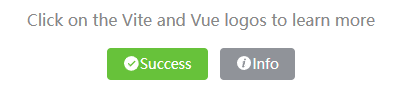

如果配置了`prefix: "Icon"`，此时使用图标的格式为：

```vue
<IconEpPlus />
<IconEpEdit />
<IconEpUserFilled />
```

**使用示例**

```vue
<el-button type="primary">
  Plus
  <IconEpPlus />
</el-button>

<el-button type="info">
  Edit
  <IconEpEdit />
</el-button>
```

**效果预览**

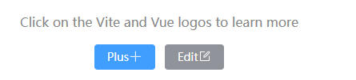

**vite.config.ts配置：**仅供参考

```ts
import { defineConfig } from "vite";
import vue from "@vitejs/plugin-vue";
import path from "path";

// 引入
import AutoImport from "unplugin-auto-import/vite";
import Components from "unplugin-vue-components/vite";
import { ElementPlusResolver } from "unplugin-vue-components/resolvers";

// 图标icon自动导入
import Icons from "unplugin-icons/vite";
import IconsResolver from "unplugin-icons/resolver";

const pathSrc = path.resolve(__dirname, "src");

// https://vite.dev/config/
export default defineConfig({
  resolve: {
    alias: {
      "@": pathSrc,
    },
  },

  css: {
    preprocessorOptions: {
      scss: {
        api: "modern-compiler",
        additionalData: `@use "@/styles/variables.scss" as *;`,
      },
    },
  },
  plugins: [
    vue(),
    // 用来自动导入函数的
    AutoImport({
      // 导入 Vue 函数，如：ref, reactive, toRef 等
      imports: ["vue"],

      resolvers: [
        // 导入 Element Plus函数，如：ElMessage, ElMessageBox 等
        // 比如代码中使用 ElMessage.success() 时，会自动导入 ElMessage
        ElementPlusResolver({ importStyle: "sass" }),
      ],

      eslintrc: {
        enabled: true, // 是否自动生成 eslint 规则，建议生成之后设置 false
        filepath: "./.eslintrc-auto-import.json", // 指定自动导入函数 eslint 规则的文件
        globalsPropValue: true,
      },
      vueTemplate: true, //允许在 .vue 模板中使用自动导入的函数
      // 导入函数TS类型声明文件路径
      //  dts: false,
      dts: "src/types/auto-imports.d.ts", // 指定自动导入函数TS类型声明文件路径
    }),

    // 自动注册并导入组件
    Components({
      resolvers: [
        // 导入 Element Plus 组件，比如代码中使用组件 el-table等时，会自动导入
        ElementPlusResolver({ importStyle: "sass" }),

        // 自动注册图标组件
        IconsResolver({
          prefix: "Icon", // 自定义前缀
          enabledCollections: ["ep"], // element-plus图标库，其他图标库 https://icon-sets.iconify.design/
        }),
      ],

      // 指定自定义组件位置(默认:src/components)
      dirs: ["src/components", "src/**/components"],
      // 导入组件类型声明文件路径 (false:关闭自动生成)
      //  dts: false,
      dts: "src/types/components.d.ts", // 指定自动导入组件TS类型声明文件路径
    }),
    Icons({
      autoInstall: true,
    }),
  ],
});
```

**区别**

上面这种方法配置完成以后，使用图标的方式发生了一些变化。

如果是全部注册，可以直接拷贝`icon-code`直接使用，比如：

```vue
<el-icon><Plus /></el-icon>
```

但是现在不行了，必须改为

```vue
< !-- 根据是否配置prefix -->
<i-ep-Plus />或者<IconEpPlus />
```

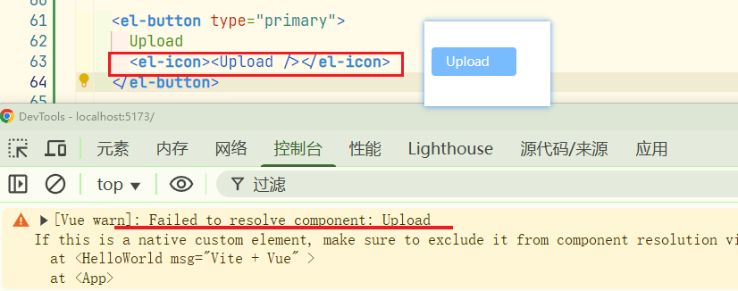

修改以后：

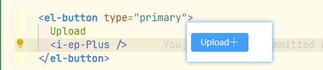

为了方便使用，这里使用全局注册。如果项目很大，在初期需要考虑各种性能问题，那可以使用自动导入。


### 整合SVG图标

参考： [vite-plugin-svg-icons 安装文档](https://link.juejin.cn/?target=https%3A%2F%2Fgithub.com%2Fvbenjs%2Fvite-plugin-svg-icons%2Fblob%2Fmain%2FREADME.zh_CN.md)

**安装依赖**

```shell
npm install -D fast-glob@3.2.11 
npm install -D vite-plugin-svg-icons@2.0.1 
```

创建 `src/assets/icons` 目录 , 放入从 Iconfont 复制的 `svg` 图标

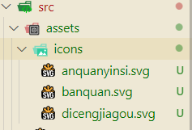

`main.ts` 引入注册脚本

```ts
// 本地SVG图标
import "virtual:svg-icons-register";
```

`vite.config.ts` 配置插件

```ts
// vite.config.ts
import { createSvgIconsPlugin } from 'vite-plugin-svg-icons';

export default defineConfig({
   // .....
  plugins: [

    // 自动注册并导入组件
    Components({
  		// .....
    }),

    createSvgIconsPlugin({
      // 指定需要缓存的图标文件夹
      iconDirs: [path.resolve(pathSrc, "assets/icons")],
      // 指定symbolId格式
      symbolId: "icon-[dir]-[name]",
    }),
  ],
});
```

**SVG 组件封装:**

```vue
<!-- src/components/SvgIcon/index.vue -->
<template>
  <svg aria-hidden="true" class="svg-icon" :style="{ width: size, height: size, color }">
    <use :xlink:href="symbolId" />
  </svg>
</template>

<script setup lang="ts">
const props = defineProps({
  prefix: {
    type: String,
    default: "icon",
  },
  iconName: {
    type: String,
    required: false,
    default: "",
  },
  color: {
    type: String,
    default: "",
  },
  size: {
    type: String,
    default: "1em",
  },
});

const symbolId = computed(() => `#${props.prefix}-${props.iconName}`);
</script>

<style scoped>
.svg-icon {
  display: inline-block;
  width: 1em;
  height: 1em;
  overflow: hidden;
  vertical-align: -0.15em; /* 因icon大小被设置为和字体大小一致，而span等标签的下边缘会和字体的基线对齐，故需设置一个往下的偏移比例，来纠正视觉上的未对齐效果 */
  outline: none;
  /* 定义元素的颜色，currentColor是一个变量，这个变量的值就表示当前元素的color值，如果当前元素未设置color值，则从父元素继承 */
  fill: currentcolor;
}
</style>
```

**组件使用**

注：颜色值生效的前提是，`svg`中的`fill`值不是写死的，可以是`fill="currentColor"`或者没有`fill`，但是不能是`fill="#1677FF"`这种颜色写死的，否则设置颜色也不会生效。

```vue
<!-- src/components/HelloWorld.vue -->
<div>
    <p>测试导入本地SVG图标</p>
    <el-button type="info">
      <svg-icon icon-name="anquanyinsi" size="24px" color="red" />
      <svg-icon icon-name="banquan" size="20px" />
      <svg-icon icon-name="dicengjiagou" />
      SVG 本地图标
    </el-button>
</div>
```

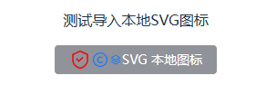

### 整合SCSS

安装依赖

```shell
npm i -D sass 
```

创建 `variables.scss` 变量文件，添加变量 `$bg-color` 定义，注意规范变量以 `$` 开头

```scss
// src/styles/variables.scss
$bg-color: #d00909;
```

`Vite` 配置导入` SCSS` 全局变量文件

```ts
// vite.config.ts
css: {
preprocessorOptions: {
  scss: {
    api: "modern-compiler",
    // 在 每个 .scss 文件或者组件的 <style lang="scss">  编译前，自动插入这一行代码。
    additionalData: `@use "@/styles/variables.scss" as *;`,
  },
},
},
```

**测试**

```vue
<!-- src/components/HelloWorld.vue -->
<template>
  <div class="box" />
</template>

<style lang="scss" scoped>
.box {
  width: 100px;
  height: 100px;
  background-color: $bg-color;
}
</style>
```

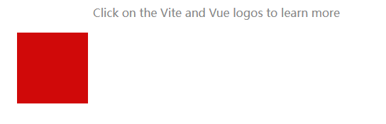

在`ts`中使用`scss`全局变量，创建一个以 `.module.scss` 结尾的文件

```scss
// src/styles/variables.module.scss

// 导出 variables.scss 文件的变量
:export{
    bgColor:$bg-color
}
```

`TypeScript` 使用 `SCSS` 全局变量

```scss
<!-- src/components/HelloWorld.vue -->
<script setup lang="ts">
  import variables from "@/styles/variables.module.scss";
  console.log(variables.bgColor)  
</script>

<template>
  <div style="width:100px;height:100px" :style="{ 'background-color': variables.bgColor }" />
</template>
```

### 整合UnoCSS

[VIte配置UnoCSS官方文档](https://unocss.dev/integrations/vite)

**安装依赖**

```shell
npm install -D unocss
```

**`vite.config.ts`配置**

```ts
import UnoCSS from 'unocss/vite'
import { defineConfig } from 'vite'

export default defineConfig({
  plugins: [
    UnoCSS(),
  ],
})
```

**创建`uno.config.ts`文件**

```ts
// uno.config.ts
import {
  defineConfig,
  presetAttributify,
  presetIcons,
  presetTypography,
  presetWind3,
  presetWebFonts,
  transformerDirectives,
  transformerVariantGroup,
} from "unocss";

export default defineConfig({
  shortcuts: {
    "flex-center": "flex justify-center items-center",
    "flex-x-center": "flex justify-center",
    "flex-y-center": "flex items-center",
    "wh-full": "w-full h-full",
    "flex-x-start": "flex items-center justify-start",
    "flex-x-between": "flex items-center justify-between",
    "flex-x-end": "flex items-center justify-end",
    "absolute-lt": "absolute left-0 top-0",
    "absolute-rt": "absolute right-0 top-0 ",
    "fixed-lt": "fixed left-0 top-0",
  },
  theme: {
    colors: {
      primary: "var(--el-color-primary)",
      primary_dark: "var(--el-color-primary-light-5)",
    },
  },
  presets: [
    presetWind3(),
    presetAttributify(),
    presetIcons(),
    presetTypography(),
    presetWebFonts({
      fonts: {
        // ...
      },
    }),
  ],
  transformers: [transformerDirectives(), transformerVariantGroup()],
});
```

**在`main.ts`中引入**

```ts
import 'virtual:uno.css'
```

**`VSCode` 安装 `UnoCSS` 插件**

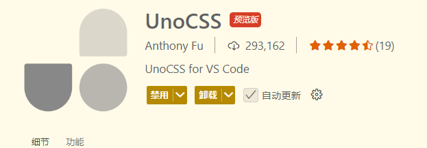

**测试**

```
// HelloWorld.vue
<h1 class="text-cyan">{{ msg }}</h1>
```

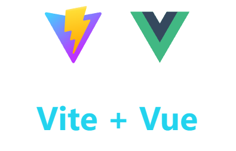

**补充：**

`ts`提示`presetUno`预设已经弃置：


```
// 修改框架单位转换，因为框架默认会将单位转换成rem，有时用调试工具看的时候感觉不是很方便，所以通过此依赖转换成px
yarn add -D @unocss/preset-rem-to-px
```


### 整合Pinia

安装

```shell
npm install pinia
```

`main.ts` 引入 `pinia`

```js
import { createPinia } from "pinia";
import App from "./App.vue";

createApp(App).use(createPinia()).mount("#app");
```

定义store

参考[定义Store](https://pinia.vuejs.org/zh/core-concepts/)


### 环境变量

开发环境要配置什么，生产环境要配置什么？？

开发环境下，项目运行在`http://localhost:3000/`地址下，这是本地的开发地址，这个地址下发送接口的请求时，会有跨域的问题产生。这就涉及到反向代理。

那么我们需要配置代理前缀和代理的目标地址，当然也可以配置一下其它的变量。

`.env.development`

```shell
# 变量必须以 VITE_ 为前缀才能暴露给外部读取
# app 名称
VITE_APP_TITLE = 'waterlogging syetem'


# 应用端口
VITE_APP_PORT = 3005


# 代理前缀
VITE_APP_BASE_URL = '/dev-api'

# 接口地址
VITE_APP_TARGET_API_URL = 'http://tmws.zksy.com/apiProxy'
```

至于生产环境：`.env.production`

生产环境下，一般就不在需要设置反向代理了。后端的接口地址就要修改为真实的接口地址，而且是一个公网地址。

上线的时候后端一般也有**跨域处理**（比如 `Access-Control-Allow-Origin: *` 之类的）：

```http
Access-Control-Allow-Origin: *
Access-Control-Allow-Methods: GET, POST, PUT, DELETE, OPTIONS
Access-Control-Allow-Headers: Content-Type, Authorization
```

允许来自**任意域名**的请求访问。

允许各种请求方法（GET、POST、PUT、DELETE）。

允许带各种头信息（比如 Authorization）。

前端即使请求的是**别的域名或端口**，浏览器也不会拦截。

`.env.production`

```shell
# 代理前缀
VITE_APP_BASE_API = '/prod-api'

# 或

# 真实的后端接口地址
VITE_APP_BASE_API = 'htpp://xx.xxx.x.x'
```

只有一个根路径 /

```shell
# 只有一个根路径 / 。 
VITE_APP_BASE_API = '/'
```

说明后端和前端部署在同一台服务器上。比如前端项目上线部署在：

```
https://web.xxx.com/
```

axios请求 `/user/list`，实际就是请求：

```
https://web.xxx.com/user/list
```

但是这是不现实的，前端部署在`https://web.xxx.com/`下，后端接口就不能是`https://web.xxx.com/`地址，因为他们的端口号一样了。

如果VITE_APP_BASE_API = '/'，是这种配置，那就要给网络请求设置前缀，比如/api，而且nginx也要设置代理。


怎么查看服务器上一个项目的部署信息：

直接找nginx的配置，`/etc/nginx/conf.d/xxxxxx.conf`

```nginx
server {
  # 监听yourdomain.com:80端口,就是80，不是8080
  listen 80;
  server_name yourdomain.com; # 你的域名或者IP

  # 前端页面
  # 访问 / 路径去/var/www/frontend目录下面找 index.html文件返回
  location / {
    root /var/www/frontend;
    index index.html;
    # $uri是用户访问的资源路径值，比如url，用户访问这个资源时，先去找$uri本身，没有，再看是不是目录 $uri/
    # 如果都不存在，最终返回 /index.html
    try_files $uri $uri/ /index.html; # 重要！SPA单页应用一定要加
  }

  # 后端接口代理
  # 前端发来的 /api/* 请求，转发到本机的9000端口上的后端服务去处理。前提是后端服务已经启动且部署在本机的9000端口下，且可以正常运行。
  # 严格来说，前端和后端不能直接部署在同一个端口上。
  location /api/ {
    proxy_pass http://127.0.0.1:9000/;
    proxy_set_header Host $host;
    proxy_set_header X-Real-IP $remote_addr;
  }
}
```

```nginx
proxy_set_header Host $host;
proxy_set_header X-Real-IP $remote_addr;
```

- **传递一些原始请求信息**给后端。
  - `Host`：保持原请求的主机名。
  - `X-Real-IP`：告诉后端客户端的真实 IP（否则后端拿到的IP就是 127.0.0.1）。

这样后端就能知道是哪个用户、哪个IP发的请求，做日志、安全校验等。

### 完整版 Nginx 配置示范

仅供参考

```nginx
server {
  listen 80;
  server_name yourdomain.com www.yourdomain.com;

  # 自动把http请求重定向到https
  return 301 https://$host$request_uri;
}

server {
  listen 443 ssl http2;
  server_name yourdomain.com www.yourdomain.com;

  # SSL证书配置（这里换成你自己的证书路径）
  ssl_certificate /etc/nginx/ssl/yourdomain.com/fullchain.pem;
  ssl_certificate_key /etc/nginx/ssl/yourdomain.com/privkey.pem;
  ssl_session_timeout 1d;
  ssl_session_cache shared:MozSSL:10m;
  ssl_protocols TLSv1.2 TLSv1.3;
  ssl_ciphers HIGH:!aNULL:!MD5;

  # 前端页面
  root /var/www/frontend;
  index index.html;

  location / {
    try_files $uri $uri/ /index.html;
  }

  # 后端接口代理
  location /api/ {
    proxy_pass http://127.0.0.1:9000/; # 后端服务端口
    proxy_http_version 1.1;
    proxy_set_header Host $host;
    proxy_set_header X-Real-IP $remote_addr;
    proxy_set_header X-Forwarded-For $proxy_add_x_forwarded_for;
    proxy_set_header X-Forwarded-Proto $scheme;
  }

  # 开启gzip压缩，提高前端资源加载速度
  gzip on;
  gzip_types text/plain text/css application/json application/javascript text/xml application/xml application/xml+rss text/javascript;
  gzip_min_length 1k;
  gzip_comp_level 5;

  # 静态文件缓存优化
  location ~* \.(?:ico|css|js|gif|jpe?g|png|woff2?|eot|ttf|otf|svg|webp)$ {
    expires 30d;
    access_log off;
    add_header Cache-Control "public";
  }

  # 404页面（可选）
  error_page 404 /404.html;
  location = /404.html {
    root /var/www/frontend;
  }

  # 其他错误码处理（可选）
  error_page 500 502 503 504 /50x.html;
  location = /50x.html {
    root /var/www/frontend;
  }
}
```

#### 核心流程：

用户访问 ➔ Nginx 监听443 ➔ 静态资源直接返回 ➔ `/api/`请求代理到后端 ➔ 支持SPA路由 ➔ 自动压缩 ➔ 静态资源缓存优化 ➔ HTTPS全程加密


问题记录：

使用了自动导入，配置了eslint，代码中直接使用ElMessage，不能通过eslint的检测，

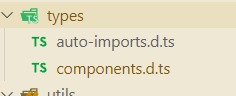

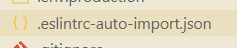

这两个文件怎么生成的，怎么配置，然后怎么自动的更新内容


presetUno预设已经弃置
