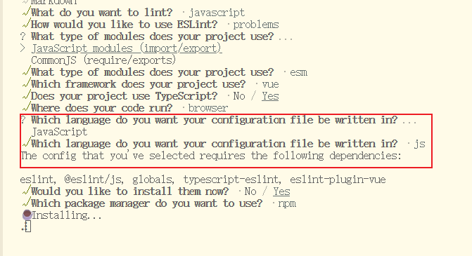

### 📝 什么是 ESLint

**ESLint** 是一个流行的 **JavaScript / TypeScript 代码静态检查工具（linter）**，用来在开发过程中发现和修复代码中的问题。它主要用于：

- 检查语法错误（syntax errors）
- 强制执行一致的代码风格（code style）
- 发现潜在的逻辑错误或反模式（anti-pattern）
- 通过插件扩展支持 React、Vue、TypeScript 等生态


### ⚙️ ESLint 的工作方式

- 它会读取一份 **配置文件**（如 `.eslintrc.js`、`.eslintrc.json`、`eslint.config.js` 等）
- 根据配置中的 **规则（rules）** 对源码进行扫描
- 输出每条不符合规则的地方，并标明行号、列号以及修复建议
- 对于部分问题可以 **自动修复**（`eslint --fix`）


### ESLint v9 及其全新的 Flat Config 配置方式

#### 安装

```ini
npm init @eslint/config@latest
```

#### 交互式问答



这是一个使用了TypeScript的项目，生成的配置文件是`eslint.config.js`

#### 默认配置

生成的默认配置如下：

```js
import js from "@eslint/js";
import globals from "globals";
import tseslint from "typescript-eslint";
import pluginVue from "eslint-plugin-vue";
import { defineConfig } from "eslint/config";

export default defineConfig([
  {
    files: ["**/*.{js,mjs,cjs,ts,mts,cts,vue}"],
    plugins: { js },
    extends: ["js/recommended"],
    languageOptions: { globals: globals.browser },
  },
  tseslint.configs.recommended,
  pluginVue.configs["flat/essential"],
  {
    files: ["**/*.vue"],
    languageOptions: { parserOptions: { parser: tseslint.parser } },
  },
]);
```

##### 配置文件的写法

1️⃣ 辅助函数写法

```js
import { defineConfig } from "eslint/config";

export default defineConfig([
    {
        // 配置对象
    }
]);
```

- `defineConfig` 是 **ESLint v9 提供的辅助函数**
- 它的作用主要是 **提供类型推断和更好的 IDE 提示**
- 功能上和直接 `export default [...]` 是一样的
- 对 ESLint 执行没有影响，只是让编辑器（VSCode 等）更好地提示规则、语法错误、自动补全


2️⃣ 直接数组写法

```js
export default [
    {
        // 配置对象
    }
];
```

- 同样可以使用
- 没有 `defineConfig`，IDE 的类型提示会稍微弱一点
- ESLint 本身运行结果完全相同

推荐用 `defineConfig`


##### 配置对象

```js
export default defineConfig([
  {
    // 配置对象 1
  },
  {
    // 配置对象 2
  },
  // ……
]);
```

- `defineConfig` 接收 **一个数组**
- 数组中的每一项都是 **配置对象（Config Object）**
- 每个配置对象可以独立配置：
  - `files`：匹配的文件（glob）
  - `ignores`：忽略的文件
  - `languageOptions`：语法、解析器等
  - `rules`：具体规则
  - `plugins`：插件
  - `settings`：插件或共享配置需要的额外设置

ESLint 会 **按数组顺序合并配置**，后面的配置可以覆盖前面的配置。


**每个配置对象**可以理解为 **一组针对特定文件/环境/功能的 ESLint 规则集合**。

**组合使用的场景主要有：**

1. 多文件类型（JS/TS/JSX/TSX/Vue）
2. 不同目录或模块（src/tests/build scripts）
3. 特定插件或环境（React/Vue/Node/Browser）


项目如果同时使用 **JavaScript、TypeScript、Vue**，最合理的做法就是针对每种文件类型写 **独立的配置对象**，这样规则不会冲突，也更清晰易维护。

**示例结构**

```js
import { defineConfig } from "eslint/config";
import vuePlugin from "eslint-plugin-vue";
import tsParser from "@typescript-eslint/parser";

export default defineConfig([
  // 1️⃣ JavaScript 文件
  {
    files: ["**/*.js"],
    languageOptions: {
      ecmaVersion: "latest",
      sourceType: "module",
    },
    rules: {
      semi: ["error", "always"],
      quotes: ["error", "double"],
    },
  },

  // 2️⃣ TypeScript 文件
  {
    files: ["**/*.ts", "**/*.tsx"],
    languageOptions: {
      parser: tsParser,
      ecmaVersion: "latest",
      sourceType: "module",
    },
    rules: {
      "@typescript-eslint/no-unused-vars": "error",
      "@typescript-eslint/explicit-function-return-type": "warn",
    },
  },

  // 3️⃣ Vue 文件
  {
    files: ["**/*.vue"],
    plugins: { vue: vuePlugin },
    languageOptions: {
      parser: "vue-eslint-parser",
      parserOptions: {
        parser: tsParser, // Vue 文件里用 TypeScript
        sourceType: "module",
        ecmaVersion: "latest",
      },
    },
    rules: {
      "vue/no-unused-vars": "error",
      "vue/html-indent": ["error", 2],
    },
  },
]);
```


##### 配置对象的核心属性：

在 Flat Config 中，每个配置对象的结构大致如下：

```js
{
  files: [],            // 匹配的文件
  ignores: [],          // 忽略的文件
  languageOptions: {},  	// 语言选项（语法、解析器等）
  plugins: {},          // 插件
  rules: {},            // 规则
  settings: {},         // 插件或共享配置需要的额外设置
  processor: "",        // 文件处理器（可选）
  defines: [],          // 内联配置或扩展配置（可选）
}
```

###### 1️⃣ `files`

- **作用**：指定当前配置对象生效的文件范围
- **类型**：字符串或字符串数组（glob 模式）
- **示例**：

```js
files: ["**/*.ts", "**/*.tsx"]
```

- TS 文件会使用这一条配置
- 没写 `files`，则默认对所有文件生效

------

###### 2️⃣ `ignores`

- **作用**：指定哪些文件 **不被检查**
- **类型**：字符串或字符串数组（glob 模式）
- **示例**：

```js
ignores: ["dist/**", "node_modules/**"]
```

- 可以用来排除构建输出或第三方库

------

###### 3️⃣ `languageOptions`

- **作用**：定义语言相关配置，比如 ECMAScript 版本、模块类型、解析器
- **常用字段**：

| 字段            | 含义                                           |
| --------------- | ---------------------------------------------- |
| `global`        | 已定义的全局变量，不需要报未定义错误           |
| `ecmaVersion`   | ECMAScript 版本（如 `latest` 或 `2021`）       |
| `sourceType`    | 模块类型：`module` 或 `script`或`commonjs`     |
| `parser`        | 使用的解析器（如 `@typescript-eslint/parser`） |
| `parserOptions` | 额外解析器选项，支持一些插件或特殊语法         |

- **示例**：

```js
languageOptions: {
  ecmaVersion: "latest",
  sourceType: "module",
  parser: "@typescript-eslint/parser",
}
```


**指定全局变量**

要在 [配置文件](https://eslint.nodejs.cn/docs/latest/use/configure/configuration-files#configuration-file) 中配置全局变量，请将 `languageOptions.globals` 配置属性设置为一个对象，该对象包含为要使用的每个全局变量命名的键。对于每个全局变量键，设置相应的值等于 `"writable"` 以允许变量被覆盖或 `"readonly"` 不允许覆盖。例如：

```js
// eslint.config.js
import { defineConfig } from "eslint/config";

export default defineConfig([
	{
		languageOptions: {
			globals: {
				var1: "writable",
				var2: "readonly",
			},
		},
	},
]);
```


 **什么情况下需要 `globals`**

如果你的全局变量是通过 **模块导出和导入（ESM 或 CommonJS）** 的方式引入，ESLint **通常不会报未定义错误**，因为它能跟踪 `import` 或 `require`。

但是 `languageOptions.globals` 的作用是针对 **真正的全局变量**，也就是：

- **浏览器环境自带变量**：如 `window`、`document`
- **Node 环境自带变量**：如 `process`、`__dirname`
- **测试环境变量**：如 Jest 的 `describe`、`it`、`beforeEach`
- **项目自定义全局变量**：没有通过 import/export 引入，而是直接挂在全局对象上的变量

1️⃣ 举例

**a) 浏览器自带变量**

```js
// JS 文件
console.log(window.location.href); // window 是全局的
```

ESLint 默认可能报 `window is not defined`

配置：

```js
languageOptions: {
  globals: {
    window: "readonly",
  }
}
```


**b) Jest 测试环境**

```js
describe("test case", () => {
  it("works", () => {});
});
```

`describe` 和 `it` 是 Jest 全局提供的

如果没加 global，ESLint 会报 `describe is not defined`

配置：

```js
languageOptions: {
  globals: {
    describe: "readonly",
    it: "readonly",
    beforeEach: "readonly"
  }
}
```

2️⃣ 总结

- **模块化引入的变量** → 不需要 `globals`
- **直接挂在全局对象上的变量** → 需要 `globals`
- **ESLint 通过 globals 知道哪些变量是安全的全局**，避免误报


###### 4️⃣ `plugins`

- **作用**：注册插件，使其规则可用
- **类型**：对象，键为插件名，值为插件模块
- **示例**：

```js
plugins: { vue: require("eslint-plugin-vue") }
```

- 之后在 `rules` 中就可以使用 `vue/...` 规则

------

###### 5️⃣ `rules`

- **作用**：配置具体规则
- **格式**：`"规则名": "off" | "warn" | "error" | [级别, 配置项]`
- **示例**：

```js
rules: {
  semi: ["error", "always"],
  quotes: ["warn", "double"],
  "@typescript-eslint/no-unused-vars": "error",
}
```


#### 配置规则rules

规则是 ESLint 的核心构建块。规则验证你的代码是否满足特定期望，以及如果不满足该期望该怎么办。规则还可以包含特定于该规则的其他配置选项。

ESLint 自带大量的 [内置规则](https://eslint.nodejs.cn/docs/latest/rules/)，你可以通过插件添加更多的规则。你可以使用配置注释或配置文件修改你的项目使用的规则。

##### 1️⃣ rules 的基本结构

```js
rules: {
  "规则名": "off" | "warn" | "error" | [级别, 配置选项]
}
```

**规则名**：ESLint 或插件提供的规则名称

比如：`semi`、`quotes`、`no-unused-vars` 都是 **ESLint 内置规则的名称**

插件规则的规则名通常是 `插件名/规则名`，例如：

- `vue/no-unused-vars` → Vue 插件规则
- `@typescript-eslint/no-unused-vars` → TypeScript 插件规则

**值的类型**：

1. `"off"` 或 `0` - 关闭规则。
2. `"warn"` 或 `1` - 将规则作为警告打开（不影响退出代码）。
3. `"error"` 或 `2` - 将规则作为错误打开（触发时退出代码为 1）。
4. `[级别, 配置项]` → 级别 + 规则配置


ESLint 规则的值可以 **两种形式**：

**a) 字符串形式（简单配置）**

```js
rules: {
  "no-unused-vars": "error",   // 错误（可能阻断编译）
  "quotes": "warn", 			// 警告（不会阻断编译）
  "semi": "off" 			//关闭规则
}
```

**b) 数组形式（带配置选项）**

```js
rules: {
  semi: ["error", "always"],            // always 表示必须加分号
  quotes: ["warn", "double"],           // double 表示使用双引号
  "no-console": ["warn", { allow: ["warn", "error"] }]
}
```

**第一个元素**：规则级别 `"off" | "warn" | "error"`

**第二个元素**（可选）：规则的配置选项（对象或字符串等）

**规则的可选值不是随便写的，而是查官方文档或者插件文档**。关于规则名以及规则的配置，参见[规则参考](https://eslint.nodejs.cn/docs/latest/rules/)


##### 2️⃣ 常见 ESLint 规则示例

```js
rules: {
  // 语句必须以分号结尾
  semi: ["error", "always"],

  // 字符串必须使用双引号
  quotes: ["warn", "double"],

  // 禁止出现未使用的变量
  "no-unused-vars": "error",

  // 禁止使用 console
  "no-console": ["warn", { allow: ["warn", "error"] }]
}
```

##### 3️⃣ 针对不同文件类型设置规则

在 Flat Config 中，每个配置对象可以独立设置 `files` 和 `rules`：

```js
export default defineConfig([
  // JS 文件规则
  {
    files: ["**/*.js"],
    rules: {
      semi: ["error", "always"],
      quotes: ["warn", "single"]
    }
  },

  // TS 文件规则
  {
    files: ["**/*.ts", "**/*.tsx"],
    rules: {
      "@typescript-eslint/no-unused-vars": "error",
      "@typescript-eslint/explicit-function-return-type": "warn"
    }
  }
]);
```

##### 4️⃣ 规则的优先级

**后面的配置对象可以覆盖前面的规则**

顺序很重要：

```js
import { defineConfig } from "eslint/config";

export default defineConfig([
	{
		rules: {
			semi: ["error", "never"],
		},
	},
	{
		rules: {
			semi: ["warn", "always"],
		},
	},
]);
```

使用此配置，`semi` 的最终规则配置是 `["warn", "always"]`，因为它出现在数组的最后。


#### 配置插件plugins

插件是 ESLint 的扩展，用来提供额外规则

常用插件：

- `eslint-plugin-vue` → Vue 规则
- `@typescript-eslint/eslint-plugin` → TypeScript 规则
- `eslint-plugin-import` → import/export 检查
- `eslint-plugin-prettier` → 将 Prettier 集成进 ESLint


**使用方式**

```js
import configPrettier from "eslint-config-prettier"; // 禁用与 Prettier 冲突的规则
import pluginPrettier from "eslint-plugin-prettier"; // 运行 Prettier 规则

{
    
    
}
```


使用插件规则

```js
// eslint.config.js
import jsdoc from "eslint-plugin-jsdoc";
import { defineConfig } from "eslint/config";

export default defineConfig([
	{
		files: ["**/*.js"],
		plugins: {
			jsdoc: jsdoc,
		},
        // 插件规则：插件名/规则名
		rules: {
			"jsdoc/require-description": "error",
			"jsdoc/check-values": "error",
		},
	},
]);
```

在此配置中，JSDoc 插件被定义为名称 `jsdoc`。

每个规则名称中的前缀 `jsdoc/` 表示该规则来自具有该名称的插件，而不是来自 ESLint 本身。


####  共享配置（extends）

- 可以继承官方或社区规则集，避免手动逐条配置
- Flat Config 中的 `extends` 用法：

```js
import js from "@eslint/js";

export default defineConfig([
  js.configs.recommended,  // 官方推荐规则
  {
    files: ["**/*.ts"],
    languageOptions: {
      parser: "@typescript-eslint/parser"
    },
    extends: ["plugin:@typescript-eslint/recommended"]  // TypeScript 官方推荐规则
  }
]);
```

- 支持 **官方规则**、**插件推荐规则**、**社区规则**（如 Airbnb、Prettier）
- 可以和自定义 `rules` 配合使用，自定义规则会覆盖继承规则

###### 顺序与覆盖

- **Flat Config 数组顺序** 决定合并和覆盖
- **extends** 会在当前配置对象中生效
- **后续配置对象**可以覆盖前面的规则