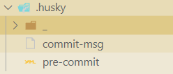
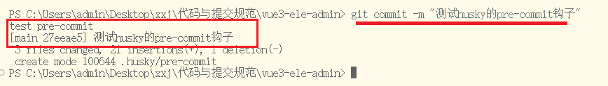
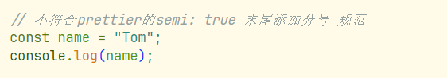
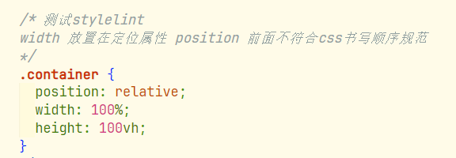
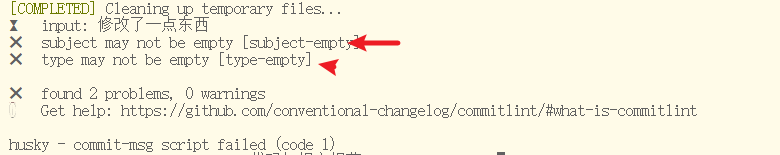
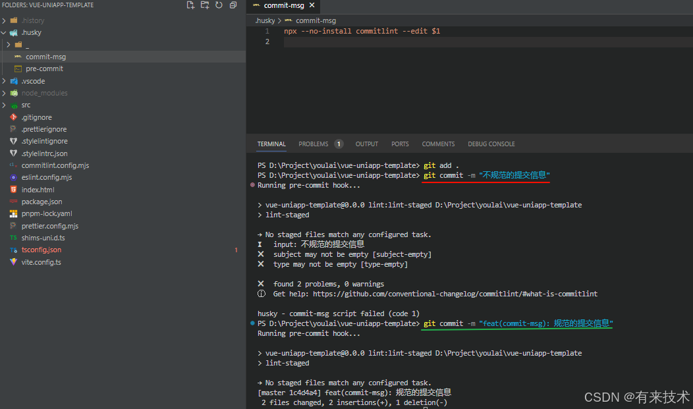
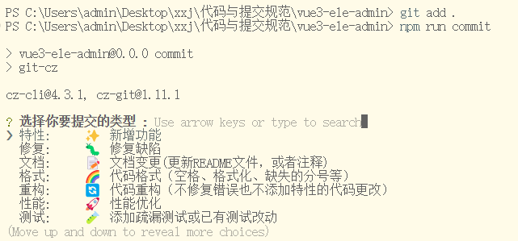
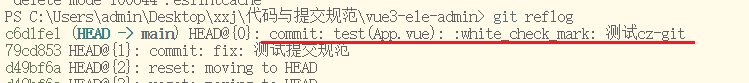

# 目的

在使用`git commit -m` 提交代码时，如果有代码不符合之前配置的代码规范，则自动执行代码规范检测和格式化操作。前提是项目已配置好 **ESLint**、**Prettier** 和 **Stylelint**。

### 一、集成Husky

Husky 是 Git 钩子工具，可以设置在 git 各个阶段（`pre-commit`、`commit-msg` 等）触发。

**安装依赖**

```shell
npm install -D husky
```

**husky init**

`init` 命令简化了项目中的 husky 设置。它会在 `.husky/` 中创建 `pre-commit` 脚本，并更新 `package.json` 中的 `prepare` 脚本。

```
npx husky init
```

此时根目录下多出了`husky`文件夹： 



`pre-commit` 钩子，可以自动运行各种代码检查工具，在提交代码前强制执行代码质量和样式检查。

`pre-commit`文件：在执行`git commit`时，会先执行这里面的命令

在`pre-commit`中添加一句测试命令：

```php
echo "test pre-commit"    
```

执行 

```
git add .
git commit -m "测试husky的pre-commit钩子"
```



通过 `pre-commit` 钩子，可以自动运行各种代码检查工具，在提交代码前强制执行代码质量和样式检查。常见的工具包括：

- **`eslint`**：用于检查和修复 JavaScript/TypeScript 代码中的问题。
- **`stylelint`**：用于检测和修复 CSS/SCSS 样式问题。

比如在 `pre-commit` 钩子中添加**eslint**，**prettier**，**stylelint**的检查与修复命令，根据之前的配置脚本，添加：

```
npm run lint:lint-staged
npm run lint:prettier
npm run lint:stylelint
```

添加一些不符合规范的代码：

App.vue

```vue
<script setup lang="ts">
    // 不符合prettier的semi: true 末尾添加分号 规范
    const name = "Tom"
    console.log(name)

    // 变量未使用，不符合eslint, 无法自动修复，提交以后只会 提示 + 报错，但不会自动删除变量
    // const a = 10;
    // const number = 10;
</script>

<style lang="scss" scoped>
/* 测试stylelint 
width 放置在定位属性 position 前面不符合css书写顺序规范
*/
.container {
  width: 100%;
  height: 100vh;
  position: relative;
}
</style>
```

执行git 命令：

```
git add . 
git commit -m "测试不符规范的提交"
```

代码自动修改为：





需要注意的是，有些不符合规范的代码，**eslint**不能进行修复，只是会提示＋报错，比如定义的变量未使用，需要我们手动的处理：

```
const a = 10;
const number = 10;
```


### 二、集成 lint-staged

`lint-staged` 是一个工具，专门用于只对 Git 暂存区的文件运行 lint 或其他任务，确保只检查和修复**被修改**或**新增**的代码部分，而不会影响整个代码库。

**简单说**

比如你有一个项目有 100 个文件，但这次提交只改了 3 个文件，那没必要 lint 全项目。

**只 lint 和格式化你这次要提交的文件，更快，更精准**，也不会把没动的文件格式化掉。

**安装依赖**

```shell
npm install -D lint-staged
```

**配置 lint-staged**

在 `package.json` 中添加 `lint-staged` 配置，确保在 `pre-commit` 阶段自动检测暂存的文件：

```json
  "lint-staged": {
    "*.{js,ts}": [
      "eslint --fix",
      "prettier --write"
    ],
    "*.{cjs,json}": [
      "prettier --write"
    ],
    "*.{vue,html}": [
      "eslint --fix",
      "prettier --write",
      "stylelint --fix"
    ],
    "*.{scss,css}": [
      "stylelint --fix",
      "prettier --write"
    ],
    "*.md": [
      "prettier --write"
    ]
  },
```

在 `package.json` 的 `scripts` 部分中，添加用于运行 `lint-staged` 的命令：

```shell
"scripts": {
   "lint:lint-staged": "lint-staged"
}
```

项目根目录的 `.husky/pre-commit` 中添加以下命令，确保在提交代码前执行 `lint-staged`：

```shell
npm run lint:lint-staged
```

#### lint-staged是干嘛的？

`lint-staged` 是一个“调度器”，它专门用来在**提交代码之前**，**只针对你修改过的文件**，调用 `eslint`、`prettier`、`stylelint` 等“检查和格式化工具”。

```sql
      git commit 前
            ⬇️
        ┌─────────────┐
        │  husky hook │  ← 用来触发 commit 前的操作
        └────┬────────┘
             ⬇️
     ┌──────────────────┐
     │   lint-staged    │  ← 只处理你这次 Git 暂存的文件
     └────┬─────────────┘
          ⬇️
┌──────────────┬──────────────┬──────────────┐
│    ESLint    │   Prettier   │  Stylelint   │  ← 代码检查、自动修复格式和样式
└──────────────┴──────────────┴──────────────┘
```

相当于他把  ESLint    │   Prettier   │  Stylelint  的工作一起做了。

所以在`pre-commit`中现在只需要一句代码

```shell
npm run lint:lint-staged
```

#### lint-staged的优势

- 🚀 快：只处理你提交的文件，省时间
- 🧼 准：不会误格式化未提交的代码
- 🧩 易扩展：ESLint、Prettier、Stylelint 都能接进来
- 🛡️ 稳定团队代码质量、统一风格，避免“代码风格战争”


### 三、集成 Commitlint

`commitlint` 用于检查 Git 提交信息（commit message）是否符合特定规范（如 Angular 提交规范），从而保证提交信息的一致性。

比如你写了一个提交信息：

```shell
git commit -m "修改了一点东西"
```

如果你用了 `commitlint`，它会直接告诉你：



这时候就限制了我们只能使用正确的提交格式。

**安装依赖**

```shell
npm install -D  @commitlint/cli @commitlint/config-conventional
```

**配置 Commitlint**

在项目根目录下创建 `commitlint.config.cjs` 文件，添加以下内容来启用 Angular 规范：

```js
module.exports = {
  // 继承的规则
  extends: ["@commitlint/config-conventional"],
  // 自定义规则
  rules: {
    // 提交类型枚举，git提交type必须是以下类型 @see https://commitlint.js.org/#/reference-rules
    "type-enum": [
      2,
      "always",
      [
        "feat", // 新增功能
        "fix", // 修复缺陷
        "docs", // 文档变更
        "style", // 代码格式（不影响功能，例如空格、分号等格式修正）
        "refactor", // 代码重构（不包括 bug 修复、功能新增）
        "perf", // 性能优化
        "test", // 添加疏漏测试或已有测试改动
        "build", // 构建流程、外部依赖变更（如升级 npm 包、修改 webpack 配置等）
        "ci", // 修改 CI 配置、脚本
        "revert", // 回滚 commit
        "chore", // 对构建过程或辅助工具和库的更改（不影响源文件、测试用例）
      ],
    ],
    "subject-case": [0], // subject大小写不做校验
  },
};
```

**添加 Husky 钩子**

将 `commitlint` 与 Husky 集成，在 `.husky/commit-msg` 文件（没有就新建一个）中添加以下内容，确保提交信息符合规范：

```shell
npx --no-install commitlint --edit $1
```

**测试**

根据 Angular 的提交规范，提交信息由以下部分组成：

1. **类型**：表示本次提交的类型，例如 `feat` (新功能)、`fix` (修复 bug)、`docs` (文档更新)。
2. **作用域**（可选）：说明本次提交影响的模块，例如 `auth`、`ui`。
3. **简短描述**：简洁明了的提交描述，限定在 50 字符以内。

当你尝试提交不符合规范的提交信息时，提交会被阻止，并显示相关错误提示。如下图所示：



既然限制提交信息的规范性，让`git commit -m "xxx"`这种提交失败，那么怎么才能正确的符合规范的提交呢，那就要使用 `Commitizen` 和 `cz-git`


### 四、集成 Commitizen 和 cz-git

**commitizen**: 是一个帮助开发者以标准化格式生成提交信息的工具。

**cz-git**: `cz-git` 是 `Commitizen` 的适配器之一，它基于 `Commitizen`，提供了更多自定义功能和增强的交互体验。

**安装依赖**

```shell
npm install -D commitizen cz-git
```

**配置 cz-git**

在 `package.json` 中添加以下配置：

```shell
"config": {
    "commitizen": {
        "path": "node_modules/cz-git"
    }
}
```

在`commitlint` 的配置文件 `commitlint.config.cjs` 中添加配置，commitlint 配置模板：https://cz-git.qbb.sh/zh/config/

```js
module.exports = {
  // 继承的规则
  extends: ["@commitlint/config-conventional"],
  // 自定义规则
  rules: {
      // 上面的代码......
  },

  // 以下是新增内容
  // 给cz-git的 配置
  prompt: {
    messages: {
      type: "选择你要提交的类型 :",
      scope: "选择一个提交范围（可选）:",
      customScope: "请输入自定义的提交范围 :",
      subject: "填写简短精炼的变更描述 :\n",
      body: '填写更加详细的变更描述（可选）。使用 "|" 换行 :\n',
      breaking: '列举非兼容性重大的变更（可选）。使用 "|" 换行 :\n',
      footerPrefixesSelect: "选择关联issue前缀（可选）:",
      customFooterPrefix: "输入自定义issue前缀 :",
      footer: "列举关联issue (可选) 例如: #31, #I3244 :\n",
      generatingByAI: "正在通过 AI 生成你的提交简短描述...",
      generatedSelectByAI: "选择一个 AI 生成的简短描述:",
      confirmCommit: "是否提交或修改commit ?",
    },
    // prettier-ignore
    types: [
        { value: "feat",     name: "特性:     ✨  新增功能", emoji: ":sparkles:" },
        { value: "fix",      name: "修复:     🐛  修复缺陷", emoji: ":bug:" },
        { value: "docs",     name: "文档:     📝  文档变更(更新README文件，或者注释)", emoji: ":memo:" },
        { value: "style",    name: "格式:     🌈  代码格式（空格、格式化、缺失的分号等）", emoji: ":lipstick:" },
        { value: "refactor", name: "重构:     🔄  代码重构（不修复错误也不添加特性的代码更改）", emoji: ":recycle:" },
        { value: "perf",     name: "性能:     🚀  性能优化", emoji: ":zap:" },
        { value: "test",     name: "测试:     🧪  添加疏漏测试或已有测试改动", emoji: ":white_check_mark:"},
        { value: "build",    name: "构建:     📦️  构建流程、外部依赖变更（如升级 npm 包、修改 vite 配置等）", emoji: ":package:"},
        { value: "ci",       name: "集成:     ⚙️   修改 CI 配置、脚本",  emoji: ":ferris_wheel:"},
        { value: "revert",   name: "回退:     ↩️   回滚 commit",emoji: ":rewind:"},
        { value: "chore",    name: "其他:     🛠️   对构建过程或辅助工具和库的更改（不影响源文件、测试用例）", emoji: ":hammer:"},
        { value: "wip",      name: "开发中:   🚧  开发阶段临时提交", emoji: ":construction:"},
      ],
    useEmoji: true,
    emojiAlign: "center",
    useAI: false,
    aiNumber: 1,
    themeColorCode: "",
    scopes: [],
    allowCustomScopes: true,
    allowEmptyScopes: true,
    customScopesAlign: "bottom",
    customScopesAlias: "custom",
    emptyScopesAlias: "empty",
    upperCaseSubject: false,
    markBreakingChangeMode: false,
    allowBreakingChanges: ["feat", "fix"],
    breaklineNumber: 100,
    breaklineChar: "|",
    skipQuestions: [],
    issuePrefixes: [{ value: "closed", name: "closed:   ISSUES has been processed" }],
    customIssuePrefixAlign: "top",
    emptyIssuePrefixAlias: "skip",
    customIssuePrefixAlias: "custom",
    allowCustomIssuePrefix: true,
    allowEmptyIssuePrefix: true,
    confirmColorize: true,
    maxHeaderLength: Infinity,
    maxSubjectLength: Infinity,
    minSubjectLength: 0,
    scopeOverrides: undefined,
    defaultBody: "",
    defaultIssues: "",
    defaultScope: "",
    defaultSubject: "",
  },
};

```

**添加 cz-git 脚本**

在`package.json` 文件中添加 `commit` 脚本命令

```shell
 "scripts": {
     "commit": "git-cz"
 }
```

**测试**

执行 `npm run commit` 命令后，按照提示输入相关信息，最终生成符合规范的提交信息。




最终的符合规范的提交信息:



### 五、执行流程

当我们进行代码提交时，执行：

```shell
git add .
npm run commit   # 或 npx cz
```

**🪄 step 1：Commitizen + cz-git 开始工作**

你会看到一个**交互式界面**👇

```python
🎯 请选择改动类型：
❯ feat     ✨ 添加新功能
  fix      🐛 修复问题
  docs     📝 仅文档修改
...

📦 请填写简短描述：
> 修复用户列表接口异常
```

它会生成：

```shell
fix(user): 修复用户列表接口异常
```

然后执行：

```shell
git commit -m "fix(user): 修复用户列表接口异常"
```

**🪄 step 2：Git 提交流程正式开始，此时进入 Git Hooks 执行阶段**

1. 触发 `pre-commit`（由 **husky** 管理）

`pre-commit`阶段触发`lint-staged`，假如在`package.json`中设置了

```json
"lint-staged": {
  "*.{ts,vue}": "eslint --fix",
  "*.{css,scss,vue}": "stylelint --fix",
  "*.{js,ts,vue,json,md}": "prettier --write"
}
```

它会：

- **只对 Git 暂存区中的文件**（也就是你 `git add` 过的）
- 执行 `ESLint / Prettier / Stylelint` 自动修复

2. 触发 `commit-msg`（由 **husky** 管理）

```shell
npx --no-install commitlint --edit $1
```

- 会执行 `commitlint` 检查刚刚生成的提交信息
- 提交信息不符合规范（如：缺少 type），会阻止提交

**🪄 step 3：如果上面两个都通过，commit 成功****

```sql
你执行：npm run commit
   ↓
[cz-git]：生成标准提交信息 + 自动执行 git commit -m "..."
   ↓
[husky pre-commit]：lint-staged 自动修复代码
   ↓
[husky commit-msg]：commitlint 校验提交信息格式
   ↓
[全部通过] ✅：提交成功！
```

#### 提示：

如果你跳过 `cz-git`，直接手写 `git commit -m "xxx"`，流程仍然一样，只是你需要自己确保信息规范。

如果某一步失败，比如：

- 代码未通过 lint（pre-commit 阶段）
- 提交信息格式错误（commit-msg 阶段）
   ➜ 都会拦截提交！

### 参考资源：

[基于 Husky、Lint-staged、Commitlint、Commitizen 与 cz-git 的 Git 代码提交规范完整配置指南](https://youlai.blog.csdn.net/article/details/145615236)

[ChatGPT](https://chatgpt.com/)