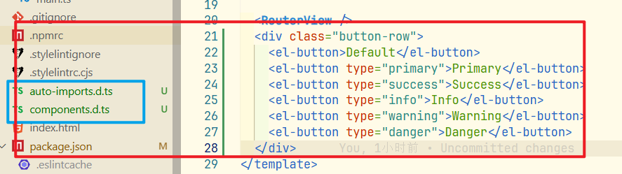

### 本文主要介绍`components.d.ts`与`auto-imports.d.ts`文件

安装`Element-Plus`以后，完成了**组件自动导入**与**Api自动导入**。

这时候的`vite.config.js`文件的配置如下：

```js
plugins: [
    vue(),
    vueDevTools(),
    AutoImport({
        // 导入 Vue 函数，如：ref, reactive, toRef 等
        imports: ["vue", "pinia", "vue-router"],
        // 导入 Element Plus函数，如：ElMessage, ElMessageBox 等
        resolvers: [ElementPlusResolver()],
    }),
    Components({
        // 导入 Element Plus 组件
        resolvers: [ElementPlusResolver()],
        // 指定自定义组件位置(默认:src/components)
        dirs: ["src/components", "src/**/components"],
    }),
],
```

在仅仅完成`API`与`组件`的自动导入以后，在页面中测试使用element-plus组件，会自动生成两个文件

`components.d.ts`与`auto-imports.d.ts`文件




### 1. components.d.ts：组件的类型声明文件

- **生成者**: `unplugin-vue-components` 插件。
- **作用**: 专门为**自动导入的 Vue 组件**提供 TypeScript 类型声明。

**它里面有什么？**

这个文件会自动生成并包含您项目中所有被自动导入的组件的类型信息。它会告诉 TypeScript：

1. 哪些组件是**全局可用**的（你不需要手动 import）。
2. 这些组件的 **props**（属性）是什么类型。

**举个例子，`components.d.ts`文件的内容可能如下所示：**

```ts
/* eslint-disable */
// @ts-nocheck
// Generated by unplugin-vue-components
// Read more: https://github.com/vuejs/core/pull/3399
// biome-ignore lint: disable
export {}

/* prettier-ignore */
declare module 'vue' {
  export interface GlobalComponents {
    ElButton: typeof import('element-plus/es')['ElButton']
    HelloWorld: typeof import('./src/components/HelloWorld.vue')['default']
    IconCommunity: typeof import('./src/components/icons/IconCommunity.vue')['default']
    IconDocumentation: typeof import('./src/components/icons/IconDocumentation.vue')['default']
    IconEcosystem: typeof import('./src/components/icons/IconEcosystem.vue')['default']
    IconSupport: typeof import('./src/components/icons/IconSupport.vue')['default']
    IconTooling: typeof import('./src/components/icons/IconTooling.vue')['default']
    RouterLink: typeof import('vue-router')['RouterLink']
    RouterView: typeof import('vue-router')['RouterView']
    TheWelcome: typeof import('./src/components/TheWelcome.vue')['default']
    WelcomeItem: typeof import('./src/components/WelcomeItem.vue')['default']
  }
}
```

**这段代码做了什么？**

它通过 TypeScript 的 "模块扩充" (module augmentation) 功能，向 `@vue/runtime-core` 这个 Vue 核心模块的 GlobalComponents 接口中添加了新的类型定义。

- `ElButton: typeof import('element-plus/es')['ElButton']:` 这行告诉 TypeScript，现在有一个全局组件叫 `ElButton`，它的类型与从 element-plus 库中导入的 ElButton 组件的类型完全相同。
- `HelloWorld: typeof import('./src/components/HelloWorld.vue')['default']:` 这行告诉 TypeScript，有一个全局组件叫 HelloWorld，它的类型就是你本地 `HelloWorld.vue` 文件导出的默认对象。

**带来的好处：**

- **代码补全**: 当你在 `<template>` 中输入 `<ElB` 时，编辑器会智能提示出 **`ElButton` 组件。**
- **Props 类型检查**: 当你使用 `<ElButton type="primary" />` 时，编辑器知道 **type 是一个合法的 prop**，并且会提示你可选的值（如 "primary", "success" 等）。如果你写错了，例如 `<ElButton tpye="primary" />`，TypeScript 会立刻报错。
- **消除错误**: 避免了 `"Component is not defined"` 这样的编辑器或编译时错误。


#### 2. auto-imports.d.ts：API (函数) 的类型声明文件

- **生成者**: `unplugin-auto-import` 插件。
- **作用**: 专门为**自动导入的 API 函数和变量**提供 TypeScript 类型声明。

**它里面有什么？**

这个文件会自动生成并包含所有被自动导入的 API（主要来自 Vue、Pinia、Vue Router 等库）的类型信息。它会将这些 API 声明为全局可用的常量或函数。

**举个例子，`auto-imports.d.ts`文件的内容可能如下所示：**

```ts
/* eslint-disable */
/* prettier-ignore */
// @ts-nocheck
// noinspection JSUnusedGlobalSymbols
// Generated by unplugin-auto-import
// biome-ignore lint: disable
// We suggest you to commit this file into source control
declare global {
  const computed: typeof import('vue')['computed']
  const defineStore: typeof import('pinia')['defineStore']
  const ElMessage: typeof import('element-plus')['ElMessage']
  const onMounted: typeof import('vue')['onMounted']
  const reactive: typeof import('vue')['reactive']
  const ref: typeof import('vue')['ref']
  const useRoute: typeof import('vue-router')['useRoute']
  const useRouter: typeof import('vue-router')['useRouter']
  const watch: typeof import('vue')['watch']
}
export {}
```

**这段代码做了什么？**

它使用 `declare global` 关键字，在项目的全局作用域中**声明了一系列常量**。

- `const ref: typeof import('vue')['ref']:` 这行告诉 TypeScript，全局有一个名为 ref 的常量，它的类型与从 vue 库中导入的 ref 函数的类型完全相同。
- `const useRoute: typeof import('vue-router')['useRoute']:` 这行声明了全局的 useRoute 函数，并指定了它的类型。

**带来的好处：**

- **代码补全**: 当你在 `<script setup>` 中输入 `ref` 或 `useR` 时，编辑器会智能提示出 ref 和 useRoute 等函数。
- **类型安全**: 你可以获得函数参数和返回值的类型提示。例如，ref() 的返回值会被正确推断为 `Ref<T>` 类型，编辑器会知道它有一个 `.value` 属性。
- **消除错误**: 避免了 "Cannot find name 'ref'" 或 "Cannot find name 'useRoute'" 这样的 TypeScript 编译错误。


#### 总结

这两个文件不是由开发者手写的，而是由 Vite 的插件（构建工具的一部分）在开发服务器启动或代码变更时**自动生成**的。

这两个文件是实现现代 Vue 项目 "丝滑" 开发体验的幕后功臣。它们将插件在背后做的 "魔法"（自动导入）明确地告诉了 TypeScript，从而让静态类型检查和开发工具链能够无缝协作。因此，**强烈建议将这两个文件启用并提交到你的 Git 仓库中**。


#### 问题一：dts 属性是不是可以配置这个文件的生成位置？

`dts` 属性的核心作用就是控制 TypeScript 类型声明文件（`.d.ts`）的生成行为，包括**是否生成**以及**生成到哪里**。

它可以接受以下几种值：

- **true (默认值)**:
  - 表示**启用**自动生成功能。
  - 文件会生成在项目的根目录下，默认文件名为 `auto-imports.d.ts` 或 `components.d.ts`
- **false**:
  - 表示**禁用**自动生成功能。
  - 将不会有任何 `.d.ts` 文件被创建。这正是您在初始配置中看到的情况。
- **字符串 (文件路径)**:
  - 表示**启用**自动生成功能，并将文件生成到您**指定的位置**。
  - 这是一个非常推荐的做法，可以将自动生成的类型文件统一存放在一个目录中，方便管理。例如：

```ts
// vite.config.ts
import AutoImport from 'unplugin-auto-import/vite'
import Components from 'unplugin-vue-components/vite'

export default {
  plugins: [
    AutoImport({
      // ...其他配置
      // 将类型声明文件生成到 src/types/ 目录下
      dts: 'src/types/auto-imports.d.ts',
    }),
    Components({
      // ...其他配置
      // 将类型声明文件生成到 src/types/ 目录下
      dts: 'src/types/components.d.ts',
    }),
  ],
}
```

**重要提示**：当您自定义了 dts 文件的路径后，需要确保 TypeScript 能够找到它们。您需要检查您的 `tsconfig.json` 文件，确保 `include` 数组包含了这些新路径。

例如，如果您的文件放在 `src/types/` 下，您的 `tsconfig.json` 应该看起来像这样：

```json
{
  "compilerOptions": {
    // ...
  },
  "include": [
    "src/**/*.ts",
    "src/**/*.d.ts",
    "src/**/*.tsx",
    "src/**/*.vue",
    "src/types/**/*.d.ts" // 确保这一行或类似的配置存在
  ]
}
```


#### 问题二：如果没有使用 TS，如果是 JS 项目，还会自动生成这两个文件吗？

这是一个非常棒的问题，答案是：**默认情况下，不会。但你可以手动开启它，并且这样做非常有益。**

##### 1. 默认行为

`.d.ts` 文件是纯粹的 TypeScript 概念，它的唯一作用是提供类型信息。对于一个纯 JavaScript 项目，TypeScript 编译器不会介入，因此这些类型声明文件本身是没有用的。所以，这两个插件很智能，在检测到项目不是 TypeScript 项目时，**默认不会生成** `components.d.ts` 和 `auto-imports.d.ts` 文件。

##### 2. 为什么在 JS 项目中开启它仍然很有用？

现代的代码编辑器，特别是 **VS Code**，内置了非常强大的智能提示引擎，这个引擎本身就是基于 TypeScript 的语言服务。

这意味着，**即使你正在编写 .js 文件，VS Code 也能读取 .d.ts 文件**，并为您提供令人惊叹的开发体验！

如果您在 JavaScript 项目中手动开启 dts 选项（例如设置为 dts: true），并生成了这两个文件，您将获得：

- **API 自动补全**：在 `.js` 文件的 `<script setup>` 中输入 ref、useRouter 时，可以获得和 TS 项目一样的智能提示。
- **组件自动补全**：在模板中输入 `<El...` 时，可以自动补全 Element Plus 的组件。
- **组件 Props 提示**：在使用组件时，可以获得对其属性（props）的提示和说明。

##### 3. 如何在 JS 项目中启用它？

**修改 Vite 配置**:
在 `vite.config.js` 文件中，将 `dts` 选项设置为 true 或一个具体的路径。

```js
// vite.config.js
export default {
  plugins: [
    AutoImport({
      // ...
      dts: 'auto-imports.d.ts', // 或者 true
    }),
    Components({
      // ...
      dts: 'components.d.ts', // 或者 true
    }),
  ],
}
```

**创建 jsconfig.json 文件**:
为了让 VS Code 能够识别这些全局的类型声明，您需要在项目根目录创建一个 `jsconfig.json` 文件（如果尚不存在的话），并确保 `include` 配置包含了这些生成的 `.d.ts` 文件。

```json
// jsconfig.json
{
  "compilerOptions": {
    "baseUrl": ".",
    "paths": {
      "@/*": ["src/*"]
    }
  },
  "include": [
    "src/**/*.js",
    "src/**/*.vue",
    "auto-imports.d.ts", // <-- 关键
    "components.d.ts"    // <-- 关键
  ],
  "exclude": ["node_modules", "dist"]
}
```

通过以上配置，您就可以在 JavaScript 项目中享受到几乎与 TypeScript 项目同等级别的代码补全和开发便利性。

