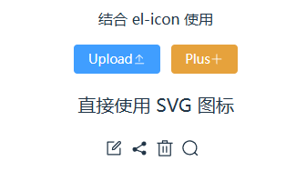
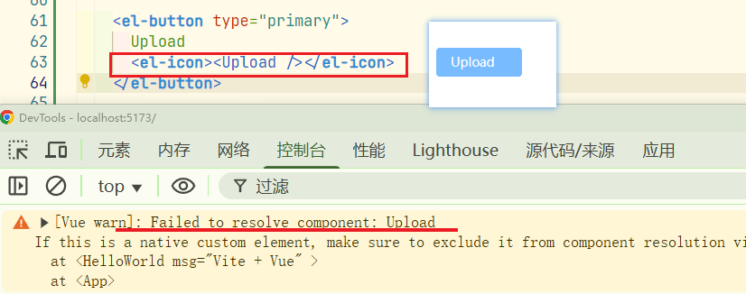
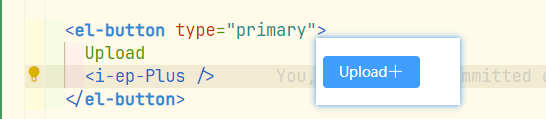
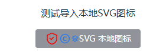
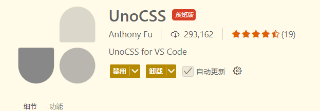

## 项目初始化

### 创建项目：

```ini
npm create vue@latest
```

创建一个`javascript`项目


### 配置别名：

**vite.config.js中别名配置**

```js
import { fileURLToPath, URL } from 'node:url'

import { defineConfig } from 'vite'
import vue from '@vitejs/plugin-vue'
import vueDevTools from 'vite-plugin-vue-devtools'

// https://vite.dev/config/
export default defineConfig({
  plugins: [
    vue(),
    vueDevTools(),
  ],
  resolve: {
    alias: {
      '@': fileURLToPath(new URL('./src', import.meta.url))
    },
  },
})
```


### 配置自动导入：

**概念**

为了避免在多个页面重复引入 `API` 或 `组件`，由此而产生的自动导入插件来节省重复代码和提高开发效率。

自动导入有两种：

`unplugin-auto-import`： 自动导入 ref，reactive,watch,computed 等API

`unplugin-vue-components` ： 自动导入Element Plus 等三方库和 指定目录下的 自定义组件

**安装插件依赖**

```ini
npm install -D unplugin-vue-components unplugin-auto-import
```


**api与组件的自动导入**

```js
// 引入
import AutoImport from 'unplugin-auto-import/vite'
import Components from 'unplugin-vue-components/vite'
import { ElementPlusResolver } from 'unplugin-vue-components/resolvers'
```

在`plugins`配置项中加入：

```js
  plugins: [
    vue(),
    AutoImport({
      resolvers: [ElementPlusResolver()],
    }),
    Components({
      resolvers: [ElementPlusResolver()],
    }),
  ],
```

其中：

```js
// 自动导入API
AutoImport({
  // 导入 Element Plus函数，如：ElMessage, ElMessageBox 等
  // 比如代码中使用 ElMessage.success() 时，会自动导入 ElMessage
  resolvers: [ElementPlusResolver()],
}),
// 自动导入组件
Components({
   // 导入 Element Plus 组件，比如代码中使用组件 el-table等时，会自动导入
  resolvers: [ElementPlusResolver()],
}),
```

还可以配置vue，vue-router，pinia之类的自动导入

```js
 AutoImport({
     // 导入 Vue 函数，如：ref, reactive, toRef 等,以及其它库的函数，比如vue-router中的useRouter
      imports: ["vue", "@vueuse/core", "pinia", "vue-router"],
      resolvers: [ElementPlusResolver()],
    }),
```


当前配置

```js
import { fileURLToPath, URL } from "node:url";

import { defineConfig } from "vite";
import vue from "@vitejs/plugin-vue";
import vueDevTools from "vite-plugin-vue-devtools";

import AutoImport from "unplugin-auto-import/vite";
import Components from "unplugin-vue-components/vite";
import { ElementPlusResolver } from "unplugin-vue-components/resolvers";

// https://vite.dev/config/
export default defineConfig({
  plugins: [
    vue(),
    vueDevTools(),
    AutoImport({
      // 导入 Vue 函数，如：ref, reactive, toRef 等
      imports: ["vue", "pinia", "vue-router"],
      resolvers: [ElementPlusResolver({ importStyle: "sass" })],
      vueTemplate: true, //允许在 .vue 模板中使用自动导入的函数
    }),
    Components({
      resolvers: [ElementPlusResolver({ importStyle: "sass" })],
      // 指定自定义组件位置(默认:src/components)
      dirs: ["src/components", "src/**/components"],
    }),
  ],
  resolve: {
    alias: {
      "@": fileURLToPath(new URL("./src", import.meta.url)),
    },
  },
});
```


配置eslint规则

```js
    AutoImport({
        
      // 自动生成 eslint 规则，解决未定义变量报错问题
      eslintrc: {
        enabled: true, // 是否自动生成 eslint 规则，建议生成之后设置 false
        filepath: "./.eslintrc-auto-import.json", // 指定自动导入函数 eslint 规则的文件
        globalsPropValue: true,
      },

    }),
```


为了vscode更好的代码提示，同样可以生成类型文件

**配置类型的自动导入：**

新建 `/src/types` 目录用于存放自动导入函数和组件的TS类型声明文件

```js
    AutoImport({
      imports: ["vue", "@vueuse/core", "pinia", "vue-router"],
      resolvers: [ElementPlusResolver()],

      eslintrc: {
        enabled: true, // 是否自动生成 eslint 规则，建议生成之后设置 false
        filepath: "./.eslintrc-auto-import.json", // 指定自动导入函数 eslint 规则的文件
        globalsPropValue: true,
      },
      vueTemplate: true, //允许在 .vue 模板中使用自动导入的函数
      // 导入函数TS类型声明文件路径
      //  dts: false,
      dts: "src/types/auto-imports.d.ts", // 指定自动导入函数TS类型声明文件路径
    }),
    // 自动导入组件
    Components({
      // 导入 Element Plus 组件，比如代码中使用组件 el-table等时，会自动导入
      resolvers: [ElementPlusResolver()],
      // 指定自定义组件位置(默认:src/components)
      dirs: ["src/components", "src/**/components"],
      // 导入组件类型声明文件路径 (false:关闭自动生成)
      //  dts: false,
      dts: "src/types/components.d.ts", // 指定自动导入组件TS类型声明文件路径
    }),
```


### 整合Element-plus

**安装 Element Plus**

```shell
npm install element-plus
```

**安装图标包**：`element-plus/icons-vue`

```shell
npm install @element-plus/icons-vue
```

#### 全局注册所有图标：

需要从 `@element-plus/icons-vue` 中导入所有图标并进行全局注册。

```ts
// main.ts

// 如果您正在使用CDN引入，请删除下面一行。
import * as ElementPlusIconsVue from '@element-plus/icons-vue'

const app = createApp(App)
for (const [key, component] of Object.entries(ElementPlusIconsVue)) {
  app.component(key, component)
}
```

**示例代码：**

```vue
  <!-- 结合 el-icon 使用 -->
  <div>
    <p>结合 el-icon 使用</p>
    <el-button type="primary">
      Upload
      <el-icon><Upload /></el-icon>
    </el-button>

    <el-button type="warning">
      Plus
      <el-icon><Plus /></el-icon>
    </el-button>
  </div>

  <!-- 直接使用 SVG 图标 -->
  <!-- 由于SVG图标默认不携带任何属性 -->
  <!-- 你需要直接提供它们 -->
  <div style="font-size: 20px">
    <p>直接使用 SVG 图标</p>
    <Edit style="width: 1em; height: 1em; margin-right: 8px" />
    <Share style="width: 1em; height: 1em; margin-right: 8px" />
    <Delete style="width: 1em; height: 1em; margin-right: 8px" />
    <Search style="width: 1em; height: 1em; margin-right: 8px" />
  </div>
```

**效果预览**




#### 配置图标自动导入

**安装自动导入 Icon 依赖**，需要完成上面一节的 **自动导入** 的安装和配置

```shell
npm i -D unplugin-icons
```

**vite.config.ts 配置**

使用 [unplugin-icons](https://github.com/antfu/unplugin-icons) 和 [unplugin-auto-import](https://github.com/antfu/unplugin-auto-import) 从 `iconify` 中自动导入任何图标集。 您可以参考[此模板](https://github.com/sxzz/element-plus-best-practices/blob/db2dfc983ccda5570033a0ac608a1bd9d9a7f658/vite.config.ts#L21-L58)。

```ts
import { defineConfig } from "vite";
import vue from "@vitejs/plugin-vue";
import path from "path";

// 引入
import AutoImport from "unplugin-auto-import/vite";
import Components from "unplugin-vue-components/vite";
import { ElementPlusResolver } from "unplugin-vue-components/resolvers";

// 图标icon自动导入
import Icons from "unplugin-icons/vite";
import IconsResolver from "unplugin-icons/resolver";

const pathSrc = path.resolve(__dirname, "src");

// https://vite.dev/config/
export default defineConfig({
  resolve: {
    alias: {
      "@": pathSrc,
    },
  },

  css: {
    preprocessorOptions: {
      scss: {
        api: "modern-compiler",
        additionalData: `@use "@/styles/variables.scss" as *;`,
      },
    },
  },
  plugins: [
    vue(),
    AutoImport({
      // 导入 Vue 函数，如：ref, reactive, toRef 等
      imports: ["vue"],

      resolvers: [
        // 导入 Element Plus函数，如：ElMessage, ElMessageBox 等
        // 比如代码中使用 ElMessage.success() 时，会自动导入 ElMessage
        ElementPlusResolver({ importStyle: "sass" }),

        // 自动导入图标组件
        IconsResolver({
          prefix: "Icon",
        }),
      ],

      eslintrc: {
        enabled: true, // 是否自动生成 eslint 规则，建议生成之后设置 false
        filepath: "./.eslintrc-auto-import.json", // 指定自动导入函数 eslint 规则的文件
        globalsPropValue: true,
      },
      vueTemplate: true, //允许在 .vue 模板中使用自动导入的函数
      // 导入函数TS类型声明文件路径
      //  dts: false,
      dts: "src/types/auto-imports.d.ts", // 指定自动导入函数TS类型声明文件路径
    }),
    Components({
      resolvers: [
        // 导入 Element Plus 组件，比如代码中使用组件 el-table等时，会自动导入
        ElementPlusResolver({ importStyle: "sass" }),

        // 自动注册图标组件
        IconsResolver({
          enabledCollections: ["ep"],
        }),
      ],

      // 指定自定义组件位置(默认:src/components)
      dirs: ["src/components", "src/**/components"],
      // 导入组件类型声明文件路径 (false:关闭自动生成)
      //  dts: false,
      dts: "src/types/components.d.ts", // 指定自动导入组件TS类型声明文件路径
    }),
    Icons({
      autoInstall: true,
    }),
  ],
});
```

官方的配置项有一个**错误**：

```ts
AutoImport({
  imports: ["vue"],
  resolvers: [

    ElementPlusResolver({ importStyle: "sass" }),

    // 自动导入图标组件，这里配置是没有用的
    // IconsResolver({
    //   prefix: "Icon",
    // }),
  ],
}),
```

`unplugin-auto-import`(`AutoImport`) 是用来自动导入函数的（例如 `ref()`、`ElMessage()` 等）；

而图标（如 `Edit`, `Plus`）是**组件**，不是函数；

所以配置 `IconsResolver` 在这里，**不会自动导入图标组件**。

实际需要的配置如下:

```ts
Components({
  resolvers: [
    // ......
    // 自动注册图标组件
    IconsResolver({
      // prefix: "Icon", // 自定义前缀
      enabledCollections: ["ep"], // element-plus图标库，其他图标库 https://icon-sets.iconify.design/
    }),
    // ......
  ],
}),
Icons({
  autoInstall: true,
}),
```

需要注意的是，`IconsResolver`中有没有配置`prefix`选项，如果没有配置，使用图标的格式为： 

```vue
<i-ep-SuccessFilled />
```

**使用示例**

```vue
<!-- src/components/HelloWorld.vue -->
<div>
    <el-button type="success">
      <i-ep-SuccessFilled />
      Success
    </el-button>

    <el-button type="info">
     <i-ep-SuccessFilled />
      Info
    </el-button>
</div>
```

**效果预览**


如果配置了`prefix: "Icon"`，此时使用图标的格式为：

```vue
<IconEpPlus />
<IconEpEdit />
<IconEpUserFilled />
```

**使用示例**

```vue
<el-button type="primary">
  Plus
  <IconEpPlus />
</el-button>

<el-button type="info">
  Edit
  <IconEpEdit />
</el-button>
```

**效果预览**


**vite.config.ts配置：**仅供参考

```ts
import { defineConfig } from "vite";
import vue from "@vitejs/plugin-vue";
import path from "path";

// 引入
import AutoImport from "unplugin-auto-import/vite";
import Components from "unplugin-vue-components/vite";
import { ElementPlusResolver } from "unplugin-vue-components/resolvers";

// 图标icon自动导入
import Icons from "unplugin-icons/vite";
import IconsResolver from "unplugin-icons/resolver";

const pathSrc = path.resolve(__dirname, "src");

// https://vite.dev/config/
export default defineConfig({
  resolve: {
    alias: {
      "@": pathSrc,
    },
  },

  css: {
    preprocessorOptions: {
      scss: {
        api: "modern-compiler",
        additionalData: `@use "@/styles/variables.scss" as *;`,
      },
    },
  },
  plugins: [
    vue(),
    // 用来自动导入函数的
    AutoImport({
      // 导入 Vue 函数，如：ref, reactive, toRef 等
      imports: ["vue"],

      resolvers: [
        // 导入 Element Plus函数，如：ElMessage, ElMessageBox 等
        // 比如代码中使用 ElMessage.success() 时，会自动导入 ElMessage
        ElementPlusResolver({ importStyle: "sass" }),
      ],

      eslintrc: {
        enabled: true, // 是否自动生成 eslint 规则，建议生成之后设置 false
        filepath: "./.eslintrc-auto-import.json", // 指定自动导入函数 eslint 规则的文件
        globalsPropValue: true,
      },
      vueTemplate: true, //允许在 .vue 模板中使用自动导入的函数
      // 导入函数TS类型声明文件路径
      //  dts: false,
      dts: "src/types/auto-imports.d.ts", // 指定自动导入函数TS类型声明文件路径
    }),

    // 自动注册并导入组件
    Components({
      resolvers: [
        // 导入 Element Plus 组件，比如代码中使用组件 el-table等时，会自动导入
        ElementPlusResolver({ importStyle: "sass" }),

        // 自动注册图标组件
        IconsResolver({
          prefix: "Icon", // 自定义前缀
          enabledCollections: ["ep"], // element-plus图标库，其他图标库 https://icon-sets.iconify.design/
        }),
      ],

      // 指定自定义组件位置(默认:src/components)
      dirs: ["src/components", "src/**/components"],
      // 导入组件类型声明文件路径 (false:关闭自动生成)
      //  dts: false,
      dts: "src/types/components.d.ts", // 指定自动导入组件TS类型声明文件路径
    }),
    Icons({
      autoInstall: true,
    }),
  ],
});
```

**区别**

上面这种方法配置完成以后，使用图标的方式发生了一些变化。

如果是全部注册，可以直接拷贝`icon-code`直接使用，比如：

```vue
<el-icon><Plus /></el-icon>
```

但是现在不行了，必须改为

```vue
< !-- 根据是否配置prefix -->
<i-ep-Plus />或者<IconEpPlus />
```



修改以后：



为了方便使用，这里使用全局注册。如果项目很大，在初期需要考虑各种性能问题，那可以使用自动导入。


### 整合SVG图标

参考： [vite-plugin-svg-icons 安装文档](https://link.juejin.cn/?target=https%3A%2F%2Fgithub.com%2Fvbenjs%2Fvite-plugin-svg-icons%2Fblob%2Fmain%2FREADME.zh_CN.md)

**安装依赖**

```shell
npm install -D fast-glob@3.2.11 
npm install -D vite-plugin-svg-icons@2.0.1 
```

创建 `src/assets/icons` 目录 , 放入从 Iconfont 复制的 `svg` 图标


`main.ts` 引入注册脚本

```ts
// 本地SVG图标
import "virtual:svg-icons-register";
```

`vite.config.ts` 配置插件

```ts
// vite.config.ts
import { createSvgIconsPlugin } from 'vite-plugin-svg-icons';

export default defineConfig({
   // .....
  plugins: [

    // 自动注册并导入组件
    Components({
  		// .....
    }),

    createSvgIconsPlugin({
      // 指定需要缓存的图标文件夹
      iconDirs: [path.resolve(pathSrc, "assets/icons")],
      // 指定symbolId格式
      symbolId: "icon-[dir]-[name]",
    }),
  ],
});
```

**SVG 组件封装:**

```vue
<!-- src/components/SvgIcon/index.vue -->
<template>
  <svg aria-hidden="true" class="svg-icon" :style="{ width: size, height: size, color }">
    <use :xlink:href="symbolId" />
  </svg>
</template>

<script setup lang="ts">
const props = defineProps({
  prefix: {
    type: String,
    default: "icon",
  },
  iconName: {
    type: String,
    required: false,
    default: "",
  },
  color: {
    type: String,
    default: "",
  },
  size: {
    type: String,
    default: "1em",
  },
});

const symbolId = computed(() => `#${props.prefix}-${props.iconName}`);
</script>

<style scoped>
.svg-icon {
  display: inline-block;
  width: 1em;
  height: 1em;
  overflow: hidden;
  vertical-align: -0.15em; /* 因icon大小被设置为和字体大小一致，而span等标签的下边缘会和字体的基线对齐，故需设置一个往下的偏移比例，来纠正视觉上的未对齐效果 */
  outline: none;
  /* 定义元素的颜色，currentColor是一个变量，这个变量的值就表示当前元素的color值，如果当前元素未设置color值，则从父元素继承 */
  fill: currentcolor;
}
</style>
```

**组件使用**

注：颜色值生效的前提是，`svg`中的`fill`值不是写死的，可以是`fill="currentColor"`或者没有`fill`，但是不能是`fill="#1677FF"`这种颜色写死的，否则设置颜色也不会生效。

```vue
<!-- src/components/HelloWorld.vue -->
<div>
    <p>测试导入本地SVG图标</p>
    <el-button type="info">
      <svg-icon icon-name="anquanyinsi" size="24px" color="red" />
      <svg-icon icon-name="banquan" size="20px" />
      <svg-icon icon-name="dicengjiagou" />
      SVG 本地图标
    </el-button>
</div>
```



### 整合SCSS

安装依赖

```shell
npm i -D sass 
```

创建 `variables.scss` 变量文件，添加变量 `$bg-color` 定义，注意规范变量以 `$` 开头

```scss
// src/styles/variables.scss
$bg-color: #d00909;
```

`Vite` 配置导入` SCSS` 全局变量文件

```ts
// vite.config.ts
css: {
preprocessorOptions: {
  scss: {
    api: "modern-compiler",
    // 在 每个 .scss 文件或者组件的 <style lang="scss">  编译前，自动插入这一行代码。
    additionalData: `@use "@/styles/variables.scss" as *;`,
  },
},
},
```

**测试**

```vue
<!-- src/components/HelloWorld.vue -->
<template>
  <div class="box" />
</template>

<style lang="scss" scoped>
.box {
  width: 100px;
  height: 100px;
  background-color: $bg-color;
}
</style>
```


在`ts`中使用`scss`全局变量，创建一个以 `.module.scss` 结尾的文件

```scss
// src/styles/variables.module.scss

// 导出 variables.scss 文件的变量
:export{
    bgColor:$bg-color
}
```

`TypeScript` 使用 `SCSS` 全局变量

```scss
<!-- src/components/HelloWorld.vue -->
<script setup lang="ts">
  import variables from "@/styles/variables.module.scss";
  console.log(variables.bgColor)  
</script>

<template>
  <div style="width:100px;height:100px" :style="{ 'background-color': variables.bgColor }" />
</template>
```


### 整理scss入口与变量文件

创建以下文件


### 整合router与pinia


### 整理入口文件，统一注册插件

`main.js`

```js
import { createApp } from "vue";
import App from "./App.vue";

import setupPlugins from "@/plugins/index";

const app = createApp(App);

// 注册插件
app.use(setupPlugins);

app.mount("#app");
```


`@/router/index.js`

内容按需修改，主要用来参考结构

```js
import { createRouter, createWebHashHistory } from "vue-router";

import HomeView from "@/views/home/index.vue";

const constantRoutes = [
  {
    path: "/",
    name: "home",
    component: HomeView,
  },
  {
    path: "/about",
    name: "about",
    // route level code-splitting
    // this generates a separate chunk (About.[hash].js) for this route
    // which is lazy-loaded when the route is visited.
    component: () => import("@/views/about/index.vue"),
  },
];

const router = createRouter({
  history: createWebHashHistory(import.meta.env.BASE_URL),
  routes: constantRoutes,
  // 刷新时，滚动条位置还原
  scrollBehavior: () => ({ left: 0, top: 0 }),
});

// 全局注册 router
export function setupRouter(app) {
  app.use(router);
}

export default router;
```


`@/stores`文件夹结构如下


`@/stores/index.js`

```js
import { createPinia } from "pinia";

const pinia = createPinia();

// 全局注册 pinia
export function setupPinia(app) {
  app.use(pinia);
}

export * from "./modules/counter";

export default pinia;
```


`@/stores/counter.js`

```js
import { defineStore } from "pinia";
import pinia from "../index";

export const useCounterStore = defineStore("counter", () => {
  const count = ref(0);
  const doubleCount = computed(() => count.value * 2);
  function increment() {
    count.value++;
  }

  return { count, doubleCount, increment };
});

/**
 * 在组件外使用 Pinia store 实例 @see https://pinia.vuejs.org/core-concepts/outside-component-usage.html
 * 例如一些js文件中使用 Pinia store 实例
 */
export function useCounterStoreHook() {
  return useCounterStore(pinia);
}
```


### 整合UnoCSS

[VIte配置UnoCSS官方文档](https://unocss.dev/integrations/vite)

**安装依赖**

```shell
npm install -D unocss
```

**`vite.config.ts`配置**

```ts
import UnoCSS from 'unocss/vite'
import { defineConfig } from 'vite'

export default defineConfig({
  plugins: [
    UnoCSS(),
  ],
})
```

**创建`uno.config.ts`文件**

```ts
// uno.config.ts
import {
  defineConfig,
  presetAttributify,
  presetIcons,
  presetTypography,
  presetWind3,
  presetWebFonts,
  transformerDirectives,
  transformerVariantGroup,
} from "unocss";

export default defineConfig({
  shortcuts: {
    "flex-center": "flex justify-center items-center",
    "flex-x-center": "flex justify-center",
    "flex-y-center": "flex items-center",
    "wh-full": "w-full h-full",
    "flex-x-start": "flex items-center justify-start",
    "flex-x-between": "flex items-center justify-between",
    "flex-x-end": "flex items-center justify-end",
    "absolute-lt": "absolute left-0 top-0",
    "absolute-rt": "absolute right-0 top-0 ",
    "fixed-lt": "fixed left-0 top-0",
  },
  theme: {
    colors: {
      primary: "var(--el-color-primary)",
      primary_dark: "var(--el-color-primary-light-5)",
    },
  },
  presets: [
    presetWind3(),
    presetAttributify(),
    presetIcons(),
    presetTypography(),
    presetWebFonts({
      fonts: {
        // ...
      },
    }),
  ],
  transformers: [transformerDirectives(), transformerVariantGroup()],
});
```

**在`main.ts`中引入**

```ts
import 'virtual:uno.css'
```

**`VSCode` 安装 `UnoCSS` 插件**



**测试**

```
// HelloWorld.vue
<h1 class="text-cyan">{{ msg }}</h1>
```


**补充：**

`ts`提示`presetUno`预设已经弃置：


```
// 修改框架单位转换，因为框架默认会将单位转换成rem，有时用调试工具看的时候感觉不是很方便，所以通过此依赖转换成px
yarn add -D @unocss/preset-rem-to-px
```


#### 集成svg图标

1️⃣ 安装依赖

```
npm install -D unocss  @iconify/utils 
```

2️⃣ 配置 `uno.config.ts`

```js
import { defineConfig, presetUno } from "unocss";
import presetIcons from "@unocss/preset-icons";
import { FileSystemIconLoader } from "@iconify/utils/lib/loader/node-loaders";
import fs from "fs";

// 本地 SVG 图标存放目录
const iconsDir = "./src/assets/icons";

// 读取本地 SVG 目录，自动生成 `safelist`
const generateSafeList = () => {
  try {
    return fs
      .readdirSync(iconsDir)
      .filter((file) => file.endsWith(".svg"))
      .map((file) => `i-svg:${file.replace(".svg", "")}`);
  } catch (error) {
    console.error("无法读取图标目录:", error);
    return [];
  }
};

export default defineConfig({
  presets: [
    presetIcons({
      // 设置全局图标默认属性
      extraProperties: {
        width: "1em",
        height: "1em",
        display: "inline-block",
      },
      // 注册本地 SVG 图标集合
      collections: {
      	// svg 是图标集合名称，使用 `i-svg:图标名` 调用  
        svg: FileSystemIconLoader(iconsDir, (svg) => {
          // 如果 SVG 文件未定义 `fill` 属性，则默认填充 `currentColor`  
          // 这样图标颜色会继承文本颜色，方便在不同场景下适配  
          return svg.includes('fill="')
            ? svg
            : svg.replace(/^<svg /, '<svg fill="currentColor" ');
        }),
      },
    }),
  ],
  safelist: generateSafeList(), // 动态生成 `safelist`
});
```

与 [官方配置](https://unocss.nodejs.cn/presets/icons#filesystemiconloader) **有两点不同**：

**1. 使用 `safelist` 解决动态图标加载问题**

UnoCSS 采用 **按需扫描** 机制，仅能解析**静态**类名，而 `vue3-element-admin` 的菜单图标是动态加载的，例如：

```vue
<template>
  <div v-for="item in menuItems" :key="item.name">
    <div :class="`i-svg:${item.icon}`"></div>
    {{ item.name }}
  </div>
</template>

<script setup lang="ts">
	const menuItems = [
	  { name: "首页", icon: "home" },
	  { name: "设置", icon: "settings" },
	];
</script>
```

由于 `unocss` **无法在编译阶段解析动态绑定的 `:class`**，导致图标不会被正确加载。因此，我们通过 **扫描 `src/assets/icons` 目录并动态生成 `safelist`**，确保所有本地 SVG 图标类名都能被 `unocss` 识别。


**2. 优化 `fill` 处理，支持多彩图标**

为了避免默认 `fill="currentColor"` 影响多彩图标的渲染，我们仅在 `SVG` **未定义 `fill`** 时才自动补充：

```js
if (!svg.includes('fill="')) {
  return svg.replace(/^<svg /, '<svg fill="currentColor" ');
}
```


3️⃣ 使用图标

在 `uno.config.ts` 中，通过 `collections` 注册了名为 `svg` 的本地 SVG 图标集合，并使用 `FileSystemIconLoader` 读取 `src/assets/icons` 目录下的 SVG 文件。因此，可直接使用 `i-svg:图标名称` 调用

```js
// 本地home.svg图标的使用语法
src/assets/icons/home.svg → i-svg:home
```


```vue
<template>
  <!-- 默认尺寸 1em，颜色继承父级 text 颜色 -->
  <div class="i-svg:home"></div>

  <!-- 自定义颜色和尺寸 -->
  <div class="i-svg:home text-xl text-blue-500"></div>   
</template>
```


