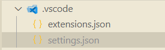

eslint.confit.js

```js
import js from "@eslint/js"; // JavaScript 规则
import globals from "globals";

// Vue支持
import pluginVue from "eslint-plugin-vue"; // Vue 规则
import vueParser from "vue-eslint-parser"; // Vue 解析器

// 代码风格与格式化
import configPrettier from "eslint-config-prettier"; // 禁用与 Prettier 冲突的规则
import prettierPlugin from "eslint-plugin-prettier"; // 运行 Prettier 规则

import { defineConfig } from "eslint/config";

// 解析自动导入配置
import fs from "fs";
let autoImportGlobals = {};
try {
  autoImportGlobals =
    JSON.parse(fs.readFileSync("./.eslintrc-auto-import.json", "utf-8"))
      .globals || {};
} catch (error) {
  // 文件不存在或解析错误时使用空对象
  console.warn("Could not load auto-import globals", error);
}

export default defineConfig([
  // 指定检查文件和忽略文件
  {
    files: ["**/*.{js,mjs,cjs,vue}"],
    ignores: ["**/node_modules/**", "**/dist/**", "**/*.min.*"],
  },

  // 全局配置
  {
    languageOptions: {
      globals: {
        ...globals.browser,
        ...globals.node,
        ...autoImportGlobals,
        // 项目中自定义的全局变量，根据实际情况添加
        ...{
          ResponseData: "readonly",
          ExcelResult: "readonly",
          TagView: "readonly",
          AppSettings: "readonly",
          __APP_INFO__: "readonly",
        },
      },
    },
    plugins: { prettier: prettierPlugin },
    rules: {
      ...configPrettier.rules, // 关闭与 Prettier 冲突的规则
      ...prettierPlugin.configs.recommended.rules, // 启用 Prettier 规则
      "prettier/prettier": "error", // 强制 Prettier 格式化
      "no-unused-vars": [
        "error",
        {
          argsIgnorePattern: "^_", // 忽略参数名以 _ 开头的参数未使用警告
          varsIgnorePattern: "^[A-Z0-9_]+$", // 忽略变量名为大写字母、数字或下划线组合的未使用警告（枚举定义未使用场景）
          ignoreRestSiblings: true, // 忽略解构赋值中同级未使用变量的警告
        },
      ],
    },
  },

  // 基础 JavaScript 配置
  js.configs.recommended,

  // Vue 配置
  {
    files: ["**/*.vue"],
    languageOptions: {
      parser: vueParser,
      parserOptions: {
        sourceType: "module",
      },
    },
    plugins: { vue: pluginVue },
    processor: pluginVue.processors[".vue"],
    rules: {
      ...pluginVue.configs.recommended.rules, // Vue 推荐规则
      "vue/no-v-html": "off", // 允许 v-html
      "vue/multi-word-component-names": "off", // 允许单个单词组件名
    },
  },

  // Prettier 集成（必须放在最后）
  {
    plugins: {
      prettier: prettierPlugin, // 将 Prettier 的输出作为 ESLint 的问题来报告
    },
    rules: {
      ...configPrettier.rules,
      "prettier/prettier": ["error", {}, { usePrettierrc: true }],
      "arrow-body-style": "off",
      "prefer-arrow-callback": "off",
    },
  },
]);
```


```
npm install -D prettier eslint-config-prettier eslint-plugin-prettier
```


`.prettierrc.yaml`

```yaml
# 在单参数箭头函数中始终添加括号
arrowParens: "always"
# JSX 多行元素的闭合标签另起一行
bracketSameLine: false
# 对象字面量中的括号之间添加空格
bracketSpacing: true
# 自动格式化嵌入的代码（如 Markdown 和 HTML 内的代码）
embeddedLanguageFormatting: "auto"
# 忽略 HTML 空白敏感度，将空白视为非重要内容
htmlWhitespaceSensitivity: "ignore"
# 不插入 @prettier 的 pragma 注释
insertPragma: false
# 在 JSX 中使用双引号
jsxSingleQuote: false
# 每行代码的最大长度限制为 100 字符
printWidth: 100
# 在 Markdown 中保留原有的换行格式
proseWrap: "preserve"
# 仅在必要时添加对象属性的引号
quoteProps: "as-needed"
# 不要求文件开头插入 @prettier 的 pragma 注释
requirePragma: false
# 在语句末尾添加分号
semi: true
# 使用双引号而不是单引号
singleQuote: false
# 缩进使用 2 个空格
tabWidth: 2
# 在多行元素的末尾添加逗号（ES5 支持的对象、数组等）
trailingComma: "es5"
# 使用空格而不是制表符缩进
useTabs: false
# Vue 文件中的 <script> 和 <style> 不增加额外的缩进
vueIndentScriptAndStyle: false
# 根据系统自动检测换行符
endOfLine: "auto"
# 对 HTML 文件应用特定格式化规则
overrides:
  - files: "*.html"
    options:
      parser: "html"

```


`.prettierignore`

```
dist
node_modules
public
.husky
.vscode
.idea
*.sh
*.md

src/assets
stats.html
pnpm-lock.yaml
```


### 集成 Stylelin


```ini
npm install -D postcss postcss-html postcss-scss stylelint stylelint-config-recommended stylelint-config-recommended-scss stylelint-config-recommended-vue stylelint-config-recess-order stylelint-config-html stylelint-prettier
```


`.stylelintignore`

```
dist
node_modules
public
.husky
.vscode
.idea
*.sh
*.md

src/assets
stats.html
```


`.stylelintrc.cjs`

```js
module.exports = {
  extends: [
    "stylelint-config-recommended",
    "stylelint-config-recommended-scss",
    "stylelint-config-recommended-vue/scss",
    "stylelint-config-html/vue",
    "stylelint-config-recess-order",
  ],

  plugins: [
    "stylelint-prettier", // 统一代码风格，格式冲突时以 Prettier 规则为准
  ],
  overrides: [
    {
      files: ["**/*.{vue,html}"],
      customSyntax: "postcss-html",
    },
    {
      files: ["**/*.{css,scss}"],
      customSyntax: "postcss-scss",
    },
  ],
  rules: {
    "prettier/prettier": true, // 强制执行 Prettier 格式化规则（需配合 .prettierrc 配置文件）
    "no-empty-source": null, //  允许空的样式文件
    "declaration-property-value-no-unknown": null, // 允许非常规数值格式 ,如 height: calc(100% - 50)
    // 允许使用未知伪类
    "selector-pseudo-class-no-unknown": [
      true,
      {
        ignorePseudoClasses: ["global", "export", "deep"],
      },
    ],
    // 允许使用未知伪元素
    "at-rule-no-unknown": null, // 禁用默认的未知 at-rule 检查
    "scss/at-rule-no-unknown": true, // 启用 SCSS 特定的 at-rule 检查
  },
};
```


#### 保存自动修复

项目根目录下`.vscode/settings.json` 文件添加配置：



```json
{
    "editor.codeActionsOnSave": {
    "source.fixAll.stylelint": "explicit" 
    },
    "stylelint.validate": ["css", "scss", "vue", "html"]
}
```

