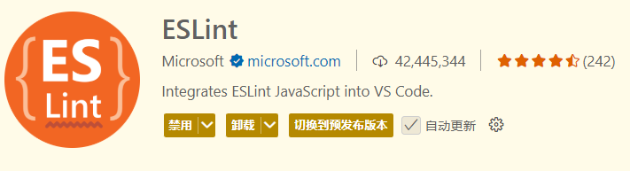
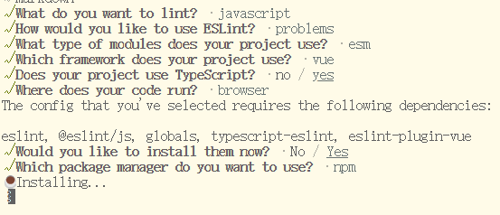
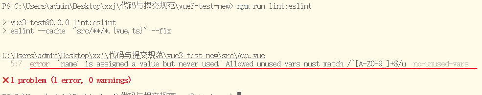
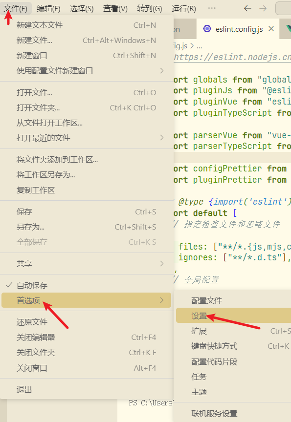
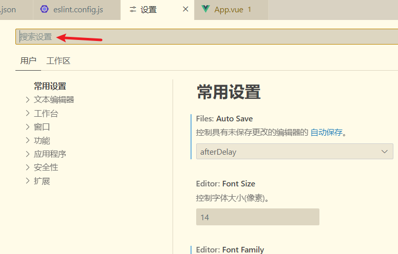
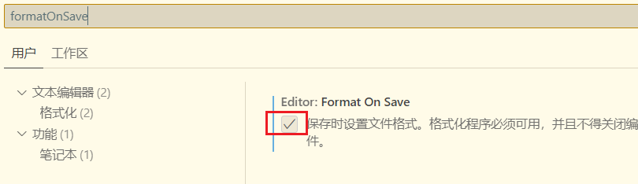
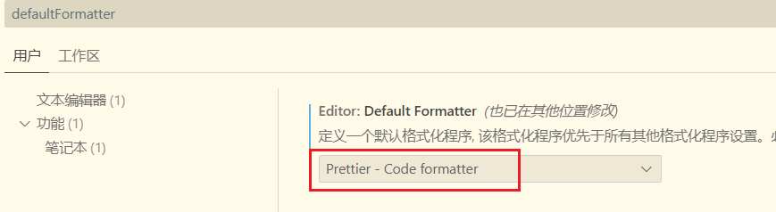
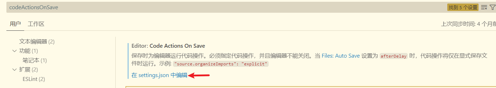

## Vue 前端代码规范：ESLint 、Prettier 与 Stylelint 集成指南

### 一、集成 ESLint

**ESLint 是一个 JavaScript/TypeScript 代码的语法检查工具**， 它能帮你找出代码中的**错误**、**风格问题**、**潜在 bug**，并可**自动修复**。

```js
const a = 1
let name = 'Tom'
console.log("hello",name);
```

这段代码 ESLint 一看会说：

- 变量`a`赋值了但未被使用
- 双引号、分号用得不规范


#### 安装插件

VSCode 插件市场搜索 ESLint 插件并安装



#### 安装依赖

使用以下命令安装和配置 ESLint：

```shell
npm init @eslint/config@latest
```

运行该命令后，ESLint 将通过交互式问答的方式，帮助安装相关依赖并生成默认配置文件 



默认生成的`eslint.config.js`配置如下：

```js
import js from "@eslint/js";
import globals from "globals";
import tseslint from "typescript-eslint";
import pluginVue from "eslint-plugin-vue";
import { defineConfig } from "eslint/config";


export default defineConfig([
  { files: ["**/*.{js,mjs,cjs,ts,vue}"], plugins: { js }, extends: ["js/recommended"] },
  { files: ["**/*.{js,mjs,cjs,ts,vue}"], languageOptions: { globals: globals.browser } },
  tseslint.configs.recommended,
  pluginVue.configs["flat/essential"],
  { files: ["**/*.vue"], languageOptions: { parserOptions: { parser: tseslint.parser } } },
]);
```

#### 定制化配置

于项目使用了 Vue 3 和 TypeScript，我们需要在默认配置的基础上进行调整，以适配当前项目。首先，安装必要的 `ESLint` 依赖：

```shell
npm install -D eslint-plugin-vue vue-eslint-parser eslint-config-prettier eslint-plugin-prettier 
```

|          依赖          |                 作用                 |
| :--------------------: | :----------------------------------: |
|   eslint-plugin-vue    |     提供 Vue 相关的 ESLint 规则      |
|   vue-eslint-parser    |           解析 `.vue` 文件           |
| eslint-config-prettier |  关闭与 Prettier 冲突的 ESLint 规则  |
| eslint-plugin-prettier | 将 Prettier 作为 ESLint 规则进行检测 |

以下是优化后的 `eslint.config.js` 配置，涵盖了 JavaScript、TypeScript 和 Vue 代码的检查规则，并集成了 `Prettier` 进行代码格式化。

```js
// https://eslint.nodejs.cn/docs/latest/use/configure/configuration-files

import globals from "globals";
import pluginJs from "@eslint/js"; // JavaScript 规则
import pluginVue from "eslint-plugin-vue"; // Vue 规则
import pluginTypeScript from "@typescript-eslint/eslint-plugin"; // TypeScript 规则

import parserVue from "vue-eslint-parser"; // Vue 解析器
import parserTypeScript from "@typescript-eslint/parser"; // TypeScript 解析器

import configPrettier from "eslint-config-prettier"; // 禁用与 Prettier 冲突的规则
import pluginPrettier from "eslint-plugin-prettier"; // 运行 Prettier 规则

/** @type {import('eslint').Linter.Config[]} */
export default [
  // 指定检查文件和忽略文件
  {
    files: ["**/*.{js,mjs,cjs,ts,vue}"],
    ignores: ["**/*.d.ts"],
  },
  // 全局配置
  {
    languageOptions: {
      globals: {
        ...globals.browser,
        ...globals.node,
        ...{
          PageQuery: "readonly",
          PageResult: "readonly",
          OptionType: "readonly",
          ResponseData: "readonly",
          ExcelResult: "readonly",
          TagView: "readonly",
          AppSettings: "readonly",
          __APP_INFO__: "readonly",
        },
      },
    },
    plugins: { prettier: pluginPrettier },
    rules: {
      ...configPrettier.rules, // 关闭与 Prettier 冲突的规则
      ...pluginPrettier.configs.recommended.rules, // 启用 Prettier 规则
      "prettier/prettier": "error", // 强制 Prettier 格式化
      "no-unused-vars": [
        "error",
        {
          argsIgnorePattern: "^_", // 忽略参数名以 _ 开头的参数未使用警告
          varsIgnorePattern: "^[A-Z0-9_]+$", // 忽略变量名为大写字母、数字或下划线组合的未使用警告（枚举定义未使用场景）
          ignoreRestSiblings: true, // 忽略解构赋值中同级未使用变量的警告
        },
      ],
    },
  },
  // JavaScript 配置
  pluginJs.configs.recommended,

  // TypeScript 配置
  {
    files: ["**/*.ts"],
    ignores: ["**/*.d.ts"], // 排除d.ts文件
    languageOptions: {
      parser: parserTypeScript,
      parserOptions: {
        sourceType: "module",
      },
    },
    plugins: { "@typescript-eslint": pluginTypeScript },
    rules: {
      ...pluginTypeScript.configs.strict.rules, // TypeScript 严格规则
      "@typescript-eslint/no-explicit-any": "off", // 允许使用 any
      "@typescript-eslint/no-empty-function": "off", // 允许空函数
      "@typescript-eslint/no-empty-object-type": "off", // 允许空对象类型
    },
  },

  // Vue 配置
  {
    files: ["**/*.vue"],
    languageOptions: {
      parser: parserVue,
      parserOptions: {
        parser: parserTypeScript,
        sourceType: "module",
      },
    },
    plugins: { vue: pluginVue, "@typescript-eslint": pluginTypeScript },
    processor: pluginVue.processors[".vue"],
    rules: {
      ...pluginVue.configs.recommended.rules, // Vue 推荐规则
      "vue/no-v-html": "off", // 允许 v-html
      "vue/multi-word-component-names": "off", // 允许单个单词组件名
    },
  },
];
```

#### 添加 ESLint 运行脚本

为了方便使用 `ESLint`，我们可以在 `package.json` 中添加 `lint` 脚本：

```json
{
  "scripts": {
    "lint:eslint": "eslint --cache  \"src/**/*.{vue,ts}\" --fix",
  }
}
```

该命令会自动修复符合 `ESLint` 规则的代码问题，并输出检查结果。

#### 测试 ESLint

在 `App.vue` 文件中添加一个未使用的变量，

```vue
<script setup lang="ts">
import HelloWorld from "./components/HelloWorld.vue";

// 未使用的变量
const name = "hello";
</script>
```

并运行以下命令：

```shell
npm run lint:eslint
```




#### 补充：自动导入eslint规则

如果配置了自动导入，代码中就可以不用手动导入了，项目可以正常运行，但是提交代码时eslint会检测到不符合规范，然后报错。

vite.config.js中需要配置：

```js
eslintrc: {
  enabled: false, // 是否自动生成 eslint 规则，建议生成之后设置 false
  filepath: "./.eslintrc-auto-import.json", // 指定自动导入函数 eslint 规则的文件
  globalsPropValue: true,
},
```

生成`.eslintrc-auto-import.json`文件

`eslint.config.js`需要导入这个文件中的规则集并使用：

```js
// 解析自动导入配置
import fs from "fs";
const autoImportConfig = JSON.parse(fs.readFileSync(".eslintrc-auto-import.json", "utf-8"));
```

还有就是`src/types/auto-imports.d.ts`和`src/types/components.d.ts`文件，到底是怎么生成的？

还有这几个文件要怎么自动的更新里面的内容，比如我使用了新的组件或者API，总不能再手动的加入吧，不能自动的添加吗？


### 二、集成 Prettier

`Prettier` 是一个代码格式化工具，能够和 `ESLint` 配合使用，确保代码风格统一。

#### 安装插件

VSCode 插件市场搜索 `Prettier - Code formatter` 插件安装


#### 安装依赖

```shell
npm install -D prettier eslint-config-prettier eslint-plugin-prettier 
```

- **prettier**：主要的 Prettier 格式化库。
- **eslint-config-prettier**：禁用 ESLint 中与 Prettier 冲突的规则。
- **eslint-plugin-prettier**：将 Prettier 的规则作为 ESLint 的规则来运行。

#### 配置 Prettier

参考 [Prettier 官方配置文档](https://prettier.nodejs.cn/docs/en/configuration.html) 在项目根目录下新建配置文件 `.prettierrc.yaml`，用于定义代码格式化规则。我们选择 **YAML** 格式，原因如下：

1. **JSON** 文件不支持注释，不利于配置的说明和维护。
2. **JS** 文件在某些情况下配置可能不生效（例如，测试发现 `printWidth: 100` 仍会按默认值 80 换行），可能是优先级问题，建议进一步验证。

以下是推荐的基础配置，供参考使用：

```yaml
# 在单参数箭头函数中始终添加括号
arrowParens: "always"
# JSX 多行元素的闭合标签另起一行
bracketSameLine: false
# 对象字面量中的括号之间添加空格
bracketSpacing: true
# 自动格式化嵌入的代码（如 Markdown 和 HTML 内的代码）
embeddedLanguageFormatting: "auto"
# 忽略 HTML 空白敏感度，将空白视为非重要内容
htmlWhitespaceSensitivity: "ignore"
# 不插入 @prettier 的 pragma 注释
insertPragma: false
# 在 JSX 中使用双引号
jsxSingleQuote: false
# 每行代码的最大长度限制为 100 字符
printWidth: 100
# 在 Markdown 中保留原有的换行格式
proseWrap: "preserve"
# 仅在必要时添加对象属性的引号
quoteProps: "as-needed"
# 不要求文件开头插入 @prettier 的 pragma 注释
requirePragma: false
# 在语句末尾添加分号
semi: true
# 使用双引号而不是单引号
singleQuote: false
# 缩进使用 2 个空格
tabWidth: 2
# 在多行元素的末尾添加逗号（ES5 支持的对象、数组等）
trailingComma: "es5"
# 使用空格而不是制表符缩进
useTabs: false
# Vue 文件中的 <script> 和 <style> 不增加额外的缩进
vueIndentScriptAndStyle: false
# 根据系统自动检测换行符
endOfLine: "auto"
# 对 HTML 文件应用特定格式化规则
overrides:
  - files: "*.html"
    options:
      parser: "html"
```

#### 配置忽略文件

项目根目录新建 `.prettierignore` 文件指定 Prettier 不需要格式化的文件和文件夹

```
dist
node_modules
public
.husky
.vscode
.idea
*.sh
*.md

src/assets
stats.html
pnpm-lock.yaml
```

#### 添加格式化脚本

在 `package.json` 文件中添加：

```json
{
  "scripts": {
    "lint:prettier": "prettier --write \"**/*.{js,cjs,ts,json,css,scss,vue,html,md}\""
  }
}
```

#### VSCode保存时自动格式化

打开 VSCode 的 `File` → `Preferences` → `Settings`或者是`文件`->`首选项`->`设置`



在搜索框中直接搜索：`formatOnSave`和`defaultFormatter`



`Format On Save` 选中，`Default Formatter`选择Prettier





#### 测试 Prettier

```js
// 箭头函数要中始终添加括号
const fn = a =>{
  return a + 10
}
fn()
```

`Ctrl + S` 自动保存并格式化（或者执行 `npm run lint:prettier`）

```js
// 箭头函数要中始终添加括号
const fn = (a) => {
  return a + 10;
};
fn();
```

### 三、集成 Stylelint

`Stylelint` 一个强大的 `CSS linter`(检查器)，是**用来检查和格式化 CSS/SCSS/Less等样式代码的工具**。

#### 安装插件

VSCode 插件搜索 `Stylelint` 并安装


#### 安装依赖

```shell
npm install -D postcss postcss-html postcss-scss stylelint stylelint-config-recommended stylelint-config-recommended-scss stylelint-config-recommended-vue stylelint-config-recess-order stylelint-config-html stylelint-prettier
```

|               依赖                |                             说明                             |                            备注                             |
| :-------------------------------: | :----------------------------------------------------------: | :---------------------------------------------------------: |
|              postcss              | CSS 解析工具，允许使用现代 CSS 语法并将其转换为兼容的旧语法  |                              -                              |
|           postcss-html            |            解析 HTML (类似 HTML) 的 PostCSS 语法             |                                                             |
|           postcss-scss            |                    PostCSS 的 SCSS 解析器                    |                                                             |
|             stylelint             |                       stylelint 核心库                       |                                                             |
|   stylelint-config-recommended    | 提供了基础的 Stylelint 配置，适用于大多数项目，允许自定义规则集 | 与 stylelint-config-standard 相比，此配置提供了更多的灵活性 |
| stylelint-config-recommended-scss |            扩展基础配置，为 SCSS 特定规则提供支持            |                                                             |
| stylelint-config-recommended-vue  |          扩展基础配置，为 Vue 文件中的样式提供支持           |                                                             |
|   stylelint-config-recess-order   |                    提供优化样式顺序的配置                    |                    参见 CSS 书写顺序规范                    |
|       stylelint-config-html       |             为 HTML (类似 HTML) 文件提供共享配置             |                                                             |
|        stylelint-prettier         |         统一代码风格，格式冲突时以 Prettier 规则为准         |                                                             |

> 其中选择 stylelint-config-recommended 替代 stylelint-config-standard 的原因在于它不仅提供了灵活性，还更加轻量。stylelint-config-recommended 默认包含的规则较少，避免了 stylelint-config-standard 中可能不需要的规则，这样可以减少配置的复杂度，提高项目的启动速度，同时让开发者能够集中关注对项目真正重要的风格指南。轻量配置有助于简化工作流程，特别是在大型或复杂的项目中。
>

#### 配置 Stylelint

根目录新建 `.stylelintrc.cjs` 文件，配置如下：

```js
module.exports = {
  extends: [
    "stylelint-config-recommended",
    "stylelint-config-recommended-scss",
    "stylelint-config-recommended-vue/scss",
    "stylelint-config-html/vue",
    "stylelint-config-recess-order",
  ],

  plugins: [
    "stylelint-prettier", // 统一代码风格，格式冲突时以 Prettier 规则为准
  ],
  overrides: [
    {
      files: ["**/*.{vue,html}"],
      customSyntax: "postcss-html",
    },
    {
      files: ["**/*.{css,scss}"],
      customSyntax: "postcss-scss",
    },
  ],
  rules: {
    "prettier/prettier": true, // 强制执行 Prettier 格式化规则（需配合 .prettierrc 配置文件）
    "no-empty-source": null, //  允许空的样式文件
    "declaration-property-value-no-unknown": null, // 允许非常规数值格式 ,如 height: calc(100% - 50)
    // 允许使用未知伪类
    "selector-pseudo-class-no-unknown": [
      true,
      {
        ignorePseudoClasses: ["global", "export", "deep"],
      },
    ],
    // 允许使用未知伪元素
    "at-rule-no-unknown": null, // 禁用默认的未知 at-rule 检查
    "scss/at-rule-no-unknown": true, // 启用 SCSS 特定的 at-rule 检查
  },
};
```

#### 配置忽略文件

根目录创建 `.stylelintignore` 文件，配置忽略文件如下：

```
dist
node_modules
public
.husky
.vscode
.idea
*.sh
*.md

src/assets
stats.html
```

#### 添加 Stylelint 脚本

`package.json` 添加 `Stylelint` 检测指令：

```json
"scripts": {
  "lint:stylelint": "stylelint  \"**/*.{css,scss,vue,html}\" --fix"
}
```

#### 保存自动修复

在`设置`中搜索`codeActionsOnSave`，进入到`setting.json`中编辑



添加以下配置：

```json
{
  "editor.codeActionsOnSave": {
    "source.fixAll.stylelint": true 
  },
  "stylelint.validate": ["css", "scss", "vue", "html"]
}
```

#### 测试 Stylelint

为了验证把尺寸属性 width 放置在定位属性 position 前面，根据 [CSS 书写顺序规范](https://jingyan.baidu.com/article/647f0115cf48957f2148a8a3.html) 推断是不符合规范的，在保存时 Stylelint 自动将属性重新排序，达到预期。

```CSS
/* 测试stylelint */
.container {
  width: 100%;
  height: 100%;
  position: relative;
  colors: #f21;
}
```

执行 `npm run lint:stylelint`


### 总结：

✅**ESLint**

**作用**：检查 JavaScript / TypeScript / Vue 中的语法错误、潜在问题、代码规范

**检查内容**：

- 变量是否使用
- 函数是否有未处理异常
- 是否使用了禁止的语法或全局变量

**是否支持自动修复**：支持部分规则自动修复（如补全分号）

✅**Prettier**

**作用**：统一所有代码的**格式**，保持一致的代码风格（不涉及代码逻辑）

**处理内容**：

- 缩进、空格、引号、分号、括号位置、换行方式等

**是否支持自动修复**：支持，运行时会直接格式化代码

 ✅**Stylelint**

**作用**：检查 CSS / SCSS / Vue `<style>` 中的语法和风格问题

**检查内容**：

- 属性拼写错误（如 `colr` 拼错）
- 无效值（如 `pxpx`）
- 是否使用了禁止的选择器或结构
- 是否符合指定的风格（缩进、引号、空格等）

**是否支持自动修复**：支持部分规则自动修复（如缩进、分号、空格等）


### 参考：

[Vue 前端代码规范实战：ESLint v9、Prettier 与 Stylelint 集成指南与最佳实践](https://youlai.blog.csdn.net/article/details/145608723)

[ChatGPT](https://chatgpt.com/)

